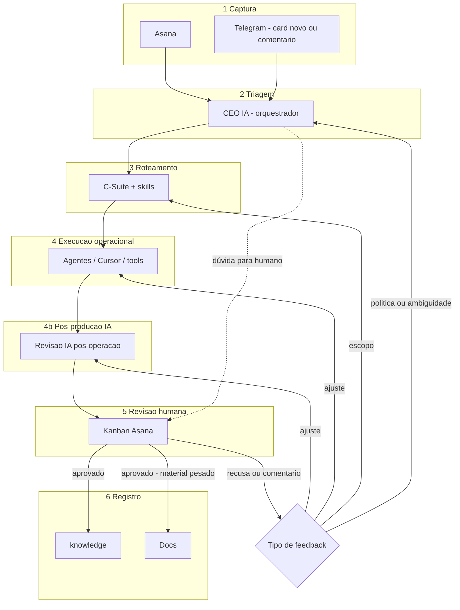

# Diagrama — fluxo principal (Mermaid)

**Notas:**

- **4b** pode ser saltada quando **não** for sensível (checklist) **nem** reformulação de pipeline — ver [checklist-sensivel.md](./checklist-sensivel.md).  
- Colunas exatas do kanban: definidas pelo **CEO IA** quando o C-Suite estiver maduro.
