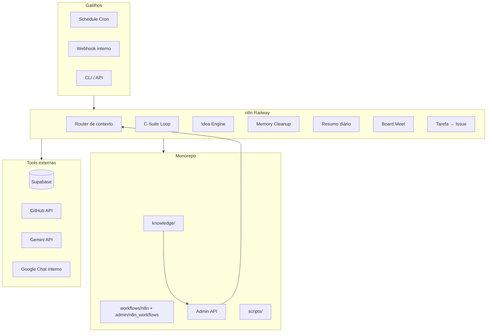

# Coleção de documentação para IA — 01_ADVENTURE_LABS

**Data:** 2026-03-12

Este arquivo reúne a documentação (README e, quando relevante, PLANO/roadmap) de **apps, sites, workflows, tools, skills e agentes** do monorepo 01_ADVENTURE_LABS. Use-o para entender **em que ponto estamos e onde queremos chegar** (implementado e pendente/futuro).

---

## Índice

### Implementado
- `README.md`
- `CONTRIBUTING.md`
- `PLANO_MONOREPO_ADVENTURE_LABS.md`
- `apps/admin/README.md`
- `apps/admin/agents/skills/README.md`
- `apps/admin/n8n_workflows/README.md`
- `apps/admin/n8n_workflows/csuite/README.md`
- `apps/admin/n8n_workflows/meta_ads_agent/README.md`
- `apps/admin/n8n_workflows/sueli/README.md`
- `apps/admin/public/context-docs/README.md`
- `apps/admin/public/context-docs/99_ARQUIVO/README.md`
- `apps/admin/public/agents-docs/skills/README.md`
- `apps/admin/supabase/README.md`
- `apps/admin/docs/PLANO_SKILL_GOOGLE_DRIVE_ADVENTURE.md`
- `apps/adventure/README.md`
- `apps/adventure/docs/README.md`
- `apps/adventure/extension/README.md`
- `apps/adventure/functions/README.md`
- `apps/elite/README.md`
- `apps/finfeed/README.md`
- `clients/02_rose/sites/auxilio-maternidade/README.md`
- `workflows/README.md`
- `tools/xtractor/README.md`
- `tools/dbgr/README.md`
- `tools/n8n-scripts/README.md`
- `tools/notebooklm/README.md`
- `tools/musicalart/README.md`
- `tools/gdrive-migrator/drive migrator/README.md`
- `.cursor/skills/clientes/README.md`
- `.cursor/skills/comercial/README.md`
- `.cursor/skills/desenvolvimento/README.md`
- `.cursor/skills/gestao-corporativa/README.md`
- `.cursor/skills/marketing/README.md`
- `clients/01_lidera/README.md`
- `clients/01_lidera/admin/README.md`
- `clients/01_lidera/lidera-dre/README.md`
- `clients/01_lidera/lidera-dre/scripts/README.md`
- `clients/01_lidera/lidera-skills/README.md`
- `clients/01_lidera/lidera-space/README.md`
- `clients/01_lidera/lideraspacev1/README.md`
- `clients/02_rose/README.md`
- `clients/02_rose/admin/README.md`
- `clients/02_rose/roseportaladvocacia/README.md`
- `clients/03_speed/README.md`
- `clients/04_young/README.md`
- `clients/04_young/admin/README.md`
- `clients/04_young/ranking-vendas/README.md`
- `clients/04_young/young-talents/README.md`
- `clients/04_young/young-talents/docs/README.md`
- `clients/05_benditta/README.md`
- `clients/06_capclear/README.md`
- `packages/config/README.md`
- `packages/db/README.md`
- `packages/ui/README.md`
- `knowledge/README.md`
- `knowledge/99_ARQUIVO/README.md`
- `docs/estrutura-visual/README.md`
- `docs/roles/README.md`
- `_internal/vault/README.md`

### Pendente / Futuro
- `clients/04_young/young-talents/docs/futuras-melhorias/README.md`
- `clients/04_young/young-talents/docs/futuras-melhorias/PLANEJAMENTO_TEMPLATES_VAGA.md`
- `docs/PLANO_N8N_AUTOMACOES_AGENTES_SKILLS_TOOLS.md`
- `apps/finfeed/PLANO_INICIAL.md`

---

# Parte 1 — Implementado

---

## Fonte: README.md

# Adventure Labs — Estrutura + Submodules

Repositório que versiona a estrutura (knowledge, docs, .cursor) e referencia apps/clientes como **submodules**.

## Clone e setup

```bash
git clone --recurse-submodules <url-adventure-labs> 01_ADVENTURE_LABS
cd 01_ADVENTURE_LABS
./scripts/setup.sh
```

Ou, se já clonou sem `--recurse-submodules`:

```bash
./scripts/setup.sh
```

O script inicializa os submodules e cria o symlink `apps/admin/context -> ../../knowledge` (evita duplicação).

## Estrutura

```
01_ADVENTURE_LABS/
├── _internal/      # Vault (refs), archive (clones temp)
├── apps/           # Submodules: admin, adventure, elite, finfeed
├── clients/        # Submodules: lidera-space, lidera-skills, roseportaladvocacia, young-emp, etc.
├── knowledge/      # Base de conhecimento (taxonomia 00–99)
├── packages/       # Pacotes compartilhados
├── tools/          # Ferramentas internas
├── workflows/      # Definições n8n
└── AGENTS.md       # Diretrizes para multi-agentes
```

**Submodules:** Cada app mantém seu próprio repo — funções específicas, deploy e histórico independentes.

## Início rápido

- **Admin:** `cd apps/admin && pnpm dev` (após `./scripts/setup.sh`)
- **Taxonomia:** `knowledge/00_GESTAO_CORPORATIVA/MANUAL_TAXONOMIA_REPOSITORIO.md`
- **Agentes:** `AGENTS.md`

## Segurança

Credenciais e dados sensíveis **nunca** no repositório. Ver `_internal/vault/README.md`.

- **Auditoria de secrets:** `./scripts/audit-secrets.sh --report` (relatório em `_internal/`)


---

## Fonte: CONTRIBUTING.md

# Como contribuir

## Estrutura e taxonomia

- Respeitar a taxonomia em `knowledge/` (00–99)
- Novos documentos: seguir `MANUAL_TAXONOMIA_REPOSITORIO.md`
- Clientes: padrão `clients/NN_nome/projeto`

## Segurança

- Nunca commitar `.env`, credenciais ou dados sensíveis
- Usar `.env.example` como template
- Dados de clientes fora do repo

## Código

- Admin: monorepo pnpm, Next.js, Supabase
- Ver `.cursorrules` em `apps/admin/` para convenções

## Regra de sobrescrita

Em conflito: PARE → mostre o existente → confirme com o Founder antes de substituir.


---

## Fonte: PLANO_MONOREPO_ADVENTURE_LABS.md

# Plano de Organização — Monorepo Privado Adventure Labs

**Versão:** 1.0  
**Data:** 2026-03-07  
**Objetivo:** Transformar o ambiente GitHub em um monorepo privado, organizado e seguro, com taxonomia profissional para ML, skills e multi-agentes.

---

## 1. Visão Geral

### 1.1 Estado Atual (Diagnóstico)

| Aspecto | Situação |
|---------|----------|
| **Estrutura** | Pastas soltas (`01_ADVENTURE_LABS`, `GEMINI_CLI`), sem repositório único na raiz |
| **Repositórios** | ~35+ repos Git independentes espalhados |
| **Duplicação** | ~~7 clones~~ → Arquivados em `_internal/archive/` (Fase 1 concluída) |
| **Clientes** | Lidera com múltiplas variantes (lidera-, lidera-space, lideraspace, Lidera/*) |
| **Contexto** | `context/` com taxonomia boa (00–99) mas duplicada em admin e admin_repo |
| **Segurança** | Credenciais em `credenciais-adventure.md` (em .gitignore, mas em disco) |
| **Skills/IA** | Skills e rules espalhados, sem mapeamento claro para pastas |

### 1.2 Princípios do Plano

1. **Segurança em camadas** — Dados sensíveis nunca no repositório; vault separado
2. **Taxonomia consistente** — Nomenclatura padronizada e previsível
3. **Preparado para IA** — Pastas e arquivos mapeáveis como skills/contextos
4. **Machine Learning** — Estrutura que facilite indexação, embeddings e RAG
5. **Escalabilidade** — Fácil adicionar novos clientes e projetos

---

## 2. Estrutura Proposta do Monorepo

```
adventure-labs/                    # Raiz do monorepo (repo único privado)
├── .cursor/
│   ├── rules/                    # Regras globais do Cursor
│   │   ├── adventure-labs-identity.mdc
│   │   ├── security-sensitives.mdc
│   │   └── monorepo-conventions.mdc
│   ├── skills/                   # Skills por domínio (mapeáveis)
│   │   ├── gestao-corporativa/
│   │   ├── comercial/
│   │   ├── marketing/
│   │   ├── desenvolvimento/
│   │   └── clientes/
│   └── AGENTS.md                 # Diretrizes para multi-agentes
│
├── .github/
│   ├── ISSUE_TEMPLATE/
│   ├── workflows/
│   └── CODEOWNERS
│
├── _internal/                    # Uso interno, nunca exposto
│   ├── vault/                    # Referências a secrets (não os secrets em si)
│   │   ├── README.md             # Instruções: onde buscar credenciais
│   │   └── .gitkeep
│   ├── temp/                     # Workspaces temporários (gitignore)
│   └── archive/                  # Código/projetos descontinuados
│
├── apps/                         # Aplicações principais
│   ├── admin/                   # Adventure Labs OS (canônico)
│   ├── adventure/               # Produto principal
│   ├── elite/
│   ├── finfeed/
│   └── ...
│
├── packages/                     # Pacotes compartilhados
│   ├── ui/                      # Componentes UI
│   ├── db/                      # Schemas, migrations
│   └── config/                  # Configs compartilhadas
│
├── clients/                      # Projetos por cliente
│   ├── 01_lidera/
│   │   ├── lidera-space/
│   │   ├── lidera-skills/
│   │   ├── capclear-site/
│   │   └── README.md            # Resumo do cliente (sem dados sensíveis)
│   ├── 02_rose/
│   │   └── roseportaladvocacia/
│   ├── 03_speed/
│   ├── 04_young/
│   │   ├── young-emp/
│   │   ├── young-talents/
│   │   └── ranking-vendas/
│   └── 05_benditta/
│
├── knowledge/                     # Base de conhecimento (indexável para ML/RAG)
│   ├── 00_gestao_corporativa/
│   ├── 01_comercial/
│   ├── 02_marketing/
│   ├── 03_projetos_internos/
│   ├── 04_projetos_clientes/
│   ├── 05_laboratorio/
│   ├── 06_conhecimento/
│   └── 99_arquivo/
│
├── tools/                        # Ferramentas internas
│   ├── xtractor/
│   ├── dbgr/
│   ├── gdrive-migrator/
│   ├── notebooklm/
│   └── musicalart/
│
├── workflows/                    # n8n, automações (definições, não secrets)
│   ├── n8n/
│   │   └── *.json               # Workflows versionados
│   └── docs/
│
├── pnpm-workspace.yaml
├── .gitignore
├── README.md
└── CONTRIBUTING.md
```

---

## 3. Camadas de Segurança e Sigilo

### 3.1 O Que NUNCA Entra no Repo

| Tipo | Exemplo | Onde Guardar |
|------|---------|--------------|
| Credenciais | Senhas, API keys, tokens | 1Password, Vault, variáveis de ambiente |
| Dados de clientes | Extratos, CPF, dados bancários | Drive criptografado, banco isolado |
| Respostas sigilosas | Questionários, NDA | `_internal/vault` (apenas referência) |
| `.env`, `.env.local` | Variáveis de ambiente | `.env.example` versionado; valores em Vercel/Railway |
| `token.json`, `token.pickle` | OAuth, sessões | Local + .gitignore |

### 3.2 Estrutura do Vault (Referências)

```
_internal/vault/
├── README.md
│   Conteúdo: "Credenciais vivem em 1Password (vault Adventure Labs).
│   Arquivos .env são gerados localmente a partir de .env.example.
│   Nunca commitar credenciais."
├── .gitkeep
└── (nenhum arquivo com dados reais)
```

### 3.3 Padrões de .gitignore na Raiz

```gitignore
# Secrets e credenciais
.env
.env.*
!.env.example
*credenciais*.md
*secret*
token*.json
token.pickle
*.secret

# Dados sensíveis de clientes
**/extratos/
**/sicredi/
**/respostas-sigilosas*.md
**/respostas-questionario*.md

# Temp e clones
_internal/temp/
**/temp_*/
**/node_modules/
**/.next/
**/dist/
**/build/
```

### 3.4 Regra Cursor para Segurança

Criar `.cursor/rules/security-sensitives.mdc`:

```markdown
---
description: Previne exposição de dados sensíveis e credenciais
alwaysApply: true
---

# Segurança e Dados Sensíveis

- Nunca sugerir ou escrever credenciais, senhas, API keys ou tokens em código versionado.
- Arquivos como credenciais-adventure.md, .env, token.json devem permanecer em .gitignore.
- Ao criar exemplos, use placeholders: `process.env.API_KEY`, `[REDACTED]`.
- Dados de clientes (CPF, extratos, respostas sigilosas) nunca no repositório.
```

---

## 4. Taxonomia da Base de Conhecimento

### 4.1 Estrutura `knowledge/` (Espelho do context atual)

| Pasta | Conteúdo | Uso para IA |
|-------|----------|-------------|
| `00_gestao_corporativa` | Financeiro, jurídico, pessoas, processos | Skills de gestão, templates |
| `01_comercial` | Pipeline, propostas, programas | Skills comerciais |
| `02_marketing` | Campanhas, entregas, KPIs | Skills de marketing |
| `03_projetos_internos` | Projetos internos, tarefas | Contexto de roadmap |
| `04_projetos_clientes` | Entregas por cliente (sem dados sensíveis) | Resumos, status |
| `05_laboratorio` | Inventário de apps, experimentos | Skills de dev |
| `06_conhecimento` | Arquitetura, manuais, backlogs | RAG, embeddings |
| `99_arquivo` | Histórico, arquivados | Referência sob demanda |

### 4.2 Convenções de Nomenclatura

- **Pastas:** `NN_nome_snake_case` (ex: `01_gestao_corporativa`)
- **Arquivos:** `kebab-case.md` ou `snake_case.md`
- **Clientes:** `NN_nome_cliente` (ex: `01_lidera`, `02_rose`)
- **Projetos:** `nome-projeto` (ex: `lidera-space`, `young-talents`)

---

## 5. Mapeamento para Skills e Multi-Agentes

### 5.1 Skills por Domínio

| Skill | Pasta de Contexto | Quando Usar |
|-------|-------------------|-------------|
| `gestao-corporativa` | `knowledge/00_gestao_corporativa` | Processos, financeiro, jurídico |
| `comercial` | `knowledge/01_comercial` | Propostas, pipeline, vendas |
| `marketing` | `knowledge/02_marketing` | Campanhas, tráfego, KPIs |
| `desenvolvimento` | `knowledge/05_laboratorio`, `apps/`, `packages/` | Código, arquitetura |
| `clientes` | `clients/`, `knowledge/04_projetos_clientes` | Contexto de cliente específico |

### 5.2 AGENTS.md (Raiz)

Arquivo que orienta o multi-agente sobre:

- Identidade (Adventure Labs OS, Grove, C-Suite)
- Onde buscar contexto (`knowledge/`, `clients/`)
- Regras de sigilo e segurança
- Mapeamento skills ↔ pastas

### 5.3 Preparação para ML/RAG

1. **Indexação:** Manter `knowledge/` em Markdown estruturado, com frontmatter opcional:
   ```yaml
   ---
   title: Nome do documento
   domain: gestao_corporativa
   tags: [processo, financeiro]
   updated: 2026-03-07
   ---
   ```
2. **Embeddings:** Pastas `knowledge/*` são candidatas naturais para vetorização
3. **Skills dinâmicos:** Skills podem referenciar pastas inteiras como contexto

---

## 6. Plano de Migração (Fases)

### Fase 1 — Limpeza e Consolidação (1–2 dias) ✅ Concluída 2026-03-07

1. **Remover clones temporários** ✅
   - Arquivados em `_internal/archive/` (temp_admin_report_*, temp_admin_repo2, temp_admin_vercel_fix)
   - Admin canônico: `01_ADVENTURE_LABS/00_LABORATÓRIO/admin/`

2. **Consolidar Lidera**
   - LIDERA-- (vazio) removido
   - Demais projetos mantidos; consolidação completa na Fase 2

3. **Mover artefatos** ✅
   - `.gitignore` raiz criado com `gh_*`, `_internal/temp/`, secrets

4. **Documentação e skill** ✅
   - `01_ADVENTURE_LABS/docs/MANUAL_TAXONOMIA_REPOSITORIO.md`
   - `admin/context/00_GESTAO_CORPORATIVA/MANUAL_TAXONOMIA_REPOSITORIO.md`
   - Skill `agents/skills/taxonomia-repositorio/SKILL.md` (owner: CEO/Grove)

### Fase 2 — Nova Estrutura de Pastas (2–3 dias) ✅ Concluída 2026-03-07

1. Criar estrutura raiz conforme seção 2 ✅
2. Mover `00_LABORATÓRIO/*` → `apps/` ou `tools/` ✅
3. Mover `01_CLIENTES/NN_*` → `clients/NN_*` ✅
4. Unificar `context/` em `knowledge/` (uma única fonte) ✅
5. Criar `_internal/vault` e README de referência ✅

### Fase 3 — Configuração do Monorepo (1–2 dias) ✅ Concluída 2026-03-07

1. pnpm-workspace.yaml na raiz 01_ADVENTURE_LABS ✅
2. Configurar `pnpm-workspace.yaml` com apps/*, packages/*, tools/dbgr ✅
3. `.gitignore` raiz robusto ✅
4. Configurar `.cursor/rules` e `AGENTS.md` ✅
5. Skills permanecem em `apps/admin/agents/skills/` ✅

### Fase 4 — Segurança e Documentação (1 dia) ✅ Concluída 2026-03-07

1. `.gitignore` com *credenciais*.md, extratos, respostas sigilosas ✅
2. README e CONTRIBUTING criados ✅
3. CODEOWNERS para _internal/vault e knowledge/00_GESTAO_CORPORATIVA ✅

### Fase 5 — Integração com GEMINI_CLI / Workflows (opcional) ✅ Concluída 2026-03-07

1. Workflows copiados para `01_ADVENTURE_LABS/workflows/n8n/` ✅
2. GEMINI_CLI permanece separado (meus-workflows preservado) ✅

### Fase 6 — Git e Versionamento ✅ Implementada 2026-03-07

**Implementação:** Repo "adventure-labs" com submodules.

- **Repo raiz** versiona: knowledge/, docs/, .cursor/, workflows/, etc.
- **Submodules:** admin, adventure, elite, finfeed, lidera-space, lidera-skills, roseportaladvocacia, young-emp, ranking-vendas, young-talents
- **Symlink:** `apps/admin/context -> ../../knowledge` (sem duplicação)
- **Setup:** `./scripts/setup.sh` após clone
- **Documentação:** `docs/FASE_6_GIT_E_REPOSITORIO.md`

### Fase 7 — Pós-Fase 6 ✅ Implementada 2026-03-07

- **Auditoria de secrets:** Script `./scripts/audit-secrets.sh --report`; instruções em `docs/FASE_6_GIT_E_REPOSITORIO.md`
- **ML/RAG:** Frontmatter YAML em docs de knowledge; instruções em `knowledge/README.md`
- **Packages:** Estrutura inicial `packages/ui`, `packages/db`, `packages/config`
- **Tools:** Mantidos como pastas; `pnpm-workspace` inclui `tools/*`
- **Submodules Lidera:** lidera-skills adicionado

---

## 7. Checklist de Validação

Antes de considerar o monorepo pronto:

- [ ] Executar `./scripts/audit-secrets.sh --report` e revisar; nenhum secret no histórico
- [x] `.env.example` existe onde há `.env` em uso (admin, adventure, elite, rose, young-talents, dbgr, xtractor)
- [x] `knowledge/` é fonte canônica; `apps/admin/context/` mantém cópia (ver knowledge/README.md)
- [x] Clientes seguem padrão `clients/NN_nome/projeto`
- [x] Skills mapeiam para pastas de conhecimento (`.cursor/skills/` + `apps/admin/agents/skills/`)
- [x] AGENTS.md e .cursor/rules estão configurados
- [x] pnpm workspaces funcionam em `apps/`, `packages/` e `tools/`
- [x] README raiz explica estrutura e como contribuir

---

## 8. Próximos Passos (opcional)

1. **Auditoria de secrets** — Executar `./scripts/audit-secrets.sh --report` periodicamente
2. **Packages** — Migrar componentes/schemas comuns para `packages/ui` e `packages/db` conforme necessidade
3. **Embeddings/RAG** — Indexar `knowledge/` para vetorização quando houver pipeline de ML

---

## 9. Referências

- Estrutura atual: `01_ADVENTURE_LABS/`, `GEMINI_CLI/`
- Taxonomia existente: `admin/context/` (00–99)
- Skills Cursor: `~/.cursor/skills-cursor/`
- Regras Cursor: `.cursor/rules/` (formato .mdc)

---

*Documento gerado como parte do plano de organização do monorepo Adventure Labs. Atualizar conforme a migração avançar.*


---

## Fonte: apps/admin/README.md

# 🚀 Adventure Labs OS - Agentic Workflow

Bem-vindo ao repositório central da **Adventure Labs**, uma Assessoria Martech.
Este não é apenas um repositório de código, é o "Sistema Operacional" da empresa, gerido colaborativamente entre o Founder (Rodrigo Ribas) e uma equipa de Agentes de IA (C-Suite).

## 🧠 A Diretoria (C-Suite)

Os nossos agentes são inspirados em referências históricas para manter o rigor e o foco nas suas respetivas áreas. **Todos possuem o dever de proatividade (Bottom-Up):**

* **Grove (CEO)**: Andy Grove. Mestre da execução, OKRs e triagem. O copiloto principal do Founder. *Proatividade: Sugere reestruturações táticas quando percebe gargalos na comunicação.*
* **Ohno (COO)**: Taiichi Ohno. Guardião dos processos, do Kanban e da eficiência operacional. *Proatividade: Propõe automações e corte de etapas desnecessárias nos processos (POPs).*
* **Torvalds (CTO)**: Linus Torvalds. Arquiteto de software, guardião do Monorepo, Next.js e Supabase. *Proatividade: Sugere refatorações de código e novas tecnologias para reduzir débito técnico.*
* **Ogilvy (CMO)**: David Ogilvy. Focado em marketing, copy, growth e análise de campanhas. *Proatividade: Propõe testes A/B e novos ângulos de campanha baseado em anomalias de dados.*
* **Buffett (CFO)**: Warren Buffett. Responsável por precificação, custos e análise de rentabilidade. *Proatividade: Alerta sobre custos invisíveis e sugere ajustes de precificação.*
* **Cagan (CPO)**: Marty Cagan. Define o escopo de produtos/projetos, ponte entre o cliente e a engenharia. *Proatividade: Identifica necessidades não expressas pelos clientes e propõe upsells ou novas features.*

## 🏗️ Arquitetura do Sistema

* **Gestão de Código:** Monorepo (`pnpm workspaces`).
* **Frontend / ERP:** Next.js (App Router), TailwindCSS, Shadcn UI.
* **Backend / DB:** Supabase (PostgreSQL) com `pgvector` para memória de longo prazo (RAG).
* **Deploy:** Vercel.

## 📁 Estrutura de Diretórios

* `/apps`: Aplicações (ERP Dashboard interno e Portal Público).
* `/packages`: Pacotes partilhados (Banco de dados, UI).
* `/agents`: Personas C-Suite (orquestradores). Skills executores em `/agents/skills/`. Ver [context/06_CONHECIMENTO/arquitetura-agentic-csuite-skills.md](context/06_CONHECIMENTO/arquitetura-agentic-csuite-skills.md).
* `/context`: Memória estática em Markdown (Diretrizes, POPs, Resumo de Projetos).
* `/supabase/migrations`: Migrations SQL das tabelas `adv_*` (admin).

## 🖥️ Área Admin (painel interno)

O painel interno da equipe fica em `apps/admin` (Next.js, App Router). O app está todo na raiz de `apps/admin` (sem subpasta `apps/admin/apps/admin`).

### Pré-requisitos

- Node 18+
- pnpm
- Projeto Supabase (ref. `ftctmseyrqhckutpfdeq`). Todas as tabelas do admin usam o prefixo `adv_`.

### Testar local

1. **Instalar dependências**  
   Na raiz do repositório: `pnpm install` (ou, só para o admin: `cd apps/admin && pnpm install`).

2. **Variáveis de ambiente**  
   Copie `apps/admin/.env.example` para **`apps/admin/.env.local`** e preencha:
   - `NEXT_PUBLIC_SUPABASE_URL` (ex.: `https://ftctmseyrqhckutpfdeq.supabase.co`)
   - `NEXT_PUBLIC_SUPABASE_ANON_KEY` (chave anon do projeto)

3. **Redirect URL no Supabase**  
   Em [Supabase](https://supabase.com/dashboard) → projeto → **Authentication** → **URL Configuration** → **Redirect URLs**, adicione:
   - `http://localhost:3001/auth/callback`

4. **Subir o app**
   ```bash
   pnpm dev
   ```
   Ou, sem pnpm no PATH: `npm run dev` (o script usa `npx pnpm`).
   Abra [http://localhost:3001](http://localhost:3001). O admin usa a porta **3001** para não conflitar com outros projetos em 3000.

5. **Migrations** (se ainda não aplicou)  
   Execute no SQL Editor do Supabase, na ordem: `supabase/migrations/20250302000002_adv_clients_only.sql` e `supabase/migrations/20250302000003_adv_projects_columns.sql`.

### Deploy no Vercel

1. **Importar o repositório** no [Vercel](https://vercel.com). Em **Settings** → **General** → **Root Directory**:
   - Se o projeto Vercel estiver ligado ao repositório **admin** (ex.: `adventurelabsbrasil/admin`): deixe **Root Directory em branco** (ou `.`) — a raiz do clone já é o app.
   - Se estiver ligado ao **monorepo** (ex.: `adventurelabsbrasil/adventure-labs`) e o admin estiver em subpasta: use **Root Directory** `apps/admin`.
   Em **Build & Development Settings**:
   - **Framework Preset:** Next.js (auto)
   - **Build Command:** em branco (usa `next build`) ou `pnpm run build`
   - **Install Command:** em branco ou `pnpm install`
   - **Output Directory:** em **branco** (não use `public`)

2. **Variáveis de ambiente** no Vercel (Settings → Environment Variables):
   - `NEXT_PUBLIC_SUPABASE_URL` = URL do projeto Supabase
   - `NEXT_PUBLIC_SUPABASE_ANON_KEY` = chave anon do Supabase  
   Marque para **Production**, **Preview** e **Development** se for usar em todos os ambientes.

3. **Redirect URL de produção no Supabase**  
   Em Supabase → **Authentication** → **URL Configuration** → **Redirect URLs**, adicione:
   - `https://admin.adventurelabs.com.br/auth/callback`  
   (ou a URL do deploy Vercel, ex.: `https://seu-projeto.vercel.app/auth/callback`)

4. **Deploy**  
   Faça push para o branch ligado ao projeto (ex.: `main`). O build roda na raiz do repositório conectado ao Vercel.

5. **Domínio**  
   Em Vercel → **Settings** → **Domains**, adicione `admin.adventurelabs.com.br` e configure o CNAME conforme indicado.

### Funcionalidades (MVP)

- **Clientes:** lista, novo, editar (Nome, CNPJ, Contato, Status).
- **Projetos:** lista, novo, editar (nome, cliente opcional, etapa, sub-status, responsável, link).
- **Kanban:** dois quadros separados — Projetos internos e Projetos de clientes. Quatro colunas: Briefing → Implementação → Execução → Relatório. Movimento de etapa via seletor no card.

Contexto e decisões da equipe: [context/00_GESTAO_CORPORATIVA/contexto_admin_equipe.md](context/00_GESTAO_CORPORATIVA/contexto_admin_equipe.md).

### Próximos passos

| Fase | O quê | Prioridade |
|------|--------|------------|
| **Go-live** | Deploy no Vercel, domínio `admin.adventurelabs.com.br`, testar login e fluxos com a equipe (Rodrigo, Igor, Mateus). | Imediato |
| **Refino MVP** | Feedback de uso: toasts/feedback visual, validação de formulários, loading states. Opcional: RLS por responsável ou por equipe. | Curto prazo |
| **Fase 2** | Integrações Omie e Meta/Google Ads; CRM Adventure Sales; KPIs no dashboard (MRR, ROAS, etc.). | Médio prazo |

Roadmap detalhado: [context/00_GESTAO_CORPORATIVA/proximos_passos_admin.md](context/00_GESTAO_CORPORATIVA/proximos_passos_admin.md).

## 🔄 Fluxos de Trabalho (Vibecoding)

### 1. Fluxo Top-Down (Execução Direta)

1. **Ideação:** O Founder chama o **Grove** no Cursor.
2. **Triagem:** Grove analisa o pedido, consulta a pasta `/context` ou o Supabase.
3. **Planejamento:** Grove gera um Plano de Ação em Markdown.
4. **Aprovação:** O Founder aprova.
5. **Delegação:** Grove instrui o Cursor a invocar os agentes necessários (ex: *Ohno para criar cards, Torvalds para programar*).

### 2. Fluxo Bottom-Up (Inovação e Proatividade)

1. **Obrigação Analítica:** Ao executar qualquer tarefa, os agentes devem analisar o contexto ao redor e buscar oportunidades de otimização.
2. **Pitching:** Agentes inserem uma secção `💡 Ideia do [Nome]` ao final das suas respostas, ou propõem a criação de um Card no Kanban na coluna "Pitches".
3. **Board Meeting (Rotina):** Periodicamente, o Founder aciona o comando de reunião geral, onde o C-Suite analisa os dados acumulados (RAG) para propor inovações estratégicas não solicitadas.


---

## Fonte: apps/admin/agents/skills/README.md

# Skills — Executores da Arquitetura Agêntica

As Skills são executores com **contexto estreito**: não precisam conhecer a estratégia da empresa; executam uma tarefa específica com maestria. São acionadas pelo C-Suite (ex.: Torvalds para tech), que planeja, delega e revisa o output.

## Regra de identidade

**Toda skill tem dois campos obrigatórios:**

- **persona** (nome): identidade da skill (ex.: Miguel, Rita, Luna).
- **role** (cargo): função/cargo (ex.: Database Engineer, Revisora de Código).

## Estrutura de uma skill

Cada skill vive em uma pasta sob `agents/skills/<slug-da-skill>/`:

```
agents/skills/
├── README.md                 # Este arquivo
├── _template/
│   └── SKILL.md              # Template para copiar ao criar nova skill
├── supabase-migrations/
│   └── SKILL.md
├── code-review/
│   └── SKILL.md
└── ...
```

- **SKILL.md** (obrigatório): frontmatter YAML + seções (Objetivo, Quando usar, Input, Passos, Output, Critérios de revisão).
- **reference.md**, **examples.md**, **scripts/** (opcionais): quando a skill precisar de material de apoio.

## Template (frontmatter)

Todo `SKILL.md` deve ter:

```yaml
---
name: slug-da-skill
description: Descrição breve do que a skill faz e quando usar.
owner: cto   # ou coo, cmo, cfo, cpo
persona: Nome
role: Cargo / Função
trigger_phrases:  # opcional
  - "criar migration"
  - "alterar tabela"
---
```

## Seções do corpo do SKILL.md

1. **Objetivo** — O que esta skill entrega.
2. **Quando usar** — Cenários em que o C-Level deve acioná-la.
3. **Input esperado** — O que o C-Level deve passar (arquivos, contexto, parâmetros).
4. **Passos** — Checklist ou sequência de ações que quem executa segue.
5. **Output esperado** — Formato e conteúdo da entrega.
6. **Critérios de revisão** — Lista para o C-Level validar se o trabalho está conforme os padrões.

## Como criar uma nova skill

1. Copie `_template/SKILL.md` para uma nova pasta `agents/skills/<slug>/SKILL.md`.
2. Preencha `name`, `description`, `owner`, `persona` e `role`.
3. Escreva as seções Objetivo, Quando usar, Input, Passos, Output e Critérios de revisão.
4. Adicione referências (reference.md, examples.md) se necessário.
5. Atualize este README ou o catálogo no contexto com a nova skill.

## Catálogo atual

### Tech / CTO

| Skill                   | Persona | Role                      |
|-------------------------|---------|---------------------------|
| supabase-migrations      | Miguel  | Database Engineer         |
| code-review             | Rita    | Revisora de Código        |
| monorepo-pnpm           | Pax     | Monorepo Steward          |
| api-routes              | Api     | API Engineer              |
| ui-components           | Luna    | UI Engineer               |
| rls-tenant              | Ségur   | Security & RLS Reviewer   |

### COO (Ohno)

| Skill                   | Persona | Role                                    |
|-------------------------|---------|-----------------------------------------|
| sla-prazos-entrega      | Sla     | Guardião de prazos                      |
| fluxo-vida-projeto      | Fluxo   | Analista de processo                    |
| kanban-board-checklist  | Kan     | Cuidador de quadros                     |
| google-drive-adventure  | Drive   | Curador de Documentos Google Drive da Adventure |

### CMO (Ogilvy)

| Skill                        | Persona | Role                              |
|------------------------------|---------|-----------------------------------|
| relatorio-kpis-campanhas     | Kira    | Analista de campanhas             |
| copy-brief-campanha          | Copy    | Estrategista de copy               |
| analise-performance-canal   | Canal   | Analista de canal                  |
| referencias-ideias-editorial | Íris    | Curadora de referências e ideias  |

### CFO (Buffett)

| Skill                    | Persona  | Role                                  |
|--------------------------|----------|---------------------------------------|
| one-pager-financeiro     | One      | Editor financeiro                     |
| reconciliacao-custos     | Concilia | Revisor de custos                     |
| metricas-saas-agencia   | Métricas | Definidor de KPIs                     |
| cronos-monitor-custos   | Cronos   | Analista de Performance e Custos      |

### CPO (Cagan)

| Skill                           | Persona | Role                       |
|---------------------------------|---------|----------------------------|
| escopo-projeto-checklist       | Escopo  | Cuidador de escopo         |
| briefing-cliente-template      | Brief   | Estruturador de briefing   |
| dashboard-kpis-especificacao   | Dash    | Especificador de dashboard  |

Documento de arquitetura: `context/06_CONHECIMENTO/arquitetura-agentic-csuite-skills.md`.


---

## Fonte: apps/admin/n8n_workflows/README.md

# Workflows n8n — Admin Adventure Labs

Workflows do **n8n** (Railway) usados pelo App Admin: C-Suite Autonomous Loop, **Lara (Meta Ads Sync)**, **Sueli (Conciliação Bancária)** e Account Manager AI.

## Versão em produção (manutenção)

**O fluxo C-Suite publicado e em uso é a versão 11:**

| Arquivo | Descrição |
|---------|-----------|
| **`C-Suite Autonomous Loop - V11 (Fase 4_ Paralelização + Histórico + Founder Reports).json`** | **C-Suite em produção.** Paralelização dos agentes, histórico de decisões, integração com relatórios do founder (`adv_founder_reports`, últimos 7 dias). |
| **`meta_ads_agent/production/lara-meta-ads-agent-v1.json`** | **Lara** — Sync diário Meta Ads (clientes + Adventure), `adv_meta_ads_daily`, relatório após N dias em `adv_founder_reports`. Ver [meta_ads_agent/README.md](meta_ads_agent/README.md). |
| **`sueli/sueli-conciliacao-bancaria-v1.json`** | **Sueli** — Agente de IA Financeira para conciliação bancária (comprovantes/OFX x Omie). Tools: Omie API, Google Sheets, Google Chat, OFX Parser. Ver [sueli/README.md](sueli/README.md) e skill [agents/skills/sueli-conciliacao-bancaria/SKILL.md](../agents/skills/sueli-conciliacao-bancaria/SKILL.md). |

Para manutenções futuras, edite o JSON do V11 (ou exporte do n8n após alterações), valide e reimporte com o script de import (ver abaixo). Mantenha este README e o [CHANGELOG em `csuite/`](csuite/CHANGELOG.md) atualizados ao criar novas versões.

## Estrutura

```
n8n_workflows/
├── README.md                    # Este arquivo — versão em uso e referências
├── C-Suite Autonomous Loop - V11 (Fase 4_ Paralelização + Histórico + Founder Reports).json  # Produção
├── C-Suite Autonomous Loop - V10 (Fase 4_ Paralelização + Histórico).json    # Base do V11
├── n8n-csuite-autonomous-loop.json   # Template/legado
├── n8n-teste-001.json
├── csuite/                      # Histórico e versões anteriores do C-Suite
│   ├── README.md                # Versionamento e fluxo de trabalho
│   ├── CHANGELOG.md             # Histórico de versões (v7–v9)
│   ├── production/              # v7, v8, v9
│   └── archive/
├── meta_ads_agent/              # Lara — sync Meta Ads, relatórios
│   ├── README.md
│   ├── CHANGELOG.md
│   └── production/
│       └── lara-meta-ads-agent-v1.json
├── sueli/                       # Sueli — conciliação bancária (OFX/Omie)
│   ├── README.md
│   ├── .env.example
│   └── sueli-conciliacao-bancaria-v1.json
└── account_manager_ai/
```

## Importar no n8n (CLI)

O script carrega credenciais de `apps/admin/.env.local` ou de **`GEMINI_CLI/.env`** (repositório irmão). Variáveis: `N8N_API_URL` e `N8N_API_TOKEN` (ou no GEMINI_CLI: `N8N_HOST_URL` e `N8N_API_KEY`).

**Executar a partir da raiz do repositório `01_ADVENTURE_LABS`:**

```bash
# C-Suite
./apps/admin/scripts/n8n/import-to-railway.sh "n8n_workflows/C-Suite Autonomous Loop - V11 (Fase 4_ Paralelização + Histórico + Founder Reports).json"

# Lara (Meta Ads)
./apps/admin/scripts/n8n/import-to-railway.sh "apps/admin/n8n_workflows/meta_ads_agent/production/lara-meta-ads-agent-v1.json"

# Sueli (Conciliação bancária)
./apps/admin/scripts/n8n/import-to-railway.sh "apps/admin/n8n_workflows/sueli/sueli-conciliacao-bancaria-v1.json"
```

Ver: [apps/admin/scripts/n8n/import-to-railway.sh](../scripts/n8n/import-to-railway.sh).

## Documentação

| Documento | Conteúdo |
|-----------|----------|
| [docs/CSuite_relatorios_founder.md](../../../docs/CSuite_relatorios_founder.md) | Integração C-Suite + relatórios do founder (V11) |
| [docs/PLANO_N8N_AUTOMACOES_AGENTES_SKILLS_TOOLS.md](../../../docs/PLANO_N8N_AUTOMACOES_AGENTES_SKILLS_TOOLS.md) | Plano de automações n8n e taxonomia de fluxos |
| [csuite/README.md](csuite/README.md) | Versionamento e fluxo de trabalho (v7–v9) |
| [csuite/CHANGELOG.md](csuite/CHANGELOG.md) | Histórico de mudanças do C-Suite |
| [meta_ads_agent/README.md](meta_ads_agent/README.md) | Lara — Meta Ads sync, mapeamento, owner_type, relatório C-Suite |
| [sueli/README.md](sueli/README.md) | Sueli — Conciliação bancária (OFX/Omie), Tools, variáveis de ambiente |
| [agents/skills/sueli-conciliacao-bancaria/SKILL.md](../agents/skills/sueli-conciliacao-bancaria/SKILL.md) | Skill da Sueli — quando acionar, input/output |
| [knowledge/00_GESTAO_CORPORATIVA/processos/n8n-railway-e-admin.md](../../../knowledge/00_GESTAO_CORPORATIVA/processos/n8n-railway-e-admin.md) | Setup n8n no Railway e integração com o Admin |


---

## Fonte: apps/admin/n8n_workflows/csuite/README.md

# C-Suite Autonomous Loop — Versionamento

Workflows n8n do C-Suite Autonomous Loop, versionados dentro do monorepo admin.

## Estrutura

```
csuite/
├── production/           # Fluxo em produção (fonte de verdade)
│   ├── csuite-loop-v9.json   # V9 — Fase 3 (Retry + CEO Flash)
│   ├── csuite-loop-v8.json   # V8 — Fase 2 (Validate + Audit)
│   └── csuite-loop-v7.json   # V7 — base
├── staging/              # Testes antes de promover para production
├── development/          # Features em desenvolvimento
├── archive/              # Versões antigas e backups
├── CHANGELOG.md          # Histórico de versões
└── README.md             # Este arquivo
```

## Fluxo de trabalho

1. **Alterar fluxo:** Editar no n8n → Exportar JSON → Salvar em `development/nome-feature.json` ou `staging/`
2. **Testar:** Importar de staging no n8n, executar, validar
3. **Promover para produção:** Copiar para `production/csuite-loop-v7.json` (ou nova versão)
4. **Commit:** `git add n8n_workflows/csuite/` + mensagem Conventional Commits
5. **Arquivar:** Versões antigas → `archive/vX-backup.json`

## Importar no n8n

### Via CLI (API REST — n8n no Railway)

Com `N8N_API_URL` e `N8N_API_TOKEN` em `apps/admin/.env.local`:

```bash
./scripts/n8n/import-to-railway.sh
# ou com arquivo específico:
./scripts/n8n/import-to-railway.sh n8n_workflows/csuite/production/csuite-loop-v9.json
```

Token: n8n → **Settings** → **API** → **Create an API key**. Ver [n8n-railway-e-admin.md](../../context/00_GESTAO_CORPORATIVA/processos/n8n-railway-e-admin.md).

### Via interface

1. Abra o n8n
2. **Create** → **Import workflow**
3. Selecione `production/csuite-loop-v9.json` (ou v8/v7)
4. Configure credenciais: Postgres (Supabase), Gemini API, GitHub
5. Execute e valide

## GitHub: issues em todos os repos

Os nós **GitHub API Tool** (usados pelos C-Levels) consultam a **Search API** (`/search/issues?q=org:adventurelabsbrasil+is:issue+state:open`) para listar issues de **todos os repositórios** da organização, não só do repo admin. A criação de issues (nó "Create an issue") continua no repo configurado no nó (ex.: admin).

## Documentação

- [docs/n8n-csuite-workflow-documentacao.md](../../docs/n8n-csuite-workflow-documentacao.md) — Arquitetura e manutenção
- [context/99_ARQUIVO/CLAUDE/N8N_ANÁLISE/](../../context/99_ARQUIVO/CLAUDE/N8N_ANÁLISE/) — Análise de bugs e otimizações


---

## Fonte: apps/admin/n8n_workflows/meta_ads_agent/README.md

# Lara — Meta Ads Agent (n8n)

Workflow da **Lara** (analista de marketing da Adventure Labs): sync diário de métricas Meta Ads para o Supabase, com separação **clientes** vs. **Adventure (próprias)** via `owner_type`.

## Objetivo

- Listar contas Meta (e mapeamento em `adv_client_meta_accounts`).
- Buscar insights (métricas) por conta para o dia anterior.
- Persistir em `adv_meta_ads_daily` com `owner_type` correto (apenas linhas com veiculação).
- Após coleta: **GET Stats** → **Build Report** → relatório para CMO e Founder (duas variantes: v2 com Agent, v2-light com 1 chamada Gemini no Admin).
- Webhook manual sempre recebe resposta (com ou sem dados).

## Versões em produção

| Arquivo | Descrição | Uso recomendado |
|---------|-----------|------------------|
| **lara-meta-ads-agent-v2.json** | Fluxo completo: resiliência (continueOnFail), Aggregate, IF Has Errors (alerta Google Chat), **Agent Lara** no n8n (Gemini + tools + memória), relatório CMO + Founder + memória. | Quando quiser análise mais rica e contexto máximo; maior uso de API Gemini. |
| **lara-meta-ads-agent-v2-light.json** | Mesmo sync e resiliência; em vez do Agent, **POST /api/lara/analyze** (1 chamada Gemini no Admin). Format Reports Econômico → POST CMO/Founder/Memory. | **Uso diário recomendado:** menor custo, 1 chamada Gemini/dia. |
| lara-meta-ads-agent-v1.json | Versão anterior (Merge Account+Insights + Code Format Row + Agent ou HTTP analyze). | Legado. |

## Credenciais e variáveis

No n8n, configurar:

- **HTTP Header Auth:** nome do header `x-admin-key`, valor = `CRON_SECRET` do Admin. Atribuir a todos os nós que chamam o Admin (GET Accounts, GET Mapping, GET Insights, POST Daily, GET Stats, POST Lara Analyze, POST CMO Report, POST Founder Report, POST Save Lara Memory; na v2 também nas tools do Agent).
- **Google Gemini API** (apenas v2): credencial no nó do modelo (Gemini 2.0 Flash) do agente Lara.

Variável opcional:

- `GOOGLE_CHAT_WEBHOOK_URL` — URL do webhook do Google Chat para alertas quando há erros na coleta (IF Has Errors → POST Google Chat Alert). Se não definida ou bloqueada no n8n, o fluxo continua sem alerta.

## Importar no n8n (CLI)

A partir da raiz do repositório (ou de `apps/admin`):

```bash
# Versão econômica (recomendada para diário)
./scripts/n8n/import-to-railway.sh "n8n_workflows/meta_ads_agent/production/lara-meta-ads-agent-v2-light.json"

# Versão completa (Agent no n8n)
./scripts/n8n/import-to-railway.sh "n8n_workflows/meta_ads_agent/production/lara-meta-ads-agent-v2.json"
```

Credenciais do script: `N8N_API_URL` e `N8N_API_TOKEN` em `apps/admin/.env.local`.

## Estrutura

- `production/lara-meta-ads-agent-v2.json` — versão completa (Agent Lara no n8n).
- `production/lara-meta-ads-agent-v2-light.json` — versão econômica (POST /api/lara/analyze).
- `production/lara-meta-ads-agent-v1.json` — versão anterior.
- `Admin_Agents_Lara - Meta Ads Sync - Claude-v3.json` — fonte das correções v2 (referência).

## Documentação

- **Nós do fluxo (v2/v2-light):** [NOS_DO_FLUXO.md](NOS_DO_FLUXO.md).
- Plano: [docs/PLANO_N8N_AUTOMACOES_AGENTES_SKILLS_TOOLS.md](../../../docs/PLANO_N8N_AUTOMACOES_AGENTES_SKILLS_TOOLS.md).
- APIs Meta no Admin: [docs/ADS_META_ADMIN.md](../../../docs/ADS_META_ADMIN.md).

## Admin (Vercel)

- **v2-light** e **POST /api/lara/analyze** exigem `GEMINI_API_KEY` no Admin; caso contrário a API retorna 503.
- Memória: GET/POST `/api/lara/memory` (adv_lara_memory).


---

## Fonte: apps/admin/n8n_workflows/sueli/README.md

# Sueli — Agente de Conciliação Bancária (n8n)

A **Sueli** é uma Agente de IA Financeira Sênior que roda no n8n. Ela realiza conciliação bancária entre comprovantes/OFX e o ERP Omie, usando ferramentas (Tools) e memória de curto prazo (Window Buffer Memory). Ela não é um fluxo estático: decide autonomamente a ordem das ações e interrompe para intervenção humana quando há ambiguidade.

## Arquitetura

- **Trigger**: Webhook POST (`/sueli-conciliacao` ou path configurado).
- **Input**: `message` (texto), `ofx` (trecho OFX opcional), `sessionId` (opcional).
- **Config via Admin**: o nó **Get Config** faz `GET /api/n8n/sueli-config` no Admin (header `x-admin-key` = CRON_SECRET) e obtém as variáveis (Omie, Google Chat, Sheets). O **Merge Config** junta esse retorno com o prompt/sessionId; a Sueli e as tools usam esses dados (nenhuma chave fica no n8n).
- **Núcleo**: um nó **AI Agent** (Tools Agent) com:
  - **LLM**: Gemini 1.5 Pro.
  - **Memória**: Window Buffer Memory (contexto da conversa/conciliação).
  - **Tools**: Omie API, Google Sheets, Google Chat, OFX Parser.

## Tools (ferramentas da Sueli)

| Tool | Quando usar | Descrição para o Agent |
|------|-------------|------------------------|
| **Omie_API_Tool** | Consultar/conciliar contas a pagar no Omie | Consultar lançamentos, status de boletos e realizar a conciliação final. Parâmetros: `call` (ListarContasPagar, ConsultarContaPagar, etc.) e payload conforme API Omie. |
| **Google_Sheets_Tool** | Antes de categorizar ou conciliar | Buscar categorias de gastos e regras de negócio definidas pelo Founder na planilha. |
| **Google_Chat_Tool** | Em ambiguidade ou necessidade de aprovação | Enviar mensagem ao canal com a pergunta ou alerta; aguardar resposta antes de prosseguir. |
| **OFX_Parser_Tool** | Quando houver extrato em formato OFX | Ler e interpretar dados de extrato bancário OFX. Entrada: string OFX. Saída: transações (data, valor, descrição, tipo). |

A ferramenta **Omie_API_Tool** envia `app_key`, `app_secret` e a chamada escolhida pelo Agent. A API Omie usa formato `call` + `param` (array) conforme [documentação](https://ajuda.omie.com.br/pt-BR/articles/8255313-cadastrando-uma-conta-a-pagar-via-api). Se necessário, ajuste o body do nó no editor do n8n para o formato exato da call (ex.: `ListarContasPagar` com `param` em array).

## Variáveis de ambiente

**As chaves da Sueli ficam no Admin (Vercel).** O workflow chama `GET /api/n8n/sueli-config` no Admin (com header `x-admin-key` = `CRON_SECRET`) e recebe `OMIE_APP_KEY`, `OMIE_APP_SECRET`, `GOOGLE_CHAT_WEBHOOK_URL`, `GOOGLE_SHEETS_SPREADSHEET_ID`. Configure essas variáveis no **Vercel** (Environment Variables do projeto Admin). No n8n você só precisa:

1. **Credencial "Admin API (x-admin-key)"** — HTTP Header Auth com nome `x-admin-key` e valor = mesmo `CRON_SECRET` do Admin (para o nó "Get Config").
2. **Credencial Gemini** — para o LLM (Google PaLM/Gemini); pode usar o mesmo valor de `GEMINI_API_KEY` que você tem no Vercel, configurado na credencial do n8n.
3. **Credencial Google Sheets** (se usar a tool de planilha) — OAuth2 no n8n.

Se o Admin estiver em outro domínio, edite no nó "Get Config" a URL para `https://SEU_DOMINIO/api/n8n/sueli-config`. Ver [.env.example](.env.example).

## Importar no n8n

A partir da raiz do repositório `01_ADVENTURE_LABS`:

```bash
./apps/admin/scripts/n8n/import-to-railway.sh "apps/admin/n8n_workflows/sueli/sueli-conciliacao-bancaria-v1.json"
```

Requer `N8N_API_URL` e `N8N_API_TOKEN` (ou equivalentes do script). Após importar, criar/associar credenciais no n8n: Gemini (Google PaLM/Gemini), Omie (HTTP ou variáveis no body), Google Sheets (OAuth2 se usar API), webhook Google Chat.

## Skill no repositório

A documentação canônica da Sueli para outros agentes (ex.: CFO) e para humanos está em:

**[agents/skills/sueli-conciliacao-bancaria/SKILL.md](../../agents/skills/sueli-conciliacao-bancaria/SKILL.md)**

Contém: objetivo, quando usar, input esperado, passos e output esperado. A execução da Sueli ocorre no n8n; o SKILL.md descreve o que ela faz e como acioná-la.

## Segurança

- Não commitar chaves, extratos completos ou PII. Usar apenas placeholders no `.env.example`.
- Em produção, usar path de webhook não trivial e, se possível, autenticação (header/secret) no webhook.


---

## Fonte: apps/admin/public/context-docs/README.md

# Base de Conhecimento

Taxonomia 00–99, espelho do Google Drive da agência.

**Fonte canônica do monorepo.** O `apps/admin/context/` mantém cópia para uso interno do Admin; sincronizar quando houver alterações relevantes.

## Estrutura

- `00_GESTAO_CORPORATIVA` — Financeiro, jurídico, pessoas, processos
- `01_COMERCIAL` — Pipeline, propostas
- `02_MARKETING` — Campanhas, KPIs
- `03_PROJETOS_INTERNOS` — Roadmap, tarefas
- `04_PROJETOS_DE_CLIENTES` — Entregas (sem dados sensíveis)
- `05_LABORATORIO` — Inventário, experimentos
- `06_CONHECIMENTO` — Arquitetura, manuais
- `99_ARQUIVO` — Histórico, avulsos


---

## Fonte: apps/admin/public/context-docs/99_ARQUIVO/README.md

# 99_ARQUIVO

Pasta para arquivos avulsos, seeds e imports pontuais.

**Política:** Use 99 para arquivo avulso, histórico por pessoa ou por projeto (ex.: pasta por contato/cliente, exports, BrainDump, atividades mensais). Processos, templates oficiais e checklists ficam em `00_GESTAO_CORPORATIVA` (e subpastas processos, templates, checklists_config, etc.). O que for versão antiga ou duplicata pode ser arquivado aqui com prefixo `_arquivado-`.

## Conteúdo mantido (memória / uso)

- **seed-cenario-atual.sql** — Seed do cenário atual (produtos, sessões do programa, vínculos). Executar após a migration `20250302100000_adv_cenario_atual.sql`. Referência: [cenario_atual_clientes_planos.md](../00_GESTAO_CORPORATIVA/cenario_atual_clientes_planos.md).
- **import-projects-config.example.ts** — Exemplo de config para o script de import de projetos via CSV. Copie para `import-projects-config.json` (formato JSON), ajuste os mapeamentos e coloque o CSV na pasta; o script gera `import-projects.sql` para executar no Supabase.
- **Templates de relatório founder** estão em [00_GESTAO_CORPORATIVA/templates/](../00_GESTAO_CORPORATIVA/templates/) (relatorio-founder-TEMPLATE.md, template-respostas-questionario-founder.md). Processo: [processo-relatorio-founder.md](../00_GESTAO_CORPORATIVA/processos/processo-relatorio-founder.md). Coloque relatórios brutos (ex.: `relatorio-YYYY-MM-DD.md`) aqui em 99 ou em 00/operacao e referencie no chat com @arquivo para o Grove organizar.

## Import de projetos (CSV)

1. Coloque o CSV na pasta e crie `import-projects-config.json` a partir do example (propriedade → cliente/interno; status → stage).
2. Na raiz do monorepo: `pnpm --filter admin run import:projects`.
3. Revise e execute o `import-projects.sql` gerado no Supabase SQL Editor.

CSV e `import-projects-config.json` estão no `.gitignore`; o SQL gerado também.


---

## Fonte: apps/admin/public/agents-docs/skills/README.md

# Skills — Executores da Arquitetura Agêntica

As Skills são executores com **contexto estreito**: não precisam conhecer a estratégia da empresa; executam uma tarefa específica com maestria. São acionadas pelo C-Suite (ex.: Torvalds para tech), que planeja, delega e revisa o output.

## Regra de identidade

**Toda skill tem dois campos obrigatórios:**

- **persona** (nome): identidade da skill (ex.: Miguel, Rita, Luna).
- **role** (cargo): função/cargo (ex.: Database Engineer, Revisora de Código).

## Estrutura de uma skill

Cada skill vive em uma pasta sob `agents/skills/<slug-da-skill>/`:

```
agents/skills/
├── README.md                 # Este arquivo
├── _template/
│   └── SKILL.md              # Template para copiar ao criar nova skill
├── supabase-migrations/
│   └── SKILL.md
├── code-review/
│   └── SKILL.md
└── ...
```

- **SKILL.md** (obrigatório): frontmatter YAML + seções (Objetivo, Quando usar, Input, Passos, Output, Critérios de revisão).
- **reference.md**, **examples.md**, **scripts/** (opcionais): quando a skill precisar de material de apoio.

## Template (frontmatter)

Todo `SKILL.md` deve ter:

```yaml
---
name: slug-da-skill
description: Descrição breve do que a skill faz e quando usar.
owner: cto   # ou coo, cmo, cfo, cpo
persona: Nome
role: Cargo / Função
trigger_phrases:  # opcional
  - "criar migration"
  - "alterar tabela"
---
```

## Seções do corpo do SKILL.md

1. **Objetivo** — O que esta skill entrega.
2. **Quando usar** — Cenários em que o C-Level deve acioná-la.
3. **Input esperado** — O que o C-Level deve passar (arquivos, contexto, parâmetros).
4. **Passos** — Checklist ou sequência de ações que quem executa segue.
5. **Output esperado** — Formato e conteúdo da entrega.
6. **Critérios de revisão** — Lista para o C-Level validar se o trabalho está conforme os padrões.

## Como criar uma nova skill

1. Copie `_template/SKILL.md` para uma nova pasta `agents/skills/<slug>/SKILL.md`.
2. Preencha `name`, `description`, `owner`, `persona` e `role`.
3. Escreva as seções Objetivo, Quando usar, Input, Passos, Output e Critérios de revisão.
4. Adicione referências (reference.md, examples.md) se necessário.
5. Atualize este README ou o catálogo no contexto com a nova skill.

## Catálogo atual

### Tech / CTO

| Skill                   | Persona | Role                      |
|-------------------------|---------|---------------------------|
| supabase-migrations      | Miguel  | Database Engineer         |
| code-review             | Rita    | Revisora de Código        |
| monorepo-pnpm           | Pax     | Monorepo Steward          |
| api-routes              | Api     | API Engineer              |
| ui-components           | Luna    | UI Engineer               |
| rls-tenant              | Ségur   | Security & RLS Reviewer   |

### COO (Ohno)

| Skill                   | Persona | Role                    |
|-------------------------|---------|-------------------------|
| sla-prazos-entrega      | Sla     | Guardião de prazos      |
| fluxo-vida-projeto      | Fluxo   | Analista de processo    |
| kanban-board-checklist  | Kan     | Cuidador de quadros     |

### CMO (Ogilvy)

| Skill                        | Persona | Role                              |
|------------------------------|---------|-----------------------------------|
| relatorio-kpis-campanhas     | Kira    | Analista de campanhas             |
| copy-brief-campanha          | Copy    | Estrategista de copy               |
| analise-performance-canal   | Canal   | Analista de canal                  |
| referencias-ideias-editorial | Íris    | Curadora de referências e ideias  |

### CFO (Buffett)

| Skill                    | Persona  | Role               |
|--------------------------|----------|--------------------|
| one-pager-financeiro     | One      | Editor financeiro  |
| reconciliacao-custos     | Concilia | Revisor de custos  |
| metricas-saas-agencia   | Métricas | Definidor de KPIs  |

### CPO (Cagan)

| Skill                           | Persona | Role                       |
|---------------------------------|---------|----------------------------|
| escopo-projeto-checklist       | Escopo  | Cuidador de escopo         |
| briefing-cliente-template      | Brief   | Estruturador de briefing   |
| dashboard-kpis-especificacao   | Dash    | Especificador de dashboard  |

Documento de arquitetura: `context/06_CONHECIMENTO/arquitetura-agentic-csuite-skills.md`.


---

## Fonte: apps/admin/supabase/README.md

# Supabase — Adventure Labs

Projeto Supabase compartilhado: **ref. `ftctmseyrqhckutpfdeq`**.

- **Domínio principal:** adventurelabs.com.br (dados e apps do ecossistema).
- **Admin (este repo):** painel interno em **admin.adventurelabs.com.br**.

## Regra de prefixo

Todas as tabelas e tipos do admin (e do ecossistema Adventure Labs neste projeto) usam o prefixo **`adv_`** para não conflitar com outras tabelas no mesmo Supabase.

## Diagnóstico do schema

Para registrar o estado atual de schemas, tabelas, colunas, RLS e auth (sem alterar nada):

1. Abra o **SQL Editor** no dashboard do Supabase.
2. Cole e execute o conteúdo de **`scripts/diagnostico_schema.sql`**.
3. Use os resultados (várias abas/result sets) para documentar ou preencher `docs/estado_schema_template.md` (ou um snapshot com data).

**Script complementar (opcional):** `scripts/diagnostico_schema_extra.sql` — índices (10), views (11), funções no public (12), colunas só das tabelas `adv_*` (13) e contagem de linhas nas tabelas adv_* (14). Rode quando precisar dessas informações para evoluir o schema ou alinhar o app ao banco.

## Migrations

As migrations em `migrations/` usam o prefixo `adv_*`. Se alguma relação já existir (ex.: `adv_projects` already exists), use o diagnóstico para ver o que já está criado e, se necessário, crie uma nova migration que altere apenas o que falta (ex.: políticas RLS, índices), em vez de recriar tabelas.


---

## Fonte: apps/admin/docs/PLANO_SKILL_GOOGLE_DRIVE_ADVENTURE.md

# Plano: Skill de Acesso ao Google Drive da Adventure

**Versão:** 1.0  
**Data:** 2026-03-12  
**Owner da skill:** COO (Ohno)

---

## 1. Objetivo

Criar uma **skill** e (futuramente) **API** para leitura e escrita no Google Drive da Adventure Labs, utilizável por:

- **Cursor:** Founder, Grove (CEO) quando precisar, C-Level (owner: Ohno/COO)
- **Equipe humana** e outros agentes
- **n8n/Railway** via API do Admin

---

## 2. Escopo funcional

### Leitura

- Listar pastas e arquivos (por pasta, busca por nome).
- Obter conteúdo de Google Docs e Sheets (exportação em texto ou valores).

### Escrita

- Criar documento.
- Atualizar documento (inserir/append ou substituir trechos).
- Respeitar sempre o **protocolo de sobrescrita** do Grove: nunca sobrescrever em conflito sem confirmação do Founder ([1] Substituir | [2] Manter | [3] Mescla/sugestão).

---

## 3. Personas e acessos


| Quem                               | Uso                                                                                                                                             |
| ---------------------------------- | ----------------------------------------------------------------------------------------------------------------------------------------------- |
| **Founder**                        | Uso direto da skill no Cursor e, quando existir, da API.                                                                                        |
| **Grove (CEO)**                    | Pode acionar a skill quando precisar de acesso a documentos (ex.: consulta transversal). O owner e revisor da skill é o COO.                    |
| **C-Level (owner: COO/Ohno)**      | Ohno planeja, delega e revisa. Outros C-Levels (Ogilvy, Cagan, etc.) acionam quando o contexto exigir doc do Drive (ex.: brief salvo no Drive). |
| **Equipe humana / outros agentes** | Mesmo contrato: consultar info, incluir em doc específico; permissões via Admin ou API com autenticação.                                        |
| **n8n/Railway**                    | Chamadas HTTP às rotas do Admin com `x-admin-key` (CRON_SECRET), no mesmo padrão de `sueli-config` e `context-docs`.                            |


---

## 4. Segurança

- Credenciais Google (service account JSON ou OAuth) **apenas em variáveis de ambiente** (Vercel/Railway).
- Referência em `_internal/vault` sem dados reais.
- Nenhum secret no repositório.

---

## 5. Fases de implementação


| Fase | Descrição                                               | Status             |
| ---- | ------------------------------------------------------- | ------------------ |
| 1    | Plano e skill em Markdown                               | ✅                  |
| 2    | API read-only (list + get content)                      | Futuro             |
| 3    | API write (create/update com regra de sobrescrita)      | Futuro             |
| 4    | Registro da skill no Grove, no Ohno (COO) e no catálogo | ✅                  |
| 5    | Doc para n8n/Railway (endpoints e exemplos)             | Quando API existir |


---

## 6. API do Admin (futuro)

- **Autenticação:** Sessão autenticada (usuário Admin) ou header `x-admin-key: CRON_SECRET` para workflows.
- **Rotas sugeridas:**
  - `GET /api/gdrive/list` — listar arquivos/pastas (query: folderId, pageSize, q).
  - `GET /api/gdrive/document?id=...` — obter conteúdo de um Doc ou Sheet.
  - `POST /api/gdrive/document` — criar ou atualizar documento; em conflito, retornar 409 e corpo existente para decisão.

---

## 7. Acesso ao Google Drive (n8n/Railway)

Quando a API existir:

- Endpoints: list, get document, create/update.
- Autenticação: `x-admin-key` = CRON_SECRET.
- Exemplo de nó HTTP Request no n8n para leitura e outro para escrita.

---

## 8. Artefatos


| Artefato     | Local                                                      |
| ------------ | ---------------------------------------------------------- |
| Plano        | `apps/admin/docs/PLANO_SKILL_GOOGLE_DRIVE_ADVENTURE.md`    |
| Skill        | `apps/admin/agents/skills/google-drive-adventure/SKILL.md` |
| Grove        | `apps/admin/agents/grove_ceo.md`                           |
| Ohno (COO)   | `apps/admin/agents/ohno_coo.md`                            |
| Catálogo     | `apps/admin/agents/skills/README.md`                       |
| API (futuro) | `apps/admin/src/app/api/gdrive/...`                        |


---

## Fonte: apps/adventure/README.md

# CRM Adventure Labs

Sistema de CRM focado em serviços desenvolvido para a Adventure Labs.

## Tecnologias

- React 18 + TypeScript
- Vite
- **Supabase** (PostgreSQL + GoTrue Auth) – auth e banco
- Tailwind CSS
- React Router v6
- React Hook Form + Zod

## Pré-requisitos

- Node.js 18+
- npm ou yarn
- Conta Supabase (ver `VERCEL_ENV_SETUP.md` e `docs/MIGRATION_QUICK_CONNECT.md`)

## Instalação

1. Clone o repositório
2. Instale as dependências:
```bash
npm install
```

3. Configure as variáveis de ambiente:
```bash
cp .env.local.example .env.local
```

Edite `.env.local` com **Supabase** (`VITE_SUPABASE_URL`, `VITE_SUPABASE_ANON_KEY`). Ver `VERCEL_ENV_SETUP.md` e `docs/MIGRATION_QUICK_CONNECT.md`.

## Desenvolvimento

```bash
npm run dev
```

O aplicativo estará disponível em `http://localhost:5173`

## Build

```bash
npm run build
```

## Validação

Antes de commitar:

```bash
npm run type-check
npm run lint
# ou
npm run validate
```

## Estrutura do Projeto

```
src/
├── components/     # Componentes reutilizáveis
├── features/       # Módulos por funcionalidade
├── lib/            # Utilitários e configurações (Supabase em lib/supabase/)
├── contexts/       # Context providers
├── routes/         # Configuração de rotas
├── styles/         # Estilos globais
└── types/          # TypeScript types
```

## Integração WhatsApp

Integração com WhatsApp Web via **extensão Chrome**, usando **Supabase** (Auth + PostgREST).

### Documentação

- **[Guia de configuração](docs/SETUP_GUIDE.md)** - Passo a passo
- **[Extensão: migração Supabase](extension/SUPABASE_MIGRATION.md)** - Config e migração SQL
- **[Solução de problemas](docs/TROUBLESHOOTING.md)** - Debug
- **[Visão geral](docs/WHATSAPP_INTEGRATION.md)** - Arquitetura

### Funcionalidades

- Sidebar no WhatsApp Web para criar/vincular contatos e negociações
- Seleção e salvamento de mensagens
- Botão WhatsApp na página de detalhes da negociação
- Detecção automática do número

## Licença

Proprietário - Adventure Labs


---

## Fonte: apps/adventure/docs/README.md

# Documentação - Adventure CRM

Índice da documentação do Adventure CRM. O projeto usa **Supabase** (PostgreSQL + GoTrue) para auth e banco.

## Índice

### Supabase (banco e auth)

- **[Conexão rápida](MIGRATION_QUICK_CONNECT.md)** - Conectar frontend ao Supabase
- **[Supabase na Vercel](MIGRATION_VERCEL_QUICK_SETUP.md)** - Variáveis e deploy
- **[RLS e troubleshooting](RLS_TROUBLESHOOTING.md)** - Row Level Security e erros comuns
- **[Configurar acesso admin](SETUP_ADMIN_ACCESS.md)** - Admin e usuários tipo developer
- **[Configuração admin completa](ADMIN_SETUP_COMPLETE.md)** - Checklist pós-setup
- **[URL de redirecionamento Supabase](SUPABASE_REDIRECT_URL_SETUP.md)** - OAuth e redirect

### Migração (concluída)

- **[Status da migração](MIGRATION_SUPABASE_COMPLETE.md)** - O que foi migrado para Supabase
- **[Próximos passos (opcional)](MIGRATION_NEXT_STEPS.md)** - Refinamentos e deploy
- **[Refatoração de código](MIGRATION_CODE_REFACTORING.md)** - Padrões para hooks
- **[Supabase CLI](MIGRATION_CLI_QUICK_START.md)** - Login e link do projeto
- **[Testar Supabase](MIGRATION_TEST_SUPABASE.md)** - Verificar conexão e RLS

### Integração WhatsApp (Supabase)

- **[Visão geral](WHATSAPP_INTEGRATION.md)** - Arquitetura e funcionalidades
- **[Guia de configuração](SETUP_GUIDE.md)** - Passo a passo (extensão + Supabase)
- **[Solução de problemas](TROUBLESHOOTING.md)** - Debug

### Multitenant

- **[Arquitetura](MULTITENANT_ARCHITECTURE.md)** - Hierarquia e estrutura
- **[Plano de implementação](MULTITENANT_IMPLEMENTATION_PLAN.md)** - Fases e schema
- **[Quick start](MULTITENANT_QUICK_START.md)** - Schema e dados iniciais
- **[Nomenclatura](MULTITENANT_TERMINOLOGY.md)** - Tenants, workspaces, roles
- **[Associação de projetos](MULTITENANT_SERVICE_ASSOCIATION.md)** - Projetos internos e clientes

### Outros

- **[Unificação Users/Responsáveis](UNIFICATION_SUMMARY.md)** - ProjectUser, ProjectMember (deprecated)
- **[CSV - mapeamento de campos](CSV_FIELD_MAPPING.md)**
- **[Changelog da documentação](CHANGELOG.md)**
- **[Revisão de manuais e planos](REVISAO_MANUAIS_E_PLANOS.md)**

### Arquivado

- **[archive/](archive/README.md)** - Docs obsoletos ou correções pontuais já aplicadas
- **[archive/firebase/](archive/firebase/README.md)** - Firebase/Firestore (descontinuado; projeto usa Supabase)

## Início rápido

| Cenário | Primeiro passo |
|---------|----------------|
| Conectar app ao Supabase | [MIGRATION_QUICK_CONNECT](MIGRATION_QUICK_CONNECT.md) |
| Configurar Vercel (Supabase) | [MIGRATION_VERCEL_QUICK_SETUP](MIGRATION_VERCEL_QUICK_SETUP.md) e [VERCEL_ENV_SETUP](../VERCEL_ENV_SETUP.md) |
| Erro de RLS no Supabase | [RLS_TROUBLESHOOTING](RLS_TROUBLESHOOTING.md) |
| Configurar admin / developer | [SETUP_ADMIN_ACCESS](SETUP_ADMIN_ACCESS.md) |
| Extensão WhatsApp | [SETUP_GUIDE](SETUP_GUIDE.md) e [extension/SUPABASE_MIGRATION](../extension/SUPABASE_MIGRATION.md) |

## Notas

- **Auth e CRUD** usam **Supabase** (PostgreSQL + GoTrue).
- **Firebase** foi descontinuado; materiais em `docs/archive/firebase/` e `archive/firebase/`.


---

## Fonte: apps/adventure/extension/README.md

# Extensão Chrome - Adventure Labs CRM WhatsApp

Integração com WhatsApp Web via **Supabase** (Auth + PostgREST).

## Funcionalidades

- **Auth Supabase** – login email/senha ou token do CRM (`window.copyFirebaseToken()`)
- **Sidebar no WhatsApp Web** – detectar número, criar/vincular contato, negociação, salvar mensagens
- **Aviso de responsável** – pergunta se cria nova negociação quando já existe com outro responsável
- **Histórico no CRM** – mensagens na página de detalhes da negociação

## Estrutura

```
extension/
├── supabase-config.js   # Gerado por: npm run extension:config
├── api.js               # PostgREST (contacts, deals, companies, whatsapp_conversations)
├── popup.html, popup.js # Login Supabase
├── content.js           # Sidebar no WhatsApp Web
├── background.js        # Service worker
├── sidebar.css
└── manifest.json
```

## Configuração

### 1. Gerar config (obrigatório)

Na raiz, com `VITE_SUPABASE_URL` e `VITE_SUPABASE_ANON_KEY` em `.env.local`:

```bash
npm run extension:config
```

### 2. Migração SQL

```bash
npx supabase db push
```

Ver `SUPABASE_MIGRATION.md`.

### 3. Carregar no Chrome

1. `chrome://extensions/` → Modo do desenvolvedor
2. Carregar sem compactação → pasta `extension/`

### 4. Login

- Email/senha ou colar token do CRM (Google: `window.copyFirebaseToken()` no console).

## Problemas

- **"Supabase não configurado"** → rodar `npm run extension:config`
- **Token / RLS** → `TROUBLESHOOTING.md` e `SUPABASE_MIGRATION.md`
- **Docs gerais** → `docs/SETUP_GUIDE.md`, `docs/TROUBLESHOOTING.md`

## Notas

- Apenas WhatsApp Web; mensagens em `whatsapp_conversations` (Supabase).
- `_archive/` – arquivos antigos de Firebase (descontinuado).


---

## Fonte: apps/adventure/functions/README.md

# Firebase Functions — descontinuado

**O projeto não utiliza mais Firebase.** Auth, banco e a extensão Chrome usam **Supabase**.

Este diretório é mantido apenas como referência. O que antes era feito aqui (ex.: integração WhatsApp, Meta Ads) foi migrado para:

- **Extensão Chrome:** Supabase (Auth + PostgREST). Ver `extension/SUPABASE_MIGRATION.md`.
- **Meta Ads:** Edge Function `supabase/functions/sync-meta-ads/`. Ver `docs/META_ADS_APPSCRIPT_SYNC.md`.

Configs antigas de Firebase (firebase.json, firestore.indexes, deploy-functions) estão em `archive/firebase/`.


---

## Fonte: apps/elite/README.md

# ELITE – Método Elite (elite.adventurelabs.com.br)

Landing page do Método ELITE: captação de leads (formulário em popup), página de agradecimento e área administrativa para visualização e exportação de leads. Backend: Supabase (schema `elite`) para dados e autenticação.

**Stack:** Next.js 14+ (App Router), TypeScript, Tailwind CSS, Supabase, React Hook Form + Zod, Shadcn/UI.

---

## Estrutura do projeto

| Pasta | Conteúdo |
|-------|----------|
| `app/` | Rotas: `page.tsx` (landing), `obrigado/` (pós-inscrição), `admin/` (layout), `admin/login/` (login), `admin/(protected)/` (dashboard). Redirect em `inscreva-se/`. |
| `components/` | **Layout:** Header, Footer, BackToTop. **Form:** QualificationForm, FormModal, CtaButton, WhatsAppInput. **Sections:** Hero, Benefits, TargetAudience, Problem, Solution, About, FinalCTA. **Admin:** Dashboard, LeadsTable, Charts. **ui/** (shadcn). |
| `lib/` | Supabase (client, server), utils (format, validation), constants (ex.: WHATSAPP_GROUP_INVITE), auth. |
| `public/` | Assets: Hero (`bairro-planejado-obras.png`, `ribas-young-hero.png`), About (`partnership.png`, `ribas-young.jpg`), Benefits (`young-team.avif`), favicon, ícones. |
| `types/` | `lead.ts` – Lead, JOB_LEVELS, REVENUE_RANGES, EMPLOYEE_RANGES. |
| `docs/` | Supabase: `SUPABASE_ELITE.md`, `SUPABASE_FORM_FIX.md`. Migrations: `supabase-migration-cargo.sql`, `supabase-migration-cargo-outro-funcionarios.sql`. `docs/archive/` – documentos e código obsoletos (ex.: cópia antiga "Sem Título"). |

---

## Rotas e como acessar

| Rota | Descrição | Como acessar |
|------|-----------|--------------|
| `/` | Landing principal | Abrir a URL do site. Formulário só em popup (todos os CTAs verdes abrem o modal). Ordem das seções: Hero → Benefits → TargetAudience → Problem → Solution → FinalCTA → About → Footer. |
| `/inscreva-se` | Redirect 301 → `/` | Qualquer link para `/inscreva-se` leva à landing. |
| `/obrigado` | Página pós-inscrição | Exibida após envio do formulário (redirect no client). Link do grupo WhatsApp em `lib/constants.ts`. |
| `/admin/login` | Login admin (Supabase) | Acessar diretamente ou via `/login` (redirect em `next.config.ts`). Credenciais: usuário criado no Supabase Auth. |
| `/admin` | Dashboard de leads | Protegido; exige login. Após autenticar em `/admin/login`, redireciona para o dashboard (leads, gráficos, export CSV). |

---

## Dev (Getting Started)

```bash
npm install
npm run dev
```

Abrir [http://localhost:3000](http://localhost:3000). Build: `npm run build`.

### Variáveis de ambiente

- `NEXT_PUBLIC_SUPABASE_URL` – URL do projeto Supabase
- `NEXT_PUBLIC_SUPABASE_ANON_KEY` – Chave anon do Supabase

Crie `.env.local` na raiz com essas variáveis. Schema e tabelas: executar `supabase-schema.sql` no SQL Editor do Supabase. Migrations adicionais (cargo, cargo outro, funcionários) em `docs/` – ver `docs/SUPABASE_ELITE.md` e `docs/SUPABASE_FORM_FIX.md`.

### Testar formulário

1. Abrir `/` (ou `/inscreva-se`), clicar em qualquer CTA verde, preencher e enviar.
2. Conferir em **Supabase → Table Editor → schema `elite` → tabela `leads`**.
3. Fazer login em `/admin/login` e acessar `/admin` para ver os leads.

---

## Admin

- **URL de login:** `/admin/login` (ou `/login`, que redireciona).
- **Login:** email/senha (usuário criado em **Supabase → Authentication → Users**) ou **Entrar com Google** (OAuth).
- **Após login:** acesso a `/admin` (dashboard com tabela de leads, filtros, export CSV e gráficos).
- **Restringir a um único admin:** ver instruções no final de `supabase-schema.sql` (seção "Admin (opcional)" com RLS por `auth.uid()`).

### Login com Google (evitar redirect para localhost)

1. **Vercel (produção):** defina a variável de ambiente **`NEXT_PUBLIC_APP_URL`** com a URL do site (ex.: `https://elite.adventurelabs.com.br`). Assim o OAuth usa sempre essa URL para o callback e não localhost.
2. **Supabase Dashboard → Authentication → URL Configuration:**
   - **Site URL:** use a URL de produção (ex.: `https://elite.adventurelabs.com.br`). Se estiver como `http://localhost:3000`, o Supabase pode redirecionar para localhost após o login.
   - **Redirect URLs:** adicione exatamente:
     - `https://elite.adventurelabs.com.br/auth/callback` (produção)
     - `http://localhost:3000/auth/callback` (dev)
3. **Supabase → Authentication → Providers → Google:** ative e preencha Client ID e Secret. No Google Cloud Console, em credenciais OAuth 2.0 (tipo "Aplicativo da Web"), a URI de redirecionamento autorizado deve ser `https://<id-do-projeto>.supabase.co/auth/v1/callback`.
4. Na tela de login do admin, use **Entrar com Google**.

---

## Deploy (Vercel)

Variáveis de ambiente recomendadas:

- `NEXT_PUBLIC_SUPABASE_URL` e `NEXT_PUBLIC_SUPABASE_ANON_KEY` (obrigatórias).
- **`NEXT_PUBLIC_APP_URL`** = URL do site em produção (ex.: `https://elite.adventurelabs.com.br`), para o login com Google redirecionar corretamente e não para localhost.

Schema e permissões: `supabase-schema.sql`; em caso de erro 42501/401 no formulário, seguir `docs/SUPABASE_FORM_FIX.md`.

---

## UTM: obter na URL e gravar na tabela de leads

O formulário lê os parâmetros UTM da URL no momento do envio e grava em `elite.leads` nos campos `source`, `medium` e `campaign`.

| Parâmetro | Campo na tabela | Exemplo |
|-----------|-----------------|---------|
| `utm_source` | `source` | `google`, `facebook`, `newsletter` |
| `utm_medium` | `medium` | `cpc`, `email`, `organic` |
| `utm_campaign` | `campaign` | `lancamento_2025`, `black_friday` |

**Exemplo de link para campanhas:**

```
https://elite.adventurelabs.com.br/?utm_source=google&utm_medium=cpc&utm_campaign=lancamento_metodo_elite
```

Implementação: `lib/utils/format.ts` (`getUTMParams`) e uso em `components/Form/QualificationForm.tsx`.

---

## Imagens e assets

- **Hero:** fundo `public/bairro-planejado-obras.png` (opacidade ~0,4); imagem principal `public/ribas-young-hero.png`.
- **About:** `public/ribas-young.jpg` (texto sobre Rodrigo), `public/partnership.png` (destaques do estrategista).
- **Benefits (“O que você vai conquistar”):** fundo semitransparente `public/young-team.avif`.

Para trocar, substituir os arquivos em `public/` mantendo os nomes ou atualizar as referências nos componentes.

---

## Documentos arquivados

Documentos e código obsoletos ou de outro projeto estão em **`docs/archive/`**, incluindo a cópia antiga da landing (**Sem Título**) e o `CODE_REVIEW.md` (conteúdo incorporado a este README). Documentação ativa de Supabase e migrations permanece em `docs/`.

---

## Learn More

- [Next.js Documentation](https://nextjs.org/docs)
- [Deploy on Vercel](https://vercel.com/docs)


---

## Fonte: apps/finfeed/README.md

# Finfeed — Gastos no Cartão Nubank

Dashboard de gastos no cartão de crédito Nubank (necessidades básicas), ano 2025.

## Ver na web (GitHub Pages)

Depois de ativar o GitHub Pages no repositório, o dashboard fica em:

**https://[seu-usuario].github.io/finfeed/**

### Como ativar o GitHub Pages

1. No repositório no GitHub: **Settings** → **Pages**.
2. Em **Build and deployment** → **Source**, escolha **GitHub Actions**.
3. Faça um push na branch `main` (o workflow vai gerar o dashboard e publicar).
4. Aguarde alguns minutos; a URL aparecerá em **Settings** → **Pages**.

## Rodar localmente

```bash
# Gerar CSV consolidado (a partir dos Nubank_*.csv em assets/)
python scripts/consolidate_csv.py

# Gerar o index.html do dashboard
python scripts/build_dashboard.py
```

Depois abra o arquivo `index.html` no navegador.


---

## Fonte: clients/02_rose/sites/auxilio-maternidade/README.md

# Auxílio Maternidade — Landing Page (Rose Portal Advocacia)

Landing de conversão responsiva para o serviço de **Auxílio-Maternidade** da Rose Portal Advocacia. Destinada a subdomínio de roseportaladvocacia.com.br. Site estático (HTML + CSS), sem formulário; todos os contatos são direcionados ao WhatsApp.

**Google Ads (gtag.js)** instalado no `<head>` com ID `AW-16549386051`. Google Tag Manager não está em uso nesta LP.

---

## Estrutura da página (7 seções)

1. **Hero** — Frame único contendo título, subtítulo, CTA e foto da Dra. Roselaine Portal. Título com destaque em “Auxílio-Maternidade” (verde). Foto 340×453px no desktop, ancorada à base do frame.
2. **Nossos Serviços** — Grid de 6 serviços (Mães Desempregadas, MEI/Autônomas, Rurais, Adoção/Guarda, Revisão de Valor, Indeferimentos INSS) + CTA “Tirar minhas dúvidas”.
3. **Sobre o Escritório** — Box escuro com título “Rose Portal Advocacia: Experiência que gera resultados.”, texto, CTA “Conheça nossa trajetória” e imagem `roseportal-auxilio-maternidade.webp` (maior no desktop, alinhada ao bloco de texto).
4. **Por que nos escolher** — Checklist com 4 itens + CTA “Falar com um especialista”.
5. **Prova Social** — Depoimento (Mariana S., Mãe do pequeno Lucas) + CTA “Quero meu benefício”.
6. **Outras especialidades** — Lista de áreas (Empréstimo Consignado, Fraudes de Pix, etc.) + CTA “Entrar em contato”.
7. **Rodapé** — Contato (Porto Alegre, RS; telefone; e-mail), CTA “Chamar agora” e redes sociais.

Botão flutuante de WhatsApp no canto inferior direito em todas as resoluções.

---

## Design

| Item | Especificação |
|------|----------------|
| **Paleta** | Marrom Sóbrio `#382C27`, Rosa Queimado `#C9A99A` (acentos/ícones), Branco Neve `#FDFAFB` |
| **CTAs (WhatsApp)** | Verde `#25d366` (botões de ação e botão flutuante) |
| **Ícones não-WhatsApp** | Rosa Queimado `#C9A99A` (serviços, checklist, prova social, outras especialidades, redes) |
| **Títulos** | Prosto One (Google Fonts) |
| **Corpo** | Jura (Google Fonts) |
| **Contato** | +55 51 99660-5387 em todos os links |
| **Endereço** | Porto Alegre, RS |

Cada seção possui pelo menos um CTA para WhatsApp, com textos variados (sem repetir “Falar no WhatsApp”).

---

## Hero: frame único

No mobile e no desktop, a headline e a foto da Dra. Rose ficam dentro de um **frame único** (`.hero-frame`): fundo semi-opaco, borda discreta, border-radius e sombra. Isso evita o efeito de conteúdo “flutuando” e mantém o layout alinhado.

---

## Imagens e assets

| Arquivo | Uso |
|---------|-----|
| `images/logo.png` | Header (centralizado, 118×64px) |
| `images/foto-dra.png` | Foto da Dra. Roselaine no hero |
| `images/hero-bg.jpeg` | Fundo do hero |
| `images/roseportal-auxilio-maternidade.webp` | Seção “Sobre o Escritório” (Rose Portal: Experiência que gera resultados.) |
| `images/sobre-auxilio-maternidade.jpg` | Reserva/alternativa (ex-Unsplash) |
| `images/favicon.png` | Ícone da aba |

---

## Formulário

Esta LP **não utiliza formulário**. Todos os contatos são direcionados ao WhatsApp (CTAs em cada seção + botão flutuante).

---

## Repositório separado (para Vercel sem Root Directory)

Este projeto é um **repositório Git próprio** (raiz = pasta do site). Assim você importa no Vercel direto, sem configurar Root Directory.

**Depois de criar o repositório no GitHub** (ex.: `adventurelabsbrasil/rose-auxilio-maternidade`), na pasta do site rode:

```bash
cd clients/02_rose/sites/auxilio-maternidade
git remote add origin https://github.com/adventurelabsbrasil/rose-auxilio-maternidade.git
git branch -M main
git push -u origin main
```

(Substitua a URL pelo seu repositório.)

---

## Deploy no Vercel — subdomínio

**Subdomínio:** `auxiliomaternidade.roseportaladvocacia.com.br`

### 1. Criar projeto no Vercel

1. Acesse [vercel.com](https://vercel.com) e faça login.
2. **Add New** → **Project** e importe o **repositório deste site** (ex.: `rose-auxilio-maternidade`).
3. Em **Configure Project**:
   - **Root Directory:** deixe em branco (a raiz do repo já é o site).
   - **Framework Preset:** deixe **Other** (ou **None**).
   - **Build Command:** deixe em branco (site estático).
   - **Output Directory:** deixe em branco.
4. Clique em **Deploy**. O site ficará em um URL tipo `*.vercel.app`.

### 2. Configurar o domínio customizado (DNS no Registro.br)

1. No projeto Vercel, vá em **Settings** → **Domains** e adicione: `auxiliomaternidade.roseportaladvocacia.com.br`.
2. No **Registro.br** (painel do domínio roseportaladvocacia.com.br), crie **apenas um registro CNAME** (não é necessário trocar os nameservers do domínio inteiro):

   | Campo        | Valor |
   |-------------|--------|
   | **Tipo**    | CNAME |
   | **Nome**    | `auxiliomaternidade` |
   | **Destino / Aponta para** | `53d9de5c1367684b.vercel-dns-017.com` |

3. Salve no Registro.br e aguarde a propagação (minutos a algumas horas). O Vercel ativará o SSL automaticamente.

**Opção alternativa (não recomendada para só um subdomínio):** usar os nameservers do Vercel no domínio inteiro (`ns1.vercel-dns.com`, `ns2.vercel-dns.com`) — isso delegaria todo o DNS de roseportaladvocacia.com.br para o Vercel. Para apenas este site no subdomínio, o CNAME acima é suficiente.

### 3. Conferir

- Acesse `https://auxiliomaternidade.roseportaladvocacia.com.br` e confira a landing.
- Em **Deployments**, cada push na branch conectada gera um novo deploy.

### Outro host (fora do Vercel)

Enviar a pasta inteira (ou apenas `index.html`, `styles.css`, `images/`, `vercel.json` pode ser ignorado) para o servidor e configurar o DNS do subdomínio (CNAME ou A) conforme o provedor.

---

## Estrutura de arquivos

```
auxilio-maternidade/
├── index.html
├── styles.css
├── vercel.json          # config deploy Vercel (subdomínio: auxiliomaternidade.roseportaladvocacia.com.br)
├── images/
│   ├── hero-bg.jpeg
│   ├── logo.png
│   ├── foto-dra.png
│   ├── roseportal-auxilio-maternidade.webp
│   ├── sobre-auxilio-maternidade.jpg
│   ├── logo-rodape.png  (se usado)
│   └── favicon.png
├── references/
│   └── Desktop.png
├── README.md
└── .gitignore
```


---

## Fonte: workflows/README.md

# Workflows

Definições de automações (n8n). **Não incluir secrets** — usar variáveis de ambiente no n8n.

## n8n/

Workflows exportados do n8n. Importar no n8n via JSON.


---

## Fonte: tools/xtractor/README.md

# Xtractor

Pipeline de processamento de emails com anexos: análise com Gemini, armazenamento no Drive, registro no Sheets e notificações via Google Chat.

## Fluxo

1. Poll Gmail a cada N minutos (emails não lidos com anexo)
2. Analisa documentos com Gemini (resumo, categoria, detecção de cobrança)
3. Faz upload dos anexos para uma pasta no Drive
4. Insere uma linha no Sheets (timestamp, remetente, assunto, categoria, resumo, link Drive, conexões)
5. Se detectar cobrança financeira, notifica no Google Chat
6. Semanalmente gera relatório consolidado

## Pré-requisitos

- Python 3.9+
- Conta Google (Gmail, Drive, Sheets)
- [Gemini API Key](https://aistudio.google.com/apikey)
- Google Chat webhook (opcional, para notificações)

## Setup

### 1. Clonar e instalar

```bash
cd Xtractor
python -m venv venv
source venv/bin/activate   # Windows: venv\Scripts\activate
pip install -r requirements.txt
```

### 2. Google Cloud

1. [Google Cloud Console](https://console.cloud.google.com/) → criar projeto
2. Ativar APIs: **Gmail API**, **Google Drive API**, **Google Sheets API**
3. OAuth consent screen: tipo External
4. Credentials → Create OAuth client ID → Desktop app
5. Baixar JSON e salvar como `credentials.json` na raiz

### 3. Configuração

```bash
cp .env.example .env
# Editar .env com seus valores
```

Variáveis obrigatórias: `GOOGLE_DRIVE_FOLDER_ID`, `GOOGLE_SHEETS_ID`, `GEMINI_API_KEY`

### 4. Primeira execução

```bash
python -m xtractor run
```

O navegador abrirá para login no Google. Após autorizar, o `token.json` será criado.

## Uso

### Local (loop contínuo)

```bash
python -m xtractor run
```

### Docker

```bash
docker build -t xtractor .
docker run -v $(pwd)/credentials.json:/app/credentials.json \
           -v $(pwd)/token.json:/app/token.json \
           -v $(pwd)/.env:/app/.env \
           xtractor
```

### Vercel (cron)

O endpoint `/api/cron` pode ser invocado pelo cron do Vercel. Configurar variáveis de ambiente no dashboard e definir `CRON_SECRET`.

**Nota:** Cron no plano Hobby é limitado a 1x/dia. Para poll a cada 5 min, use plano Pro ou rode local/Docker. OAuth (token.json) precisa ser gerado localmente e adicionado como variável/base64 no Vercel.

## Teste

```bash
python scripts/test_gmail.py
```

## Estrutura

```
xtractor/
├── main.py         # Loop principal
├── gmail_client.py
├── drive_client.py
├── sheets_client.py
├── gemini_analyzer.py
├── chat_notifier.py
├── weekly_report.py
├── config.py
└── models.py
```


---

## Fonte: tools/dbgr/README.md

# Dbgr

CLI para **debug** e **configuração** de domínio, email e deploy quando você usa Wix (domínio/email) e Vercel (site). O app faz diagnóstico automático e orienta ou executa a configuração do Gmail e do domínio na Vercel.

## Pré-requisitos

- Node.js 18+
- Conta na [Vercel](https://vercel.com) e (opcional) no [Wix](https://wix.com)

## Instalação

```bash
npm install
npm run build
```

## Configuração

Copie o arquivo de exemplo e preencha as variáveis necessárias:

```bash
cp .env.example .env
```

Veja [docs/CREDENTIALS.md](docs/CREDENTIALS.md) para quais chaves são necessárias em cada comando.

## Uso

- **Diagnóstico** (estado do domínio, DNS, Vercel, Wix quando possível):

  ```bash
  npx ts-node src/index.ts debug
  # ou após build:
  node dist/index.js debug
  ```

  Opções:
  - `--domain <dominio>` – domínio a analisar (default: variável de ambiente ou `capclear.com.br`)
  - `--json` – saída em JSON

- **Configurar Gmail** com o email corporativo (instruções passo a passo e parâmetros IMAP/SMTP):

  ```bash
  npx ts-node src/index.ts config gmail
  ```

- **Configurar domínio** na Vercel (adicionar domínio ao projeto e exibir registros DNS):

  ```bash
  npx ts-node src/index.ts config domain [--project <nome-projeto>]
  ```

- **Migração** para fora do Wix (checklist e guias):

  ```bash
  npx ts-node src/index.ts migrate domain
  npx ts-node src/index.ts migrate email
  ```

## Desenvolvimento

```bash
npm run dev -- debug
npm run build && node dist/index.js debug
```

## Licença

MIT


---

## Fonte: tools/n8n-scripts/README.md

# n8n-scripts

Scripts Node.js para interagir com a API do n8n (export/import de workflows, análise, cleanup). Ferramenta interna do laboratório Adventure Labs.

## Contexto

Estes scripts foram consolidados a partir do workspace GEMINI_CLI para `01_ADVENTURE_LABS/tools/n8n-scripts`. O contexto de uso é o monorepo — workflows versionados ficam em `../../workflows/n8n/`.

## Setup

```bash
cd 01_ADVENTURE_LABS/tools/n8n-scripts
cp .env.example .env
# Edite .env com N8N_HOST_URL e N8N_API_KEY (nunca commitar .env)
npm install
```

## Scripts principais

- **upload_workflow.js** — Envia um JSON de workflow para o n8n: `node upload_workflow.js ../../workflows/n8n/NomeDoWorkflow.json`
- **get_workflow.js** / **get_csuite_workflow.js** — Baixam workflow(s) da API e salvam em arquivo.
- **analyze_n8n.js**, **cleanup_n8n.js** — Análise e limpeza de workflows na instância.
- **create_*.js** — Scripts de criação/importação em lote (create_cleanup, create_idea_engine, create_v2, create_v3, create_v6).

## Variáveis de ambiente

| Variável        | Descrição                          |
|-----------------|------------------------------------|
| `N8N_HOST_URL`  | URL base da instância n8n (ex.: Railway) |
| `N8N_API_KEY`   | API key do n8n (Settings → API)    |


---

## Fonte: tools/notebooklm/README.md

# NotebookLM Data Client

Aplicativo Python para consultar dados de notebooks do [Google NotebookLM](https://notebooklm.google.com).

## ⚠️ Importante

**O NotebookLM não possui uma API oficial pública.** Este projeto é uma tentativa de criar uma interface para acessar dados do NotebookLM, mas pode ter limitações significativas.

## 📋 Requisitos

- Python 3.8+
- Conta Google (para acessar o NotebookLM)
- Acesso ao notebook: `84b4b6d9-e014-48b7-a141-fa9ec1b9b01f`

## 🚀 Instalação

1. Clone ou baixe este repositório
2. Instale as dependências:

```bash
pip install -r requirements.txt
```

## 🔧 Configuração (Opcional)

Para usar autenticação OAuth (pode ser necessário para acessar dados privados):

1. Crie um projeto no [Google Cloud Console](https://console.cloud.google.com/)
2. Configure OAuth 2.0 credentials
3. Configure as variáveis de ambiente:

```bash
export GOOGLE_CLIENT_ID="seu-client-id"
export GOOGLE_CLIENT_SECRET="seu-client-secret"
```

## 📖 Uso

### Uso Básico

```bash
python main.py
```

### Análise Profunda de Notebook Público

Para notebooks públicos, use o script de análise:

```bash
python3 analisar_publico.py
```

Este script:
- Extrai todas as informações disponíveis da página pública
- Procura dados JSON embutidos no HTML/JavaScript
- Identifica endpoints de API
- Salva os dados em um arquivo JSON para análise

### Fazer uma Consulta

```bash
python main.py "Qual é o conteúdo do notebook?"
```

## 🔍 Métodos Disponíveis

### `NotebookLMClient`

- `get_notebook_info()`: Obtém informações básicas do notebook
- `query_notebook(query)`: Faz uma pergunta ao notebook
- `list_sources()`: Lista as fontes (documentos) do notebook

### Exemplo de Código

```python
from notebooklm_client import NotebookLMClient

client = NotebookLMClient("84b4b6d9-e014-48b7-a141-fa9ec1b9b01f")

# Obter informações
info = client.get_notebook_info()
print(info)

# Fazer uma consulta
response = client.query_notebook("Resuma o conteúdo principal")
print(response)

# Listar fontes
sources = client.list_sources()
print(sources)
```

## 🛠️ Alternativas e Limitações

Como o NotebookLM não possui API oficial, existem algumas alternativas da comunidade:

1. **[notebooklm-mcp](https://github.com/PleasePrompto/notebooklm-mcp)**: Servidor MCP para NotebookLM
2. **[nblm-rs](https://github.com/K-dash/nblm-rs)**: Cliente não oficial em Rust com SDK Python (focado em Enterprise)
3. **[InsightsLM](https://github.com/theaiautomators/insights-lm-public)**: Alternativa open source

## 📝 Notas

- Este projeto é experimental
- O acesso pode requerer autenticação manual via navegador
- Endpoints da API podem mudar sem aviso
- Alguns recursos podem não funcionar devido à falta de API oficial

## 🤝 Contribuindo

Contribuições são bem-vindas! Como o NotebookLM não tem API oficial, estamos explorando métodos alternativos de acesso.

## 📄 Licença

Este projeto é fornecido "como está" para fins educacionais e experimentais.


---

## Fonte: tools/musicalart/README.md

# Musical Art

App web que mostra notas musicais em forma de geometria de ondas: teclado de linhas horizontais (grave → agudo) à esquerda e visualização de ondas à direita.

## Como rodar

No terminal, na pasta do projeto:

```bash
npx serve .
```

Ou com Python:

```bash
python3 -m http.server 8000
```

Abra no navegador: **http://localhost:3000** (ou **http://localhost:8000** no caso do Python).

Para abrir o browser automaticamente com `serve`:

```bash
npx serve . -o
```

## Uso

- **Esquerda**: toque ou clique em uma linha para tocar a nota (mais grave embaixo, mais agudo em cima). Cada nota tem cor da escala cromática (arco-íris por oitava).
- **Som contínuo**: marque a opção no topo para manter o som enquanto segura; desmarque para tocar um pulso ao clicar.
- **Direita**: ao tocar uma nota, as ondas são desenhadas em diferentes ângulos com a cor da nota.

Require um ambiente com áudio (Web Audio API) e suporte a pointer/touch.


---

## Fonte: tools/gdrive-migrator/drive migrator/README.md

<div align="center">

</div>

# Run and deploy your AI Studio app

This contains everything you need to run your app locally.

View your app in AI Studio: https://ai.studio/apps/drive/14PsgTzbvcAdI7dyhNCN7mZeutkz_O09i

## Run Locally

**Prerequisites:**  Node.js


1. Install dependencies:
   `npm install`
2. Set the `GEMINI_API_KEY` in [.env.local](.env.local) to your Gemini API key
3. Run the app:
   `npm run dev`


---

## Fonte: .cursor/skills/clientes/README.md

# Skill: Clientes

**Contexto:** `clients/`, `knowledge/04_PROJETOS_DE_CLIENTES/`

Projetos por cliente, entregas, status (sem dados sensíveis).


---

## Fonte: .cursor/skills/comercial/README.md

# Skill: Comercial

**Contexto:** `knowledge/01_COMERCIAL/`

Pipeline, propostas, programas, vendas.


---

## Fonte: .cursor/skills/desenvolvimento/README.md

# Skill: Desenvolvimento

**Contexto:** `knowledge/05_LABORATORIO/`, `apps/`, `packages/`

Código, arquitetura, inventário de apps.


---

## Fonte: .cursor/skills/gestao-corporativa/README.md

# Skill: Gestão Corporativa

**Contexto:** `knowledge/00_GESTAO_CORPORATIVA/`

Processos, financeiro, jurídico, pessoas, guidelines, templates.


---

## Fonte: .cursor/skills/marketing/README.md

# Skill: Marketing

**Contexto:** `knowledge/02_MARKETING/`

Campanhas, entregas, copy, KPIs (ROAS, CPA, CPL, CVR).


---

## Fonte: clients/01_lidera/README.md

# Cliente: Lidera

**Projetos (submodules):**
- `lidera-space` — App principal (área de membros / ponto)
- `lidera-skills` — Sistema de gestão de avaliações de desempenho

**Futuros:** capclear-site (quando existir como repo).


---

## Fonte: clients/01_lidera/admin/README.md

# Admin — Lidera

Variáveis de ambiente do **Admin** para o cliente Lidera.

- **Subdomínio:** `lidera.admin.adventurelabs.com.br`
- **Vercel:** criar projeto (ex. `admin-lidera`), Root Directory `apps/admin`, colar as variáveis de `.env.example` em Settings → Environment Variables.
- **Local:** copiar `.env.example` para `apps/admin/.env.local` e preencher com valores reais.

Ver `docs/ADMIN_POR_CLIENTE_SUBDOMINIO.md` na raiz do repositório.


---

## Fonte: clients/01_lidera/lidera-dre/README.md

# Lidera DRE

Sistema de lançamento de receitas e despesas para formação de DRE (Demonstração do Resultado do Exercício). Interface moderna em tema escuro, pensada para o dono do restaurante.

## Funcionalidades

- **Lançamentos**: formulário para cadastro rápido (data, tipo, categoria, subcategoria, descrição, valor, observações, responsável) e lista dinâmica agrupada por data.
- **Editar lançamentos**: tabela com filtros por período e tipo; edição inline e exclusão.
- **Categorias e subcategorias**: CRUD em menu separado (categorias por tipo entrada/saída e subcategorias por categoria).
- **DRE Mensal e DRE Anual**: relatórios agrupados por categoria e subcategoria, com totais e resultado. DRE Anual inclui visão por mês.
- **Exportar**: PDF (tema claro para impressão), XLS e CSV do DRE e dos lançamentos do período.

## Stack

- React 19 + TypeScript + Vite
- React Router
- Supabase (backend)
- jspdf + jspdf-autotable (PDF), xlsx (Excel)

## Setup

1. Clone e instale dependências:
   ```bash
   cd lidera-dre && npm install
   ```

2. Crie um projeto no [Supabase](https://supabase.com) e crie as tabelas (com prefixo `dre_`):
   - **Passo a passo detalhado:** veja [docs/PASSO_A_PASSO_SUPABASE.md](docs/PASSO_A_PASSO_SUPABASE.md).
   - Em resumo: no SQL Editor do Supabase, rode `supabase/migrations/001_schema_dre.sql` (cria `dre_categorias`, `dre_subcategorias`, `dre_lancamentos`) e, se quiser dados de exemplo, rode `supabase/seed_dre.sql`.

3. Configure variáveis de ambiente (copie `.env.example` para `.env`):
   ```
   VITE_SUPABASE_URL=https://seu-projeto.supabase.co
   VITE_SUPABASE_ANON_KEY=sua-anon-key
   ```

4. Inicie o app:
   ```bash
   npm run dev
   ```

## Estrutura

- `src/pages/` — Lançamentos, LancamentosEditar, Categorias, DREMensal, DREAnual, Exportar
- `src/components/` — Layout (sidebar, tema escuro)
- `src/hooks/` — useCategorias, useSubcategorias, useLancamentos
- `src/lib/` — supabase, dre (agregação), exportPdf, exportXls, exportCsv
- `scripts/` — [remover-mocks.sql](scripts/remover-mocks.sql) para limpar lançamentos de exemplo no Supabase (ver [scripts/README.md](scripts/README.md)).


---

## Fonte: clients/01_lidera/lidera-dre/scripts/README.md

# Scripts Lidera DRE

## Remover mocks

Para limpar os lançamentos de exemplo (dados de teste) do banco:

1. Abra o **Supabase** do projeto → **SQL Editor**.
2. Copie todo o conteúdo de `scripts/remover-mocks.sql`.
3. Cole no editor e execute (**Run**).

Isso remove apenas os lançamentos da organização padrão. Categorias, subcategorias e organizações são mantidos.


---

## Fonte: clients/01_lidera/lidera-skills/README.md

# 🚀 Lidera Skills - Sistema de Gestão de Avaliações de Desempenho

Sistema web completo para gestão e análise de avaliações de desempenho de colaboradores e líderes, desenvolvido com React, TypeScript e Firebase.

## 📋 Índice

- [Sobre o Projeto](#sobre-o-projeto)
- [Funcionalidades](#funcionalidades)
- [Tecnologias Utilizadas](#tecnologias-utilizadas)
- [Estrutura do Projeto](#estrutura-do-projeto)
- [Pré-requisitos](#pré-requisitos)
- [Instalação](#instalação)
- [Configuração](#configuração)
- [Como Usar](#como-usar)
- [Estrutura de Dados](#estrutura-de-dados)
- [Scripts Disponíveis](#scripts-disponíveis)
- [Usuários e Permissões](#usuários-e-permissões)
- [Arquitetura](#arquitetura)
- [Contribuindo](#contribuindo)

## 🎯 Sobre o Projeto

O **Lidera Skills** é uma plataforma SaaS multi-tenant desenvolvida para empresas gerenciarem avaliações de desempenho de seus colaboradores e líderes. O sistema permite:

- Importação de dados históricos via CSV
- Análise visual de desempenho com gráficos e métricas
- Gestão completa de cadastros (critérios, setores, cargos, funcionários)
- Comparativos individuais e por setor
- Histórico detalhado de avaliações
- Perfis individuais de colaboradores com edição inline
- Suporte a múltiplas empresas (multi-tenant)
- Sistema de autenticação por email/senha e Google
- Upload e gestão de fotos de colaboradores
- Audit logs para rastreamento de alterações

## ✨ Funcionalidades

### 📊 Dashboard Principal

O dashboard oferece uma visão completa da saúde organizacional com filtros avançados em painel colapsável:

#### Abas do Dashboard:

- **Saúde da Empresa**: Visão geral com métricas consolidadas
  - Checkboxes no sidebar para mostrar/ocultar seções (scorecards, rankings, saúde, distribuições, performance, destaques, funcionários, DISC)
  - Exportação Excel/PDF no sidebar com tema claro para impressão
  - Score de saúde geral da empresa
  - Distribuição por setores e cargos (gráficos de rosca)
  - Top 10 colaboradores em desempenho com destaque visual
  - Ranking completo de todos os colaboradores
  - Heatmap de pontuação por critério de avaliação
  - Ranking de cargos com evolução temporal
  - Funcionários inativos aparecem acinzentados mas mantêm histórico

- **Análise de Desempenho**: Análise detalhada por competências
  - Matriz de competências por setor
  - Evolução temporal (Líderes vs Colaboradores)
  - Gráficos de linha mostrando tendências
  - Meta de desempenho configurável

- **Ranking de Pontuação**: Visualização de rankings e evolução
  - Ranking completo de colaboradores (ordenado por nome por padrão)
  - Evolução temporal do Top 10 (gráfico cumulativo)
  - Exportação com checkboxes: dados filtrados, tabela de ranking, gráfico de evolução (Excel e PDF com tema claro)
  - Filtros por período e setor

- **Comparativo Individual**: Análise comparativa
  - Comparação individual vs média do setor
  - Comparação individual vs média da empresa
  - Visualização em gráficos de barras

- **Perfil Comportamental**: Análise de perfis DISC
  - Visualização de perfis comportamentais
  - Distribuição por perfil DISC

#### Filtros Avançados (Painel Colapsável)

- Busca por nome de colaborador
- Filtro por setor (múltipla seleção)
- Filtro por status (Ativo/Inativo)
- Filtros de período:
  - Últimos 30 dias
  - Últimos 3 meses
  - Este ano
  - Todo o período
  - Intervalo personalizado (data inicial e final)
- Persistência de filtros no localStorage

### 👤 Perfil de Colaborador

Página dedicada para cada colaborador (`/employee/:companyId/:employeeId`) com:

#### Dashboard do Colaborador:
- **Informações Básicas**: Nome, cargo, setor, foto (ou iniciais)
- **Perfil DISC**: Exibição do perfil comportamental cadastrado
- **Evolução Temporal**: Gráfico de área mostrando evolução das notas ao longo do tempo
- **Métricas Detalhadas**: Tabela expansível com todas as avaliações e notas por critério
  - Ordenação por mês de referência, critério ou nota
  - Visualização detalhada de cada avaliação
- **Scorecards de Performance**: Resumo visual das avaliações

#### Edição de Cadastro:
- Formulário inline completo (não em popup)
- Edição de todos os campos do colaborador
- Upload de foto com compressão automática (JPG, PNG, WEBP)
- Alteração de foto via ícone de lápis no avatar ou botão na página
- Validação de campos obrigatórios
- Histórico de alterações (audit log) carregado sob demanda

**Nota**: A edição de colaboradores foi movida da página de Configurações para o perfil individual, proporcionando uma experiência mais integrada.

### 📜 Histórico de Avaliações

- Visualização hierárquica em 3 níveis:
  1. **Resumo por Período**: Lista de meses com volume e média (mostra apenas mês de referência)
  2. **Lista do Período**: Todas as avaliações do mês selecionado
  3. **Detalhes Individuais**: Detalhamento completo da avaliação
- Filtros em painel colapsável (mesmo padrão do dashboard)
- Nomes de colaboradores são clicáveis e levam ao perfil

### 📊 Relatórios Analíticos e Resumidos

Página dedicada de relatórios (`/reports`) com exportação em CSV, Excel e PDF:

- **Tipos de Relatório**: Geral, Empresas, Setores, Cargos, Níveis, Colaboradores, Critérios de Avaliação, Histórico das Avaliações, Perfil DISC, Ranking por Pontuação, Ranking por Destaque
- **Filtros Avançados** (estilo Sienge): Período, setores, cargos, status, colaboradores — aplicados antes da exportação para evitar downloads grandes
- **Prévia de Dados**: Tabela paginada antes de exportar (50 registros por página)
- **Relatório Geral**: Resumo executivo + seções separadas (PDF: páginas; Excel: abas)
- **Exportação**: CSV, Excel (XLS) e PDF com tema claro para impressão

### ✍️ Avaliações

- **Criação de Avaliações**: Formulário completo com validação
  - Seleção de funcionário (apenas ativos)
  - Tipo de avaliação (Líder/Colaborador)
  - Mês de referência
  - Critérios dinâmicos baseados no tipo
  - Cálculo automático da média
- **Tabela de Avaliações**: Lista completa com filtros
  - Nomes clicáveis para acesso ao perfil
  - Edição e exclusão individual
  - Filtros por nome e setor

### ⚙️ Configurações e Cadastros

#### Cadastros Gerais
- **Critérios de Avaliação**: Definição de critérios para Líderes e Colaboradores
- **Setores**: Gestão de departamentos/setores da empresa (select pesquisável em formulários)
- **Cargos**: Cadastro de funções e níveis hierárquicos (select pesquisável em formulários)

#### Pessoas
- **Funcionários**: Visualização e gestão
  - Ordenação padrão por nome dos colaboradores
  - Nível hierárquico em dropdown (Estratégico, Tático, Operacional, Colaborador, Líder)
  - Selects pesquisáveis para setor e cargo em formulários de edição
  - Ordem dos campos configurável no modal de edição
  - Botão Cancelar no modal de edição (além de Salvar)
  - Nomes clicáveis que levam ao perfil do colaborador
  - Status "Ativo" ou "Inativo"
  - Funcionários inativos não aparecem no formulário de novas avaliações
  - Funcionários inativos continuam visíveis no histórico (preservação de dados)
  - **Nota**: A edição completa foi movida para a página de perfil do colaborador

- **Usuários do Sistema**: Gestão de usuários e permissões

**Recursos de Edição:**
- Todos os cadastros são **editáveis** e **excluíveis**
- Edição inline com modal (com botão Cancelar)
- Selects vinculados (setor, cargo) pesquisáveis e ordenados alfabeticamente
- Validação de campos obrigatórios
- Suporte a campos customizados (campos extras)

### 📥 Importação de Dados

Sistema robusto de importação CSV com suporte para:
- Critérios de avaliação
- Setores
- Cargos
- Funcionários
- Histórico de avaliações (Líderes)
- Histórico de avaliações (Colaboradores)

**Recursos da importação:**
- Validação de duplicidade por empresa
- Processamento em lote
- Feedback visual de sucesso/erro
- Tratamento de dados com vírgula decimal

### 📁 Arquivos de Exemplo

Arquivos CSV de exemplo estão disponíveis na pasta `exemplos/`:
- `criterios_exemplo.csv` - 10 critérios (5 para Líderes, 5 para Colaboradores)
- `setores_exemplo.csv` - 10 setores diferentes
- `cargos_exemplo.csv` - 15 cargos (6 líderes, 9 colaboradores)
- `funcionarios_exemplo.csv` - 20 funcionários distribuídos pelos setores
- `avaliacoes_lideres_exemplo.csv` - Histórico de 4 meses para 6 líderes
- `avaliacoes_colaboradores_exemplo.csv` - Histórico de 4 meses para 14 colaboradores

Consulte `exemplos/LEIA-ME.md` para instruções detalhadas de uso.

### 🏢 Multi-Tenancy

- Suporte a múltiplas empresas clientes
- Isolamento completo de dados por empresa
- Seletor visual de empresa no header
- Criação rápida de novas empresas
- Persistência da empresa selecionada (localStorage)
- Todos os cadastros e avaliações são filtrados automaticamente por empresa
- Dados de uma empresa não são visíveis para outras empresas

### 🔐 Autenticação

- **Login por Email e Senha**: Método principal de autenticação
- **Login com Google**: Alternativa via OAuth
- Sistema de roles (Master, Admin, Gestor, Líder, Colaborador)
- Controle de acesso baseado em permissões

### 📸 Gestão de Fotos

- Upload de fotos de colaboradores
- Compressão automática de imagens (JPG, PNG, WEBP)
- Redimensionamento para tamanho de avatar
- Exibição de iniciais quando não há foto
- Armazenamento no Firebase Storage

### 📝 Audit Logs

- Rastreamento de todas as alterações em dados de colaboradores
- Histórico completo de quem alterou, quando e o que foi alterado
- Visualização no perfil do colaborador
- Carregamento sob demanda para performance

### 🎨 Interface Moderna

- Design responsivo (mobile-first)
- Modo escuro/claro com detecção automática
- Animações suaves
- UI/UX intuitiva
- Ícones Lucide React
- Painéis colapsáveis para filtros
- Navegação fluida entre páginas

## 🛠 Tecnologias Utilizadas

### Frontend
- **React 18.2.0** - Biblioteca JavaScript para construção de interfaces
- **TypeScript 5.2.2** - Superset JavaScript com tipagem estática
- **Vite 5.2.0** - Build tool e dev server ultra-rápido
- **React Router DOM 7.9.6** - Roteamento para aplicações React

### Estilização
- **Tailwind CSS 3.4.17** - Framework CSS utility-first
- **PostCSS 8.4.38** - Processador CSS
- **Autoprefixer 10.4.19** - Adiciona prefixos CSS automaticamente

### Backend & Banco de Dados
- **Firebase 10.8.1** - Plataforma completa
  - **Firestore** - Banco de dados NoSQL
  - **Authentication** - Autenticação com Email/Senha e Google
  - **Storage** - Armazenamento de arquivos (fotos)

### Bibliotecas de Gráficos
- **Recharts 2.12.0** - Biblioteca de gráficos React

### Utilitários
- **PapaParse 5.5.3** - Parser CSV robusto
- **Lucide React 0.344.0** - Ícones modernos
- **Sonner** - Toast notifications

### Desenvolvimento
- **ESLint 8.57.0** - Linter para JavaScript/TypeScript
- **TypeScript** - Compilador e verificador de tipos
- **Husky** - Git hooks para validação

## 📁 Estrutura do Projeto

```
lidera-skills/
├── public/                 # Arquivos estáticos
├── src/
│   ├── assets/            # Imagens e recursos
│   ├── components/         # Componentes React
│   │   ├── dashboard/     # Componentes do dashboard
│   │   │   ├── tabs/      # Abas do dashboard
│   │   │   │   ├── CompanyOverview.tsx
│   │   │   │   ├── PerformanceAnalysis.tsx
│   │   │   │   ├── IndividualAnalysis.tsx
│   │   │   │   ├── RankingView.tsx
│   │   │   │   └── BehavioralProfile.tsx
│   │   │   ├── Dashboard.tsx
│   │   │   └── EvaluationHistory.tsx
│   │   ├── employee/      # Perfil de colaborador
│   │   │   └── EmployeeProfile.tsx
│   │   ├── evaluations/   # Avaliações
│   │   │   └── EvaluationsView.tsx
│   │   ├── layout/        # Componentes de layout
│   │   │   └── CompanySelector.tsx
│   │   ├── reports/       # Página de relatórios analíticos
│   │   │   ├── ReportsView.tsx
│   │   │   ├── ReportTypeSelector.tsx
│   │   │   ├── AdvancedReportFilters.tsx
│   │   │   ├── DataPreviewTable.tsx
│   │   │   └── ReportExporter.tsx
│   │   ├── settings/      # Componentes de configuração
│   │   │   ├── DataImporter.tsx
│   │   │   ├── GenericDatabaseView.tsx
│   │   │   ├── Registers.tsx
│   │   │   └── GoalsView.tsx
│   │   └── ui/            # Componentes UI reutilizáveis
│   │       ├── Card.tsx
│   │       ├── Modal.tsx
│   │       ├── Toaster.tsx
│   │       └── ThemeToggle.tsx
│   ├── contexts/          # Context API do React
│   │   ├── AuthContext.tsx
│   │   └── CompanyContext.tsx
│   ├── hooks/             # Custom hooks
│   │   ├── useDashboardAnalytics.ts
│   │   ├── useReportData.ts
│   │   ├── usePagination.ts
│   │   └── usePerformanceGoals.ts
│   ├── services/          # Serviços e integrações
│   │   └── firebase.ts
│   ├── utils/             # Utilitários
│   │   ├── auditLogger.ts
│   │   ├── errorHandler.ts
│   │   ├── nameFormatter.ts
│   │   ├── employeeLink.ts
│   │   ├── reportExporter.ts         # Exportação Excel/PDF de dashboards e rankings
│   │   ├── reportExporterAnalytics.ts # Exportação CSV/XLS/PDF de relatórios analíticos
│   │   └── toast.ts
│   ├── App.tsx            # Componente principal
│   ├── main.tsx           # Ponto de entrada
│   └── index.css          # Estilos globais
├── scripts/               # Scripts utilitários
│   ├── create-admin-user.ts
│   ├── set-user-role-company.ts   # Atribui role 'company' a um usuário (requer Admin SDK)
│   └── pre-commit-check.js
├── exemplos/              # Arquivos CSV de exemplo
├── .gitignore
├── eslint.config.js       # Configuração ESLint
├── index.html
├── package.json
├── postcss.config.js      # Configuração PostCSS
├── tailwind.config.js     # Configuração Tailwind
├── tsconfig.json          # Configuração TypeScript
├── vite.config.ts         # Configuração Vite
└── vercel.json            # Configuração Vercel
```

## 📋 Pré-requisitos

Antes de começar, certifique-se de ter instalado:

- **Node.js** (versão 18 ou superior)
- **npm** ou **yarn** (gerenciador de pacotes)
- Conta no **Firebase** (para configuração do backend)

## 🚀 Instalação

1. **Clone o repositório**
   ```bash
   git clone https://github.com/somoslidera/lidera-skills.git
   cd lidera-skills
   ```

2. **Instale as dependências**
   ```bash
   npm install
   ```

3. **Configure o Firebase** (veja seção [Configuração](#configuração))

4. **Inicie o servidor de desenvolvimento**
   ```bash
   npm run dev
   ```

5. **Acesse a aplicação**
   - Abra seu navegador em `http://localhost:5173` (ou a porta indicada no terminal)

## ⚙️ Configuração

### Configuração do Firebase

1. **Crie um projeto no Firebase Console**
   - Acesse [Firebase Console](https://console.firebase.google.com/)
   - Crie um novo projeto ou use um existente

2. **Configure o Firestore**
   - Ative o Firestore Database
   - Configure as regras de segurança (veja `firestore.rules`)

3. **Configure a Autenticação**
   - Ative o método de autenticação "Email/Password"
   - Ative o método de autenticação "Google"
   - Configure os domínios autorizados

4. **Configure o Storage**
   - Ative o Firebase Storage
   - Configure as regras de segurança para upload de fotos

5. **Atualize as credenciais**
   - Configure as variáveis de ambiente (veja `README_ENV.md`)
   - Ou edite o arquivo `src/services/firebase.ts` com suas credenciais (apenas desenvolvimento)

### Criar Usuário Admin

Consulte `README_ADMIN_LOGIN.md` para instruções detalhadas sobre como criar o usuário admin inicial.

### Regras de Segurança do Firestore

As regras de segurança estão no arquivo `firestore.rules`. Consulte a documentação do Firebase para fazer o deploy das regras.

## 📖 Como Usar

### Primeiro Acesso

1. **Faça Login**
   - Use email/senha ou login com Google
   - O primeiro usuário deve ser criado como "master" (veja `README_ADMIN_LOGIN.md`)

2. **Selecione ou Crie uma Empresa**
   - Ao acessar o sistema, você verá a tela de boas-vindas
   - Selecione uma empresa existente ou crie uma nova

3. **Importe Dados Iniciais** (Opcional)
   - Acesse a aba "Configurações"
   - Use os importadores CSV para carregar:
     - Critérios de avaliação
     - Setores
     - Cargos
     - Funcionários
     - Histórico de avaliações

4. **Explore o Dashboard**
   - Acesse a aba "Painel" para ver as análises
   - Use os filtros (painel colapsável à direita) para refinar os dados
   - Navegue entre as abas: Saúde da Empresa, Análise de Desempenho, Ranking, etc.

### Navegação

- **Nomes de Colaboradores**: Clique em qualquer nome de colaborador em qualquer lugar do sistema para acessar seu perfil completo
- **Relatórios**: Acesse a aba "Relatórios" no menu principal para exportar relatórios analíticos em CSV, Excel ou PDF com filtros avançados
- **Logo "Lidera Skills"**: Clique no logo no header para voltar à página inicial
- **Filtros**: Use o botão de filtros no dashboard para expandir/recolher o painel de filtros

## 🗄 Estrutura de Dados

### Collections do Firestore

#### `companies`
```typescript
{
  id: string;
  name: string;
  createdAt: string;
}
```

#### `evaluation_criteria`
```typescript
{
  id: string;
  name: string;
  type: 'Líder' | 'Colaborador';
  description?: string;
  companyId?: string; // Opcional para critérios universais
}
```

#### `sectors`
```typescript
{
  id: string;
  name: string;
  manager?: string;
  companyId: string;
}
```

#### `roles`
```typescript
{
  id: string;
  name: string;
  level: string;
  companyId: string;
}
```

#### `employees`
```typescript
{
  id: string;
  name: string;
  email?: string;
  sector: string;
  role: string;
  status: 'Ativo' | 'Inativo';
  photoUrl?: string;
  discProfile?: string;
  admissionDate?: string;
  employeeCode?: string;
  contractType?: string;
  managerName?: string;
  unit?: string;
  costCenter?: string;
  phone?: string;
  area?: string;
  function?: string;
  seniority?: string;
  jobLevel?: string;
  terminationDate?: string;
  companyId: string;
}
```

#### `evaluations`
```typescript
{
  id: string;
  employeeName: string;
  employeeId?: string;
  role?: string;
  sector?: string;
  type: 'Líder' | 'Colaborador';
  date: string; // YYYY-MM-DD
  referenceMonth?: string; // YYYY-MM
  average: number;
  details: {
    [criteriaName: string]: number;
  };
  companyId: string;
  importedAt?: string;
}
```

#### `user_roles`
```typescript
{
  id: string; // userId
  userId: string;
  email: string;
  role: 'master' | 'admin' | 'gestor' | 'lider' | 'colaborador';
  companyIds?: string[];
  createdAt: string;
  updatedAt: string;
}
```

#### `audit_logs`
```typescript
{
  id: string;
  collection: string;
  documentId: string;
  action: 'create' | 'update' | 'delete';
  userId: string;
  userEmail: string;
  timestamp: Timestamp;
  changes?: {
    field: string;
    oldValue: any;
    newValue: any;
  }[];
  metadata?: Record<string, any>;
}
```

## 📜 Scripts Disponíveis

```bash
# Inicia o servidor de desenvolvimento
npm run dev

# Cria build de produção
npm run build

# Visualiza o build de produção localmente
npm run preview

# Executa o linter
npm run lint

# Validação completa (TypeScript + ESLint + Build)
npm run validate
```

## 👥 Usuários e Permissões

Para **adicionar um novo usuário** e dar **permissões específicas** (por exemplo, acesso só à empresa dele para ver e fazer avaliações), use o guia completo:

**[README_USUARIOS_E_PERMISSOES.md](./README_USUARIOS_E_PERMISSOES.md)**

Resumo: criar o usuário no Firebase Authentication, anotar o UID e o ID da empresa no Firestore (coleção `companies`), e criar um documento na coleção `user_roles` com `role: 'company'` e `companyId` da empresa. O script `scripts/set-user-role-company.ts` pode ser usado em ambiente com Admin SDK; no dia a dia, o documento costuma ser criado manualmente no Firestore Console.

## 🏗 Arquitetura

### Contextos (State Management)

- **AuthContext**: Gerencia autenticação do usuário via Firebase Auth e roles
- **CompanyContext**: Gerencia empresa selecionada e lista de empresas

### Hooks Customizados

- **useDashboardAnalytics**: Processa e calcula todas as métricas do dashboard
  - Normalização de dados
  - Aplicação de filtros
  - Cálculo de métricas gerais
  - Análise de competências
  - Comparativos individuais
  - Preservação de dados históricos (setor/cargo/role no momento da avaliação)

- **usePerformanceGoals**: Gerencia metas de desempenho
- **usePagination**: Gerencia paginação de dados

### Componentes Principais

- **App.tsx**: Componente raiz com roteamento e providers
- **Dashboard**: Componente principal com filtros colapsáveis e abas
- **EmployeeProfile**: Página completa de perfil do colaborador com edição
- **EvaluationHistory**: Visualização hierárquica do histórico
- **EvaluationsView**: Criação e gestão de avaliações
- **DataImporter**: Componente genérico para importação CSV
- **GenericDatabaseView**: Visualização e edição genérica de collections

### Fluxo de Dados

1. Usuário seleciona empresa → `CompanyContext`
2. Dados são carregados do Firestore filtrados por `companyId`
3. Dados são processados pelo hook `useDashboardAnalytics`
4. Componentes recebem dados processados e renderizam visualizações
5. Alterações são registradas em `audit_logs`

## 🎨 Personalização

### Tema e Cores

As cores podem ser personalizadas no arquivo `tailwind.config.js`:

```javascript
theme: {
  extend: {
    colors: {
      lidera: {
        dark: '#121212',
        gray: '#1E1E1E',
        gold: '#D4AF37',
      },
      skills: {
        light: '#F8FAFC',
        white: '#FFFFFF',
        blue: {
          primary: '#0F52BA',
          secondary: '#4CA1AF',
        }
      }
    }
  }
}
```

### Modo Escuro

O modo escuro é ativado automaticamente via classe CSS `dark`. O sistema detecta a preferência do sistema operacional ou permite alternância manual.

## 🤝 Contribuindo

Contribuições são bem-vindas! Para contribuir:

1. Faça um fork do projeto
2. Crie uma branch para sua feature (`git checkout -b feature/AmazingFeature`)
3. Commit suas mudanças (`git commit -m 'Add some AmazingFeature'`)
4. Push para a branch (`git push origin feature/AmazingFeature`)
5. Abra um Pull Request

### Padrões de Código

- Use TypeScript para todos os arquivos
- Siga as convenções do ESLint configurado
- Mantenha componentes pequenos e reutilizáveis
- Adicione comentários quando necessário
- Use nomes descritivos para variáveis e funções
- Evite o uso de `any` - use tipos específicos

## 📝 Licença

Este projeto está sob a licença MIT. Veja o arquivo `LICENSE` para mais detalhes.

## 📞 Suporte

Para suporte, abra uma issue no repositório ou entre em contato com a equipe de desenvolvimento.

---

**Desenvolvido por Lidera para facilitar a gestão de avaliações de desempenho**

## 📚 Documentação Adicional

- **[Visão Geral do Sistema](VISAO_GERAL.md)** - Documentação completa das funcionalidades
- **[Roadmap Técnico](ROADMAP.md)** - Planejamento e melhorias futuras
- **[Documentação Arquivada](docs/archived/README.md)** - Fases concluídas e solicitações implementadas
- **[Configuração de Ambiente](README_ENV.md)** - Guia de variáveis de ambiente
- **[Login Admin](README_ADMIN_LOGIN.md)** - Como criar usuário admin
- **[Configuração Vercel](VERCEL_ENV_SETUP.md)** - Deploy no Vercel
- **[Troubleshooting](TROUBLESHOOTING_EMPRESAS.md)** - Solução de problemas comuns


---

## Fonte: clients/01_lidera/lidera-space/README.md

## Lidera Space — Visão Geral do MVP

Lidera Space é a área de membros da Adventure Labs para desenvolvimento de líderes em redes de escolas.  
Modelo: **SaaS B2B2C**, onde cada cliente possui seu próprio projeto Supabase (isolamento por projeto, não por `tenant_id`).

### Stack
- **Frontend**: Next.js 16 (App Router), React, Tailwind CSS, shadcn/ui.
- **Backend/Auth/DB**: Supabase (`@supabase/ssr`), PostgreSQL, RLS habilitado em todas as tabelas.
- **Infra**: pensada para rodar em Vercel + Supabase.

---

## Cenário de tabelas (qual usar)

Este app pode rodar com **dois** cenários de banco:

| Cenário | Tabelas | Quando usar |
|--------|---------|-------------|
| **Com prefixo `space_*`** | `space_users`, `space_programs`, `space_modules`, `space_lessons`, `space_notes`, `space_progress` | Projeto Supabase do cliente já teve a migração `20260311100000_space_tables_prefix.sql` aplicada (ex.: Lidera). **Este é o cenário atual do código.** |
| **Sem prefixo** | `users`, `programs`, `modules`, `lessons`, `notes`, `progress` | Projeto exclusivo novo, sem a migração de prefixo; use `20260301195140_init_schema.sql` e altere no código os `from('space_*')` para os nomes sem prefixo. |

O deploy em `lideraspace.adventurelabs.com.br` usa o **Supabase do Lidera** com tabelas `space_*`. As env `NEXT_PUBLIC_SUPABASE_URL` e `NEXT_PUBLIC_SUPABASE_ANON_KEY` devem apontar para o projeto do cliente. Status e checklist do setup Lidera: [docs/SETUP_PROJETO_LIDERA.md](docs/SETUP_PROJETO_LIDERA.md).

---

## Arquitetura de Domínio

Hierarquia de conteúdo:
- `space_programs` (ou `programs`) → Programas (ex.: Programa de Liderança)
- `space_modules` (ou `modules`) → Módulos dentro de um programa
- `space_lessons` (ou `lessons`) → Aulas dentro de um módulo
- `space_notes` (ou `notes`) → Anotações em texto por aula e por aluno
- `space_progress` (ou `progress`) → Progresso (checkbox de conclusão) por aula e por aluno

Tabelas: schema inicial em `supabase/migrations/20260301195140_init_schema.sql`; schema com prefixo em `supabase/migrations/20260311100000_space_tables_prefix.sql`. Trigger popula a tabela de perfil (users ou space_users) a partir de `auth.users`. RLS ativado em todas as tabelas; políticas por `role` (`admin` x `aluno`) e `user_id`.

---

## Fluxos Principais Implementados

### 1. Autenticação e sessão (CIPHER)
- `app/actions/auth.ts`
  - `login(formData)` → email/senha via Supabase Auth, redireciona para `/dashboard`.
  - `logout()` → encerra sessão e redireciona para `/login`.
- `middleware.ts` + `utils/supabase/middleware.ts`
  - Refresca sessão via cookies em cada request.
  - Protege `/dashboard` e subrotas; redireciona não autenticados para `/login`.

### 2. Gestão de conteúdo (admin)
- `app/actions/admin.ts`
  - `requireAdmin()` garante que apenas usuários com `role = 'admin'` acessem as actions.
  - CRUD mínimo:
    - `getPrograms`, `getProgramById`
    - `getModulesByProgram`, `getLessonsByModule`
    - `createProgram`, `createModule`, `createLesson`
  - Usa `revalidatePath` para manter o cache do App Router em sincronia.
- UI:
  - `app/dashboard/page.tsx`:
    - Busca o perfil em `space_users` (ou `users`) e decide entre visão **admin** ou **aluno**.
    - Admin → `AdminView` (`components/dashboard/admin-view.tsx`), com:
      - Tabela de programas.
      - Dialog para criar novo programa (Server Action + `useActionState`).
  - `app/dashboard/programs/[id]/page.tsx` + `ProgramDetailView`
    - Lista módulos e aulas de um programa.
    - Dialogs para criar módulo e aula.

### 3. Área do aluno (consumo de conteúdo)
- `app/actions/student.ts`
  - `listStudentPrograms()` → lista todos os programas que o aluno pode ver (RLS garante acesso apenas autenticado).
  - `getStudentProgram(programId)` → detalhe de um programa.
  - `getStudentProgramModules(programId)` → módulos + aulas de um programa.
  - `getLessonDetail(lessonId)` → aula + nota atual + status de conclusão para o usuário logado.
  - `saveLessonNote(prev, formData)` → upsert em `notes` por `(user_id, lesson_id)`.
  - `toggleLessonProgress(prev, formData)` → cria ou alterna `progress.completed` para `(user_id, lesson_id)`.
- Páginas:
  - `app/dashboard/page.tsx`
    - Se `role === 'admin'` → visão admin.
    - Caso contrário → seção **“Meus Programas”** com cards dos programas e links para `/dashboard/courses/[id]`.
  - `app/dashboard/courses/[id]/page.tsx`
    - Página de programa para o aluno, mostra módulos e aulas.
  - `app/dashboard/lessons/[id]/page.tsx`
    - Carrega `getLessonDetail` e delega para `LessonView`.
- UI de aula:
  - `components/dashboard/lesson-view.tsx` (client component)
    - Player de vídeo (iframe YouTube ou similar).
    - Link para material externo (Google Drive, etc.).
    - Card de **Progresso** (checkbox “concluída” via Server Action).
    - Card de **Anotações** (textarea persistida em `notes`).

### 4. Home e layout
- `app/page.tsx`
  - Landing mínima:
    - Se logado → CTA “Ir para o dashboard”.
    - Se não logado → CTA “Entrar na plataforma”.
  - Link secundário para o site da Adventure Labs.
- `app/dashboard/layout.tsx`
  - Layout de sidebar com:
    - Logo/título “Lidera Space”.
    - Link “Início” (dashboard).
    - Botão “Sair” que chama a Server Action de logout.

---

## Visões do dashboard (admin x aluno)

- **Gestão de Programas** — Aparece quando o usuário tem `role = 'admin'` na tabela de perfil (`space_users` ou `users`). Mostra tabela de programas, botão "Novo Programa" e links para módulos/aulas. Dados vêm de `getPrograms()`.
- **Meus Programas** — Aparece quando o usuário tem `role = 'aluno'` (ou qualquer outro valor). Mostra cards dos programas disponíveis e links para `/dashboard/courses/[id]`. Dados vêm de `listStudentPrograms()`.

Se uma conta que deveria ter acesso total vê "Meus Programas" vazio, verifique: (1) se a tabela de perfil (`space_users` ou `users`) tem `role = 'admin'` para esse usuário (ver passo 4 acima); (2) se o seed mínimo de conteúdo foi executado (passo 5); (3) se as migrations de RLS foram aplicadas (init_schema + rls_authenticated_read, ou space_tables_prefix).

---

## Como Rodar Localmente

Pré‑requisitos:
- Node.js 20+
- Conta Supabase e um projeto configurado

1. Instalar dependências:
   ```bash
   npm install
   ```

2. Configurar variáveis de ambiente em `.env.local`:
   ```bash
   NEXT_PUBLIC_SUPABASE_URL=...
   NEXT_PUBLIC_SUPABASE_ANON_KEY=...
   ```

3. Garantir schema e RLS:
   - **Cenário com prefixo (recomendado para Lidera):** Execute `supabase/migrations/20260311100000_space_tables_prefix.sql` no SQL Editor do projeto Supabase do cliente. Ela cria/renomeia tabelas para `space_*` e aplica RLS.
   - **Cenário sem prefixo:** Execute `20260301195140_init_schema.sql` e depois `20260304120000_rls_authenticated_read.sql` (e altere o código para usar tabelas sem prefixo).

4. Criar usuários iniciais e definir admin (conta com acesso total):
   - Crie usuários em `auth.users` pelo painel do Supabase (Authentication → Users). O trigger insere na tabela de perfil (`space_users` ou `users`) com `role = 'aluno'`.
   - Para dar **acesso total** (painel de gestão de programas), promova um usuário a admin:
     - **Opção A — seed por e-mail:** Edite `supabase/seeds/seed_admin.sql`, substitua `admin@seu-dominio.com` pelo e-mail desejado e execute no SQL Editor ou:  
       `supabase db execute --file supabase/seeds/seed_admin.sql`  
       (O seed usa `space_users` se você estiver no cenário com prefixo.)
     - **Opção B — manual:**  
       `UPDATE public.space_users SET role = 'admin' WHERE email = 'admin@seu-dominio.com';`  
       (ou `public.users` se sem prefixo.)

5. Seed mínimo de conteúdo (programas para exibir no dashboard):
   - Sem esse seed, **Meus Programas** e **Gestão de Programas** ficam vazios. Execute uma vez no SQL Editor ou:  
     `supabase db execute --file supabase/seeds/seed_minimo.sql`  
   - O arquivo está em `supabase/seeds/seed_minimo.sql` (programa + módulo + aula de exemplo).

6. Subir o servidor de desenvolvimento:
   ```bash
   npm run dev
   ```
   Acesse `http://localhost:3000`.

---

## O que já está pronto no MVP

- Autenticação com Supabase (login/logout) e proteção de rotas via middleware.
- Modelo de dados completo no Supabase com RLS por usuário e role.
- Painel admin para:
  - Listar programas.
  - Criar programas, módulos e aulas.
- Área do aluno para:
  - Listar programas disponíveis.
  - Navegar por módulos e aulas.
  - Assistir aula (iframe), acessar material externo.
  - Criar/editar anotações por aula.
  - Marcar aula como concluída.
- Home page mínima alinhada com o produto.

---

## Backlog recomendado (próximos passos)

1. **Edição/remoção de conteúdo (admin)**
   - Permitir editar título/descrição de programas, módulos e aulas.
   - Permitir reordenar módulos e aulas.

2. **Melhorias de UX para alunos**
   - Indicadores de progresso por programa/módulo.
   - Estados de loading/skeleton nas telas de dashboard, curso e aula.

3. **Observabilidade e testes**
   - Testes E2E (Playwright/Cypress) cobrindo:
     - Login admin → criação de programa/módulo/aula.
     - Login aluno → consumo de conteúdo, notas e progresso.

4. **Multi-tenant avançado (futuro)**
   - Hoje o isolamento é por projeto Supabase (um projeto por cliente).
   - Se for necessário multi-tenant num único banco:
     - Adicionar `tenant_id` nas tabelas.
     - Atualizar políticas de RLS para filtrar por `tenant_id`.
     - Injetar o tenant nas Server Actions a partir do contexto (domínio/subdomínio, etc.).


---

## Fonte: clients/01_lidera/lideraspacev1/README.md

# LideraSpace

Plataforma de gestão de programas de liderança com autenticação, organizações multitenant, programas, módulos hierárquicos e blocos dinâmicos estilo Notion. Desenvolvida com **Vite + React + TypeScript** e **Supabase** (Auth, Database, Storage).

---

## Estado atual do app (atualizado)

### Funcionalidades implementadas

| Área | Recurso | Status |
|------|---------|--------|
| **Auth** | Login email/senha | ✅ |
| **Auth** | Login com Google OAuth | ✅ |
| **Auth** | Proteção de rotas | ✅ |
| **Perfil** | Nome e avatar (upload Supabase Storage) | ✅ |
| **Organizações** | Multitenant por organização | ✅ |
| **Roles** | `lidera_admin`, `org_admin`, `aluno` | ✅ |
| **Super admin** | `profiles.is_super_admin` para ver todos os dados | ✅ |
| **Programas** | Listar, criar, editar, detalhe | ✅ |
| **Módulos** | Hierarquia (`parent_id`), subpáginas | ✅ |
| **Módulos** | Blocos dinâmicos (título, texto Markdown, link, vídeo, tarefa, subpágina) | ✅ |
| **Módulos** | Conteúdo Markdown (`content`) como fallback | ✅ |
| **Módulos** | Vídeo YouTube (URL → embed automático) | ✅ |
| **Estado do aluno** | Anotações e checklist por módulo (`student_module_states`) | ✅ |
| **Storage** | Bucket `avatars` (avatar do perfil) | ✅ |
| **Storage** | Bucket `programas` (banners, favicons) | ✅ |
| **UI** | Temas: Original (Deep Navy + Dourado), Dark, Light | ✅ |
| **UI** | Sidebar com árvore de programas e módulos | ✅ |
| **UI** | Layout responsivo (drawer em mobile) | ✅ |
| **RLS** | Políticas por organização e role | ✅ |

### Rotas

| Rota | Página | Descrição |
|------|--------|-----------|
| `/login` | Login | Autenticação |
| `/` | Inicio | Dashboard inicial |
| `/perfil` | Perfil | Nome e avatar |
| `/equipe` | Equipe | Gerenciar membros (admins) |
| `/programas` | MeusProgramas | Lista de programas |
| `/programas/novo` | ProgramaNovo | Criar programa |
| `/programas/:id` | ProgramaDetalhe | Detalhe do programa |
| `/programas/:id/editar` | ProgramaEditar | Editar programa |
| `/programas/:programId/modulos/novo` | ModuloNovo | Novo módulo |
| `/programas/:programId/modulos/:moduleId` | ModuloDetalhe | Detalhe do módulo |
| `/programas/:programId/modulos/:moduleId/editar` | ModuloEditar | Editar módulo |
| `/tarefas` | MinhasTarefas | Tarefas (em construção) |
| `/ativos` | MeusAtivos | Ativos (em construção) |
| `/ajuda` | Ajuda | Documentação e guia do admin |

### Organograma e roles

- **lidera_admin** — Admin geral (Adventure Labs) ou admin da organização cliente. Acesso completo a programas e módulos da org.
- **org_admin** — Admin da organização. Pode criar/editar programas e módulos da org.
- **aluno** — Membro matriculado. Visualiza conteúdo e salva anotações/checklist.
- **Super admin** — `profiles.is_super_admin = true` vê todas as organizações (bypass RLS para SELECT).

### Stack técnico

- **Frontend:** React 19, Vite 7, TypeScript 5.9, React Router 7
- **Backend:** Supabase (PostgreSQL, Auth, Storage)
- **Editor:** @uiw/react-md-editor (Markdown com toolbar)
- **Markdown:** react-markdown, remark-gfm, rehype-sanitize

---

## Pré-requisitos

- Node.js 18+
- Conta [Supabase](https://supabase.com)

---

## Configuração

### 1. Variáveis de ambiente

```bash
cp .env.example .env
```

Edite `.env`:

```
VITE_SUPABASE_URL=https://seu-projeto.supabase.co
VITE_SUPABASE_ANON_KEY=sua-anon-key
```

URL e Anon key em: Supabase Dashboard → **Settings** → **API**.

### 2. Banco de dados

Execute as migrações em ordem:

```bash
supabase db push
```

Ou, no SQL Editor do Supabase, rode manualmente os arquivos em `supabase/migrations/` (001 a 011).

### 3. Seed de organizações e admins

Após criar usuários em **Authentication > Users**, rode no SQL Editor:

```bash
# Ajuste os UUIDs conforme os IDs dos usuários no Auth
supabase/seed_orgs_and_admins.sql
```

**Se não conseguir criar programas:** o seed usa UUIDs fixos. Se seu usuário tem outro ID, use:

```bash
# Substitua SEU_USER_ID_AQUI pelo seu UUID (Supabase > Authentication > Users)
supabase/add_user_as_admin.sql
```

O app mostra seu User ID na tela "Novo programa" quando você não tem permissão.

Para super admin (ver todos os dados):

```sql
UPDATE public.profiles SET is_super_admin = true WHERE id = 'seu-user-uuid'::uuid;
```

### 4. Login com Google

1. Supabase: **Authentication** → **Providers** → **Google** → ative e preencha Client ID e Secret.
2. **URL Configuration:** Site URL e Redirect URLs (ex.: `http://localhost:5173/**`).

### 5. Instalação e execução

```bash
npm install
npm run dev
```

Acesse [http://localhost:5173](http://localhost:5173).

---

## Deploy no Vercel

1. Conecte o repositório ao Vercel.
2. Adicione `VITE_SUPABASE_URL` e `VITE_SUPABASE_ANON_KEY` em Environment Variables.
3. Configure Site URL e Redirect URLs no Supabase para a URL do Vercel.
4. Deploy automático a cada push.

---

## Scripts

| Comando | Descrição |
|---------|-----------|
| `npm run dev` | Servidor de desenvolvimento |
| `npm run build` | Build de produção |
| `npm run preview` | Preview do build |
| `npm run lint` | ESLint |

---

## Estrutura do projeto

```
src/
  pages/          # Páginas (Login, Inicio, MeusProgramas, ModuloDetalhe, etc.)
  components/     # Layout, BlockEditor, RichTextContent, ImageUrlOrUpload, etc.
  contexts/       # AuthContext, ThemeContext
  lib/            # supabase.ts, youtube.ts
docs/             # Documentação (MODULO_1.md, VERIFICACAO_SUPABASE_CODIGO.md)
supabase/
  migrations/     # 001–009 (schema, storage, RLS, super admin)
  seed_orgs_and_admins.sql
```

---

## Documentação adicional

- [Módulo 1 — Autenticação](docs/MODULO_1.md)
- [Módulo 2 — Modelo de dados](docs/MODULO_2.md)
- [Módulo 3 — UI/UX e admin](docs/MODULO_3.md)
- [Módulo 4 — Rich text e imagens](docs/MODULO_4.md)
- [Verificação Supabase ↔ Código](docs/VERIFICACAO_SUPABASE_CODIGO.md)

---

## Segurança

- Use apenas a **Anon key** no frontend.
- RLS ativo em `organizations`, `organization_members`, `programs`, `modules`, `tasks`, `assets`, `profiles`, `student_module_states`.
- Políticas baseadas em `user_in_organization()` e `user_can_admin_program()`.


---

## Fonte: clients/02_rose/README.md

# Cliente: Rose (Rose Portal Advocacia)

**Projetos:**
- `roseportaladvocacia` — Portal de advocacia (relatório de marketing)
- `sites/auxilio-maternidade` — Landing page de conversão para **Auxílio-Maternidade**, destinada a subdomínio de roseportaladvocacia.com.br. Site estático (HTML/CSS), 7 seções, CTAs WhatsApp em cada dobra, sem formulário. Detalhes em `sites/auxilio-maternidade/README.md`.


---

## Fonte: clients/02_rose/admin/README.md

# Admin — Rose

Variáveis de ambiente do **Admin** para o cliente Rose.

- **Subdomínio:** `rose.admin.adventurelabs.com.br`
- **Vercel:** criar projeto (ex. `admin-rose`), Root Directory `apps/admin`, colar as variáveis de `.env.example` em Settings → Environment Variables.
- **Local:** copiar `.env.example` para `apps/admin/.env.local` e preencher com valores reais.

Ver `docs/ADMIN_POR_CLIENTE_SUBDOMINIO.md` na raiz do repositório.


---

## Fonte: clients/02_rose/roseportaladvocacia/README.md

# Rose Portal Advocacia — Relatório Diário Marketing

Dashboard de relatório diário de marketing em **Next.js** (Vercel), com dados no **Supabase** e integração **Meta Ads** + Messenger/WhatsApp. Tema dark, métricas em BRL e gráfico de leads por campanha.

**URL do relatório:** `roseportaladvocacia.adventurelabs.com.br/marketing`

## Stack

- **Next.js 14+** (App Router), **TypeScript**, **Tailwind CSS**
- **Supabase** (dados)
- **Vercel** (deploy)
- **Meta Marketing API** (insights) e **Messaging Insights** (conversas iniciadas)

## Como rodar

1. **Clone e instale dependências**

```bash
npm install
```

2. **Variáveis de ambiente**

Copie o exemplo e preencha no `.env.local`:

```bash
cp .env.example .env.local
```

Obrigatórias para o sync e o dashboard:

- `NEXT_PUBLIC_SUPABASE_URL` — URL do projeto Supabase (ex.: `https://ypyuzjczokfrvtndnoem.supabase.co`)
- `SUPABASE_SERVICE_ROLE_KEY` — Service Role Key do Supabase (para escrita no sync e leitura no server)
- `META_ACCESS_TOKEN` — Token de acesso (Meta). Para automação sem expiração, use um **token de System User**; veja [docs/META_TOKEN_SETUP.md](docs/META_TOKEN_SETUP.md).
- `META_AD_ACCOUNT_ID` — ID da conta de anúncios (ex.: `499901480052479`)
- `META_BUSINESS_ID` — ID do negócio (ex.: `1731482393692848`)

Opcional (conversas iniciadas via Page Insights):

- `META_PAGE_ID` — ID da página do Facebook/Meta para métricas de conversas

3. **Banco de dados (Supabase)**

Rode a migration no **Supabase SQL Editor** (ou via CLI):

- `supabase/migrations/20250212000000_initial_marketing.sql` — tabelas `channels`, `campaigns`, `ads`, `daily_metrics` e canal **Meta Ads**.
- `supabase/migrations/20250212100000_add_results_to_daily_metrics.sql` — coluna **results** (métrica principal: mensagem iniciada / resultados do objetivo).

4. **Dev**

```bash
npm run dev
```

Acesse:

- Raiz: [http://localhost:3000](http://localhost:3000)
- Relatório: [http://localhost:3000/marketing](http://localhost:3000/marketing)

## Como disparar o sync

O relatório usa dados do **dia anterior** (“ontem”, timezone America/Sao_Paulo).

- **Manual:** no dashboard em `/marketing`, clique em **“Sincronizar ontem”**.  
  Isso chama `POST /api/sync/meta` e busca dados do Meta para ontem, gravando no Supabase.

- **Data específica (opcional):**  
  `POST /api/sync/meta?date=YYYY-MM-DD`  
  Ex.: `date=2025-02-11` para sincronizar só esse dia.

Depois de sincronizar, altere a data no filtro da página e/ou recarregue para ver os dados.

**Sync no backend da Vercel (para o front em produção mostrar os dados):**  
Se você rodou o sync só localmente, os dados foram gravados no Supabase do seu `.env.local`. O front em produção (Vercel) usa as variáveis de ambiente do projeto Vercel — se for o **mesmo** Supabase, os dados já devem aparecer (use o filtro de data no sidebar, ex. "Ontem" ou 12/02, e dê refresh). Se a Vercel usar outro projeto Supabase, dispare o sync pelo backend em produção:

```bash
curl -X POST "https://SEU_DOMINIO.vercel.app/api/sync/meta?date=2025-02-12"
```

Troque a URL pelo domínio real (ex.: `roseportaladvocacia.adventurelabs.com.br`). Assim o sync roda no servidor da Vercel e grava no mesmo banco que o front em produção usa.

### Gatilho diário (cron)

O projeto está configurado para rodar um **sync automático** todo dia via **Vercel Cron**. Existe apenas o cron de **sync** (`GET /api/cron/sync-meta`), que grava os dados de **ontem** no Supabase.

- **Horário:** 8:00 UTC (5:00 BRT), definido em `vercel.json`.
- **Para ativar na Vercel:** no dashboard do projeto → **Settings** → **Environment Variables**, adicione `CRON_SECRET` (um valor secreto qualquer, ex.: `openssl rand -hex 32`). A Vercel envia esse valor no header ao chamar o cron; sem ele, a rota retorna 401.
- **Testar:** após o deploy, você pode disparar o cron manualmente em **Settings** → **Cron Jobs** (ou esperar o horário).

## Deploy (Vercel)

- Configure as mesmas variáveis de ambiente no projeto Vercel.
- Domínio: `roseportaladvocacia.adventurelabs.com.br` (configurar no dashboard da Vercel).

### Se der 404 após o build

No dashboard do projeto Vercel → **Settings** → **General**:

1. **Framework Preset:** deve ser **Next.js** (não "Other" nem outro).
2. **Root Directory:** deixe **vazio** (ou `.`). Se estiver preenchido com outra pasta, o deploy não acha o app.
3. **Build Command:** deixe o padrão (`npm run build` ou em branco).
4. **Output Directory:** deixe **vazio** (Next.js usa `.next`; a Vercel cuida disso).

Salve e faça um novo deploy (Deployments → ⋮ no último → Redeploy).

## Puxar histórico (01/08/2025 até ontem)

O botão "Puxar histórico" no dashboard pode dar timeout em ambiente serverless (a requisição demora muitos minutos). Para popular o banco com todo o histórico, rode **localmente** o script:

```bash
npm run sync-history
```

Requisitos: `.env.local` com `NEXT_PUBLIC_SUPABASE_URL`, `SUPABASE_SERVICE_ROLE_KEY` e credenciais Meta (`META_ACCESS_TOKEN`, `META_AD_ACCOUNT_ID`, `META_BUSINESS_ID`, opcionalmente `META_PAGE_ID`).

O script deleta os dados de **ontem** em `daily_metrics` (canal Meta) e depois sincroniza **por mês** (um request de insights por mês) até ontem, com log no console (OK/ERRO por mês) e resumo ao final. Data inicial: `npm run sync-history` (2025-08-01) ou `npm run sync-history -- 2025-09-18` para retomar a partir de uma data (evita reprocessar períodos já puxados).

Se aparecer **"Token da Meta expirado"**: o token de *usuário* expira em pouco tempo. Para **automação estável**, use um **token de System User** (não expira): veja o guia **[docs/META_TOKEN_SETUP.md](docs/META_TOKEN_SETUP.md)**.

Depois de rodar, use o dashboard normalmente; o gráfico e a tabela passam a ter dados do período.

## Estrutura relevante

- `app/marketing/` — Página do relatório e layout
- `app/api/sync/meta/` — Sync Meta → Supabase
- `app/api/marketing/` — Leitura dos dados do dashboard (filtro por data e canal)
- `app/api/channels/` — Lista de canais (dropdown)
- `lib/supabase/server.ts` — Cliente Supabase (service role)
- `lib/meta/ads.ts` — Meta Marketing API (campanhas, anúncios, insights)
- `lib/meta/conversations.ts` — Conversas iniciadas (Page Insights, opcional)
- `lib/marketing/load-dashboard.ts` — Agregação para o dashboard
- `supabase/migrations/` — SQL das tabelas


---

## Fonte: clients/03_speed/README.md

# Cliente: Speed

**Projetos:** (a definir)


---

## Fonte: clients/04_young/README.md

# Cliente: Young

**Projetos:**
- `young-emp` — Young Emp
- `young-talents` — Young Talents
- `ranking-vendas` — Ranking de vendas


---

## Fonte: clients/04_young/admin/README.md

# Admin — Young

Variáveis de ambiente do **Admin** para o cliente Young.

- **Subdomínio:** `young.admin.adventurelabs.com.br`
- **Vercel:** criar projeto (ex. `admin-young`), Root Directory `apps/admin`, colar as variáveis de `.env.example` em Settings → Environment Variables.
- **Local:** copiar `.env.example` para `apps/admin/.env.local` e preencher com valores reais.

Ver `docs/ADMIN_POR_CLIENTE_SUBDOMINIO.md` na raiz do repositório.


---

## Fonte: clients/04_young/ranking-vendas/README.md

# Ranking de Vendas 2025 — Young Empreendimentos

Visualização interativa de dados de vendas com gráficos dinâmicos e timelapse.

## 📊 Funcionalidades

### Página Timelapse
- Gráfico de barras horizontais animado mostrando a evolução do ranking ao longo do tempo
- Controles de play/pause e reinício da animação
- Filtros por métrica (VGV), agrupamento temporal e canal (interno/externo)

### Página Gráficos Analíticos
- **Gráfico de Linha Temporal**: Evolução acumulada dos top consultores ao longo do tempo
- **Gráfico de Pizza (Donut)**: Distribuição percentual por consultor
- **Gráfico de Barras Verticais**: Ranking final dos top 10 consultores
- **Gráfico de Área Empilhada**: VGV acumulado separado por canal (interno vs externo)

## 🚀 Como usar

### Desenvolvimento Local

```bash
# Instalar dependências
npm install

# Executar em modo desenvolvimento
npm run dev

# Build para produção
npm run build

# Preview do build
npm run preview
```

### Formato do CSV

O aplicativo espera um arquivo CSV com as seguintes colunas:

- `data`: Data da venda (formato: YYYY-MM-DD ou DD/MM/YYYY)
- `consultor`: Nome do consultor
- `canal`: Canal de venda (`interno` ou `externo`)
- `vgv`: Valor Geral de Vendas (número)
- `unidades`: Quantidade de unidades vendidas (número)

Exemplo:
```csv
data,consultor,canal,vgv,unidades
2025-01-03,Ana Souza,interno,450000,2
2025-01-05,Bruno Lima,interno,320000,1
```

## 📦 Deploy no GitHub Pages

O projeto está configurado para deploy automático no GitHub Pages:

1. **Configuração do repositório**:
   - Vá em Settings → Pages
   - Configure a source como "GitHub Actions"

2. **Deploy automático**:
   - Toda vez que você fizer push para a branch `main` ou `master`, o GitHub Actions irá:
     - Fazer o build do projeto
     - Publicar na GitHub Pages

3. **URL do site**:
   - O site estará disponível em: `https://rodrigoribasyoung.github.io/ranking-vendas/`

O workflow está configurado em `.github/workflows/deploy.yml` e o base path está configurado em `vite.config.ts`.

## 🛠️ Tecnologias

- React 19
- TypeScript
- Vite
- Tailwind CSS
- PapaParse (para parsing de CSV)

## 📝 Licença

Projeto interno da Young Empreendimentos.


---

## Fonte: clients/04_young/young-talents/README.md

# React + Vite

# 🏆 Young Talents ATS

Sistema de Gerenciamento de Recrutamento (ATS - Applicant Tracking System) desenvolvido com React + Vite + Supabase.

## 📋 Funcionalidades Principais

### 🎯 Gestão de Candidatos
- **Pipeline Kanban**: Visualização em colunas com drag & drop para mover candidatos entre etapas
- **Banco de Talentos**: Tabela completa com todas as informações dos candidatos
  - Colunas: Nome, Email, Telefone, Cidade, Fonte, Áreas de Interesse, Formação, Escolaridade, CNH, Status, Data de Cadastro
  - Busca em tempo real por múltiplos campos
  - Ordenação por qualquer coluna (clique no cabeçalho)
  - Paginação configurável (5, 10, 25, 50, 100, 500, 1000 itens por página)
- **Filtros Avançados**: 
  - Período (últimos 7/30/90 dias ou personalizado)
  - Status/Etapa da Pipeline (seleção múltipla)
  - Vaga vinculada (seleção múltipla)
  - Cidade (seleção múltipla com busca por texto)
  - Área de Interesse (seleção múltipla com busca por texto)
  - Fonte/Origem (seleção múltipla com busca por texto)
  - Escolaridade (seleção múltipla, ordenado alfabeticamente)
  - Estado Civil (seleção múltipla, ordenado alfabeticamente)
  - CNH (Sim/Não)
- **Menu de Avanço de Etapa**: Menu destacado na primeira aba do formulário de candidato para avançar etapas rapidamente
- **Normalização Inteligente**: Padronização automática de cidades, fontes e áreas de interesse

### 💼 Gestão de Vagas
- **Cadastro Completo**: Título, Empresa, Cidade, Área de Interesse, Status, Tipo, Faixa Salarial, Descrição, Requisitos
- **Vincular a Base**: Empresas, Cidades e Áreas de Interesse vinculadas às collections do sistema
- **Visualização por Abas**: 
  - Por Status (Aberta, Preenchida, Cancelada, Fechada)
  - Por Cidade
  - Por Empresa
  - Por Período (data de criação)
- **Candidatos Vinculados**: Visualizar quantos candidatos estão associados a cada vaga

### 🏢 Gestão de Empresas/Unidades
- **CRUD Completo**: Criar, editar e excluir empresas
- **Campos**: Nome, Cidade, Área de Interesse, Endereço, Telefone, Email
- **Integração**: Empresas cadastradas aparecem automaticamente no cadastro de vagas

### 📊 Dashboard
- **KPIs Principais**: Total de Candidatos, Contratados, Vagas Abertas, Reprovados
- **Gráficos Interativos**:
  - Candidatos por Status (Pizza)
  - Candidatos por Cidade (Barras)
  - Candidatos por Fonte/Origem (Barras)
  - Candidatos por Área de Interesse (Barras)
  - Candidatos por Mês (Linha)
- **Responsivo**: Gráficos adaptáveis com legendas e tooltips melhorados

### 📥 Importação e Exportação
- **Importação CSV/XLSX**:
  - Download de modelo (CSV ou XLSX) com 3 linhas de exemplo
  - Mapeamento inteligente de colunas com auto-detecção
  - Revisão de vínculos antes da importação
  - Opções de duplicação: Pular (manter atual), Substituir/Atualizar, Duplicar
  - Tags de importação automáticas (nome do arquivo + data + hora) ou personalizadas
  - Normalização automática de cidades, fontes e áreas de interesse
- **Exportação**: Exportar candidatos ou vagas em formato CSV ou Excel (XLSX)

### ⚙️ Configurações
- **Gerenciamento de Campos**: 
  - Seções separadas para Campos do Candidato e Campos da Vaga
  - Toggle de visibilidade e obrigatoriedade (funcional)
  - Busca de campos
- **Configuração do Pipeline**: 
  - Adicionar, editar e remover etapas do funil
  - Gerenciar motivos de perda
- **Empresas/Unidades**: Gerenciamento completo de empresas
- **Histórico de Ações**: Registro de todas as ações em massa (importações, exportações, exclusões)
- **Usuários**: Gerenciamento de usuários do sistema (em desenvolvimento)
- **Modelos de Email**: Templates de email automáticos (em desenvolvimento)

### 🎨 Interface e UX
- **Tema Dark/Light**: Toggle com persistência e suporte completo
- **Design Universal**: Cores padrão (blue/gray) para melhor contraste e legibilidade
- **Responsivo**: Otimizado para desktop, tablet e mobile
- **URLs Compartilháveis**: Cada página e modal tem URL única para compartilhamento
- **Paginação**: Implementada em Pipeline (Kanban e Lista) e Banco de Talentos
- **Soft Delete**: Exclusão lógica com preservação de dados
- **Histórico de Ações**: Rastreamento completo de modificações por usuário

## 🚀 Quick Start

### Pré-requisitos
- Node.js 16+
- npm ou yarn

### Instalação

\`\`\`bash
# Clone o repositório
git clone https://github.com/rodrigoribasyoung/young-hunt-ats.git
cd young-hunt-ats

# Instale dependências
npm install

# Configure variáveis de ambiente
# Crie um arquivo .env.local com as credenciais do Supabase:
# VITE_SUPABASE_URL=https://seu-projeto.supabase.co
# VITE_SUPABASE_ANON_KEY=sua-anon-key-aqui

# Inicie o servidor de desenvolvimento
npm run dev
\`\`\`

Acesse \`http://localhost:5173\`

## 📦 Build e Deploy

\`\`\`bash
# Build para produção
npm run build

# Preview do build
npm run preview
\`\`\`

### Deploy no Vercel

1. Conecte seu repositório no [Vercel](https://vercel.com)
2. Adicione variáveis de ambiente no dashboard:
	- \`VITE_SUPABASE_URL\` - URL do seu projeto Supabase
	- \`VITE_SUPABASE_ANON_KEY\` - Anon key do Supabase
3. Clique em "Deploy"

## 🔐 Configuração Supabase

1. Crie um projeto no [Supabase](https://supabase.com)
2. Execute as migrations SQL (veja `supabase/migrations/`)
3. Configure Google OAuth (opcional) no dashboard do Supabase
4. Crie um arquivo \`.env.local\`:

\`\`\`env
VITE_SUPABASE_URL=https://seu-projeto.supabase.co
VITE_SUPABASE_ANON_KEY=sua-anon-key-aqui
SUPABASE_SERVICE_ROLE_KEY=sua-service-role-key-aqui
\`\`\`

5. Execute o script para criar usuários iniciais:
\`\`\`bash
node scripts/setup-supabase-users.js
\`\`\`

📖 **Guia completo**: Veja [GUIA_SETUP_SUPABASE.md](./GUIA_SETUP_SUPABASE.md) para instruções detalhadas.

## 🌐 Arquitetura e URLs (produção)

- **App (cliente Young):** https://youngempreendimentos.adventurelabs.com.br  
- **Formulário público (candidatos):** https://youngempreendimentos.adventurelabs.com.br/apply  
- **Login (recrutadores/admins):** https://youngempreendimentos.adventurelabs.com.br/login  

**Auth:** Este app usa o projeto Supabase **Young Talents** (separado do CRM Adventure). Apenas recrutadores/admins fazem login; candidatos usam apenas `/apply` (sem criação de usuário em Auth). Redirect URLs no Supabase devem apontar apenas para o domínio youngempreendimentos.adventurelabs.com.br.

## 📚 Documentação

### 📖 Para Usuários Finais
- [README_USUARIO.md](./README_USUARIO.md) - **Guia completo do usuário** - Como usar todas as funcionalidades do sistema

### 🔧 Para Desenvolvedores / Administradores

#### Navegação e Rotas
- [docs/ROTAS_E_NAVEGACAO.md](./docs/ROTAS_E_NAVEGACAO.md) - **Guia completo de rotas e navegação** - Todas as URLs e slugs do sistema

#### Configuração e Integração
- [GUIA_APPS_SCRIPT.md](./GUIA_APPS_SCRIPT.md) - **Configuração do Google Apps Script** (Forms → Firebase)
  - Script oficial: `assets/.APPSCRIPT.txt`
  - ⚠️ **Nota:** O arquivo `Code.gs` em `assets/legacy/` é **LEGADO** - não usar
- [GUIA_CRIAR_USUARIO_ADMIN.md](./GUIA_CRIAR_USUARIO_ADMIN.md) - Como criar usuário administrador no Firebase
- [docs/FIREBASE_SECURITY_FORM.md](./docs/FIREBASE_SECURITY_FORM.md) - **Configuração de segurança para formulário público**

#### Importação e Normalização de Dados
- [GUIA_IMPORTACAO_CSV.md](./GUIA_IMPORTACAO_CSV.md) - Guia de importação de dados via CSV/XLSX
- [GUIA_NORMALIZACAO_CIDADES.md](./GUIA_NORMALIZACAO_CIDADES.md) - Regras de normalização de cidades
- [docs/DELETAR_COLEÇÃO_CANDIDATES.md](./docs/DELETAR_COLEÇÃO_CANDIDATES.md) - **Zerar a coleção candidates** no Firestore (antes de reimportar CSV)

#### Deploy e Troubleshooting
- [CONFIGURACAO_VERCEL.md](./CONFIGURACAO_VERCEL.md) - Configuração de variáveis de ambiente no Vercel
- [TROUBLESHOOTING_LOGIN.md](./TROUBLESHOOTING_LOGIN.md) - Solução de problemas de autenticação Google

#### Documentação Arquivada
- [docs/arquivado/](./docs/arquivado/) - Documentos históricos e de teste arquivados

## 🛠️ Scripts Disponíveis

\`\`\`bash
npm run dev             # Servidor de desenvolvimento
npm run build           # Build para produção
npm run preview         # Preview do build
npm run lint            # Verificar linting
npm run delete-candidates   # Excluir todos os docs da coleção candidates (Firestore) — ver docs/DELETAR_COLEÇÃO_CANDIDATES.md
\`\`\`

## 📱 Estrutura do Projeto

\`\`\`
src/
├── App.jsx                      # Aplicação principal com rotas
├── main.jsx                     # Entry point com BrowserRouter
├── firebase.js                  # Configuração centralizada do Firebase
├── constants.js                 # Constantes (Pipeline stages, cores, etc)
├── ThemeContext.jsx             # Context para tema dark/light
├── components/
│   ├── CandidateProfilePage.jsx # Página de perfil do candidato (/candidate/:id)
│   ├── PublicCandidateForm.jsx  # Formulário público de candidatos (/apply)
│   ├── ThankYouPage.jsx          # Página de agradecimento após envio
│   ├── SettingsPage.jsx         # Página de configurações
│   ├── DataManager.jsx          # Gerenciamento de dados base
│   ├── ApplicationsPage.jsx     # Página de candidaturas
│   ├── ReportsPage.jsx          # Página de relatórios
│   ├── HelpPage.jsx             # Página de ajuda
│   └── modals/
│       ├── TransitionModal.jsx          # Modal de transição entre etapas
│       ├── JobsCandidateModal.jsx       # Modal de candidatos de vagas
│       ├── CsvImportModal.jsx           # Modal de importação CSV
│       ├── DashboardCandidatesModal.jsx  # Modal de candidatos do dashboard
│       └── InterviewModal.jsx           # Modal de agendamento de entrevistas
├── utils/                       # Utilitários
│   ├── cityNormalizer.js        # Normalização de cidades
│   ├── interestAreaNormalizer.js # Normalização de áreas de interesse
│   ├── sourceNormalizer.js      # Normalização de fontes
│   ├── validation.js            # Validações de formulários
│   └── matching.js              # Sistema de match candidato-vaga
├── assets/                      # Imagens e assets
└── index.css                    # Estilos globais

assets/
├── .APPSCRIPT.txt               # Script oficial do Google Apps Script
└── legacy/
    └── Code.gs                  # Script legado (não usar)

docs/
├── ROTAS_E_NAVEGACAO.md         # Documentação de rotas e navegação
└── arquivado/                   # Documentação histórica arquivada
\`\`\`

## 🎯 Tecnologias

- **React 18.3** - UI Framework
- **Vite 5.4** - Build tool
- **Firebase 11.0** - Backend e autenticação
- **Recharts 2.13** - Gráficos
- **Tailwind CSS 3.4** - Styling
- **Lucide React 0.460** - Icons

## 🐛 Troubleshooting

### Login Google não funciona
Ver [TROUBLESHOOTING_LOGIN.md](./TROUBLESHOOTING_LOGIN.md)

### Porta 5173 em uso
\`\`\`bash
npm run dev -- --port 3000
\`\`\`

## 📝 Licença

Proprietário - Young Talents

## 👥 Contribuidores

- Rodrigo Ribas (Young Talents)
- GitHub Copilot (Desenvolvimento)

## 🔧 Melhorias e Correções Recentes

### ✨ Funcionalidades Adicionadas (v2.2.0)
- ✅ **Formulário Público de Candidatos**: Formulário público (`/apply`) que substitui Google Forms + AppScript
  - Envio direto para Firebase sem dependência de scripts externos
  - Validação e normalização integradas
  - **Recadastro permitido**: aviso se já está no Banco de Talentos, mas permite continuar para atualizar informações
  - **Identidade Young**: logo, cor laranja (#fe5009), fonte Be Vietnam Pro
  - Design responsivo e acessível
  - Página de agradecimento após envio

### ✨ Funcionalidades Adicionadas (v2.1.0)
- ✅ **Página de Perfil do Candidato**: Página dedicada (`/candidate/:id`) com dashboard, abas e histórico completo
- ✅ **Sistema de Match**: Cálculo automático de compatibilidade entre candidatos e vagas
- ✅ **Dashboard Interativo**: Scorecards clicáveis que abrem modais com listas de candidatos
- ✅ **Sistema de Permissões**: Controle de acesso por roles (admin, recruiter, viewer)
- ✅ **Login Email/Senha**: Autenticação tradicional além do Google Login
- ✅ **Filtros Inteligentes**: Busca e seleção em massa para filtros multi-seleção
- ✅ **Data de Criação**: Exibida em tabelas e cards da pipeline
- ✅ **Paginação "Load More"**: Sistema de carregamento progressivo no Kanban
- ✅ **Validação de Movimentação**: Avisos ao tentar mover candidato sem candidatura vinculada
- ✅ **Cidades dos Candidatos**: Priorização de cidades existentes no cadastro de vagas
- ✅ **Gráficos Melhorados**: Animações, gradientes, legendas clicáveis e tooltips com melhor contraste

### ✨ Funcionalidades Anteriores (v2.0.0)
- ✅ **Menu de Avanço de Etapa**: Menu destacado no formulário de candidato para avançar etapas rapidamente
- ✅ **Coluna de Data de Cadastro**: Adicionada na tabela de banco de talentos com ordenação
- ✅ **Cadastro de Empresas Completo**: Com campos de cidade e área de interesse
- ✅ **Filtros de Período**: Funcionando corretamente com campo createdAt
- ✅ **Avisos Visuais**: Badges indicando funcionalidades em desenvolvimento
- ✅ **Melhorias de Contraste**: Cores ajustadas para melhor legibilidade em dark/light mode
- ✅ **Normalização de Dados**: Sistema inteligente para padronizar cidades, fontes e áreas de interesse
- ✅ **Histórico de Ações**: Sistema completo de rastreamento de operações
- ✅ **Exportação de Dados**: Exportação de candidatos e vagas em CSV/XLSX

### 🐛 Correções Recentes
- ✅ **Modal do Dashboard**: Corrigido tela escura ao clicar em scorecards
- ✅ **Timestamps do AppScript**: Melhorada conversão para formato Firestore correto
- ✅ **Leitura de Timestamps**: Suporte para múltiplos formatos do Firebase SDK
- ✅ **Página de Vagas**: Simplificada com botão centralizado e dropdown em vez de abas
- ✅ **Validação de Status**: Avisos ao tentar avançar etapa sem candidatura vinculada
- ✅ **Filtros de Período**: Corrigido funcionamento com campo createdAt
- ✅ **Soft Delete**: Registros deletados não aparecem mais nas listas
- ✅ **Contraste Visual**: Tags, etapas e cabeçalhos com melhor visibilidade
- ✅ **Tabela Completa**: Todas as colunas importantes incluídas
- ✅ **Filtro Padrão de Candidatos**: Corrigido para mostrar todos os candidatos por padrão (não apenas últimos 7 dias)
- ✅ **Módulo Firebase Centralizado**: Criado `src/firebase.js` para evitar inicializações duplicadas
- ✅ **Código de Debug Removido**: Removido código de telemetria que causava erros em produção

---

**Status:** ✅ Pronto para Produção

**Versão:** 2.1.0  
**Última atualização:** Janeiro 2025


---

## Fonte: clients/04_young/young-talents/docs/README.md

# 📚 Documentação - Young Talents ATS

Índice da documentação ativa. O ATS usa **Supabase** (não Firebase).

## Na raiz do projeto

| Documento | Uso |
|-----------|-----|
| [README.md](../README.md) | Visão geral, quick start, stack |
| [DOCUMENTACAO_ADMIN.md](../DOCUMENTACAO_ADMIN.md) | Documentação técnica para administradores |
| [GUIA_USO_APP.md](../GUIA_USO_APP.md) | Guia canônico para usuários do app |

## Nesta pasta (`docs/`)

| Documento | Uso |
|-----------|-----|
| [MANUAL_COMPLETO_CLIENTE.md](./MANUAL_COMPLETO_CLIENTE.md) | Manual principal do cliente (uso, manutenção, credenciais) |
| [NOVAS_FUNCIONALIDADES_E_AJUSTES.md](./NOVAS_FUNCIONALIDADES_E_AJUSTES.md) | Novidades e ajustes para o usuário final (Fev/2026) |
| [GUIA_SETUP_SUPABASE.md](./GUIA_SETUP_SUPABASE.md) | Setup do Supabase (migrations, credenciais, OAuth) |
| [GUIA_CRIAR_USUARIO_ADMIN.md](./GUIA_CRIAR_USUARIO_ADMIN.md) | Criar admin (script, Dashboard, Edge Function) |
| [LOGIN_SEM_EXPOR_CREDENCIAIS.md](./LOGIN_SEM_EXPOR_CREDENCIAIS.md) | Login sem expor usuário/senha (OAuth, Magic Link, arquivo local) |
| [GUIA_IMPORTACAO_CSV.md](./GUIA_IMPORTACAO_CSV.md) | Importação CSV/XLSX pelo frontend |
| [GUIA_NORMALIZACAO_CIDADES.md](./GUIA_NORMALIZACAO_CIDADES.md) | Regras de normalização de cidades |
| [CHECKLIST_PRE_DEPLOY.md](./CHECKLIST_PRE_DEPLOY.md) | Checklist antes do deploy |
| [CONFIGURACAO_VERCEL.md](./CONFIGURACAO_VERCEL.md) | Variáveis de ambiente no Vercel |
| [TROUBLESHOOTING_LOGIN.md](./TROUBLESHOOTING_LOGIN.md) | Problemas de login (Supabase Auth) |
| [README_USUARIO.md](./README_USUARIO.md) | Guia detalhado para usuários finais |
| [REVISAO_SQL.md](./REVISAO_SQL.md) | Revisão de scripts SQL |
| [ROTAS_E_NAVEGACAO.md](./ROTAS_E_NAVEGACAO.md) | Rotas, slugs e query params |
| [GUIA_BACKUP_SUPABASE.md](./GUIA_BACKUP_SUPABASE.md) | Backup do banco Supabase |
| [IMPORTAR_CSV_CANDIDATOS.md](./IMPORTAR_CSV_CANDIDATOS.md) | Importar candidatos via script (CSV → Supabase) |
| [SEED_CANDIDATOS_CLI.md](./SEED_CANDIDATOS_CLI.md) | Seed de candidatos via CLI |
| [TROUBLESHOOTING_DEPLOY.md](./TROUBLESHOOTING_DEPLOY.md) | Problemas de deploy |
| [TROUBLESHOOTING_SCHEMA.md](./TROUBLESHOOTING_SCHEMA.md) | Problemas de schema Supabase |
| [RLS_E_DESENVOLVEDORES.md](./RLS_E_DESENVOLVEDORES.md) | RLS e usuários desenvolvedores (dev, contato@, eduardo@); migrations 024–031; como aplicar |
| [DIAGNOSTICO_SUPABASE.md](./DIAGNOSTICO_SUPABASE.md) | Como rodar o diagnóstico SQL/Node do Supabase |

## C-suite / base de conhecimento

A documentação de referência para a liderança (acesso desenvolvedores, Supabase, RLS) está na **base de conhecimento** do monorepo: `knowledge/06_CONHECIMENTO/young-talents-acesso-desenvolvedores-supabase.md`. Consumida pela API `/api/csuite/context-docs` e pelo /admin.

## Futuras melhorias

A pasta [futuras-melhorias/](./futuras-melhorias/) reúne planejamentos e especificações de funcionalidades **ainda não implementadas**, para consulta nas próximas etapas do projeto.

## Arquivado

A pasta [arquivado/](./arquivado/) contém documentação **obsoleta** (Firebase, Firestore, Google Forms, Apps Script) e planejamentos **não implementados**. Ver [arquivado/README.md](./arquivado/README.md) para a lista.


---

## Fonte: clients/05_benditta/README.md

# Cliente: Benditta

**Projetos:** (a definir)


---

## Fonte: clients/06_capclear/README.md

# Cliente: CAPCLEAR

**Projetos:**
- `CAPCLEAR` — Site/projeto CAPCLEAR (pasta versionada no repo)

**Futuros:** capclear-site como submodule quando existir como repo separado no GitHub.


---

## Fonte: packages/config/README.md

# @adventure-labs/config

Configurações compartilhadas (ESLint, TypeScript, Tailwind, etc.).

**Status:** Estrutura inicial. Migração de configs comuns será feita conforme necessidade.


---

## Fonte: packages/db/README.md

# @adventure-labs/db

Schemas, migrations e utilitários de banco compartilhados (Supabase, etc.).

**Status:** Estrutura inicial. Migração de schemas comuns será feita conforme necessidade.


---

## Fonte: packages/ui/README.md

# @adventure-labs/ui

Componentes UI compartilhados entre apps (Admin, Adventure, Elite, Finfeed, clientes).

**Status:** Estrutura inicial. Migração de componentes comuns será feita conforme necessidade.


---

## Fonte: knowledge/README.md

# Base de Conhecimento

Taxonomia 00–99, espelho do Google Drive da agência.

**Fonte canônica do monorepo.** O `apps/admin/context/` mantém cópia para uso interno do Admin; sincronizar quando houver alterações relevantes.

## Estrutura

- `00_GESTAO_CORPORATIVA` — Financeiro, jurídico, pessoas, processos
- `01_COMERCIAL` — Pipeline, propostas
- `02_MARKETING` — Campanhas, KPIs
- `03_PROJETOS_INTERNOS` — Roadmap, tarefas
- `04_PROJETOS_DE_CLIENTES` — Entregas (sem dados sensíveis)
- `05_LABORATORIO` — Inventário, experimentos
- `06_CONHECIMENTO` — Arquitetura, manuais
- `99_ARQUIVO` — Histórico, avulsos

## Frontmatter para ML/RAG

Para facilitar indexação e embeddings, novos documentos devem incluir frontmatter YAML no início:

```yaml
---
title: Nome do documento
domain: gestao_corporativa | comercial | marketing | laboratorio | conhecimento | projetos_clientes
tags: [tag1, tag2, tag3]
updated: YYYY-MM-DD
---
```

**Domínios sugeridos:** `gestao_corporativa`, `comercial`, `marketing`, `laboratorio`, `conhecimento`, `projetos_clientes`.

## Manuais e guias (referência cruzada)

Documentos em `docs/` que fazem parte da base de conhecimento para operação e manutenção:

| Documento | Descrição |
|------------|-----------|
| [docs/roles/PASSO_A_PASSO.md](../docs/roles/PASSO_A_PASSO.md) | **Projeto Roles e RLS** — Passo a passo e referência para Roles (Admin + Adventure CRM) no Supabase. |
| [docs/ADS_META_ADMIN.md](../docs/ADS_META_ADMIN.md) | **Google Ads e Meta BM no Admin** — Acesso restrito, variáveis, APIs, CLI e uso com Cursor/Gemini. |
| [docs/CREDENCIAIS_GOOGLE_E_META.md](../docs/CREDENCIAIS_GOOGLE_E_META.md) | **Credenciais Google e Meta** — Passo a passo (Drive, Google Ads, Meta BM) e correção 403. |
| [docs/ADMIN_POR_CLIENTE_SUBDOMINIO.md](../docs/ADMIN_POR_CLIENTE_SUBDOMINIO.md) | **Admin por cliente** — Subdomínio + Vercel por cliente; env em `clients/XX_nome/admin/.env.example`. |
| [docs/VERCEL_GITHUB_DEPLOY.md](../docs/VERCEL_GITHUB_DEPLOY.md) | **Deploy Vercel + GitHub** — Projetos conectados e Admin por cliente. |

## Processos internos (comunicação e operação)

| Documento | Descrição |
|-----------|-----------|
| [00_GESTAO_CORPORATIVA/processos/email-html-cliente-adventure-labs.md](00_GESTAO_CORPORATIVA/processos/email-html-cliente-adventure-labs.md) | **Email em HTML para cliente (padrão Adventure Labs)** — Processo para criar, editar e enviar emails em HTML (novas features, entregas) via Google Apps Script; padrão visual; link do projeto Apps Script; uso interno (futuro: automação por feature). |

## Relatórios Tech (C-Suite)

Relatórios diários ou pontuais do que foi feito em termos de tecnologia. Consumidos pela API `/api/csuite/context-docs` e pelo workflow n8n (Build Context) para que o C-Suite tenha visibilidade.

| Documento | Descrição |
|-----------|-----------|
| [06_CONHECIMENTO/relatorio-tech-2026-03-10.md](06_CONHECIMENTO/relatorio-tech-2026-03-10.md) | **Relatório Tech — 10/03/2026** — Admin (catálogo apps/ativos, filtros, tabela, estrutura Next.js); Lidera DRE (app multi-tenant, auth, export); PLL Planilha CEF + docs C-Suite; Young Talents export CSV/XLS/PDF; Lara (API analyze, n8n); Sueli (sueli-config); base de conhecimento atualizada. |
| [06_CONHECIMENTO/relatorio-tech-2026-03-09.md](06_CONHECIMENTO/relatorio-tech-2026-03-09.md) | **Relatório Tech — 09/03/2026** — CRM, Space, C-Suite V11, Time Bank; Admin (Google Ads, Meta BM, allowlist, /dashboard/ads, CLI); credenciais e env por cliente (subdomínio, template, clients/XX/admin). |
| [06_CONHECIMENTO/lidera-pll-planilha-cef-2026-03-10.md](06_CONHECIMENTO/lidera-pll-planilha-cef-2026-03-10.md) | **Lidera PLL — Planilha CEF (10/03/2026)** — Gestão de estoque e lista de compras para restaurantes (Programa Lucro e Liberdade); Google Sheets + Apps Script; links da planilha e do script; 1 de 5 do pacote. |
| [06_CONHECIMENTO/young-talents-export-candidatos-2025-03-10.md](06_CONHECIMENTO/young-talents-export-candidatos-2025-03-10.md) | **Young Talents — Exportação de candidatos (10/03/2025)** — Nova feature: exportar lista filtrada em CSV, XLS (Excel) e PDF com seleção de colunas; Banco de Talentos e Relatórios. |


---

## Fonte: knowledge/99_ARQUIVO/README.md

# 99_ARQUIVO

Pasta para arquivos avulsos, seeds e imports pontuais.

**Política:** Use 99 para arquivo avulso, histórico por pessoa ou por projeto (ex.: pasta por contato/cliente, exports, BrainDump, atividades mensais). Processos, templates oficiais e checklists ficam em `00_GESTAO_CORPORATIVA` (e subpastas processos, templates, checklists_config, etc.). O que for versão antiga ou duplicata pode ser arquivado aqui com prefixo `_arquivado-`.

## Conteúdo mantido (memória / uso)

- **seed-cenario-atual.sql** — Seed do cenário atual (produtos, sessões do programa, vínculos). Executar após a migration `20250302100000_adv_cenario_atual.sql`. Referência: [cenario_atual_clientes_planos.md](../00_GESTAO_CORPORATIVA/cenario_atual_clientes_planos.md).
- **import-projects-config.example.ts** — Exemplo de config para o script de import de projetos via CSV. Copie para `import-projects-config.json` (formato JSON), ajuste os mapeamentos e coloque o CSV na pasta; o script gera `import-projects.sql` para executar no Supabase.
- **Templates de relatório founder** estão em [00_GESTAO_CORPORATIVA/templates/](../00_GESTAO_CORPORATIVA/templates/) (relatorio-founder-TEMPLATE.md, template-respostas-questionario-founder.md). Processo: [processo-relatorio-founder.md](../00_GESTAO_CORPORATIVA/processos/processo-relatorio-founder.md). Coloque relatórios brutos (ex.: `relatorio-YYYY-MM-DD.md`) aqui em 99 ou em 00/operacao e referencie no chat com @arquivo para o Grove organizar.

## Import de projetos (CSV)

1. Coloque o CSV na pasta e crie `import-projects-config.json` a partir do example (propriedade → cliente/interno; status → stage).
2. Na raiz do monorepo: `pnpm --filter admin run import:projects`.
3. Revise e execute o `import-projects.sql` gerado no Supabase SQL Editor.

CSV e `import-projects-config.json` estão no `.gitignore`; o SQL gerado também.


---

## Fonte: docs/estrutura-visual/README.md

# Documentação visual — Estrutura GitHub e monorepos

Mapas e diagramas que explicam o conteúdo de `/GitHub` e a estrutura do monorepo 01_ADVENTURE_LABS (apps, clientes, funções e conexões).

## Um único FigJam (recomendado para a equipe)

Existe um **único board no FigJam** com todo o mapa em um só lugar: **"Estrutura GitHub e monorepos — Adventure Labs (completo, cores e anotações)"**. Inclui:
- **Cores por seção:** azul (raiz), verde (monorepo), laranja (apps), roxo (clientes), vermelho (conexões)
- **Formas geométricas:** retângulos, hexágonos, cilindros/stadium, losangos, para facilitar leitura
- **Anotações:** rótulos nos subgrafos e nas setas (ex.: "versiona", "dados", "fonte unica", "persiste")

Use o link gerado pelo Cursor (claim no Figma) para abrir, editar e compartilhar. O mesmo conteúdo está em [00-estrutura-completa-unificado.md](00-estrutura-completa-unificado.md).

## Índice dos diagramas (detalhe por tema)

| # | Arquivo | Conteúdo |
|---|---------|----------|
| 0 | [00-estrutura-completa-unificado.md](00-estrutura-completa-unificado.md) | **Tudo em um só diagrama** (raiz, monorepo, apps, clientes, conexões) |
| 1 | [01-visao-geral-github.md](01-visao-geral-github.md) | O que existe na raiz (01_ADVENTURE_LABS, GEMINI_CLI) e relação entre eles |
| 2 | [02-mapa-monorepo.md](02-mapa-monorepo.md) | Árvore de pastas do monorepo (apps, clients, knowledge, packages, tools, etc.) |
| 3 | [03-apps-e-funcoes.md](03-apps-e-funcoes.md) | Apps (admin, adventure, elite, finfeed), funções e repositórios submodule |
| 4 | [04-clientes-e-projetos.md](04-clientes-e-projetos.md) | Estrutura clients/NN_nome, projetos por cliente e ligação ao Admin/Supabase |
| 5 | [05-conexoes-e-fluxos.md](05-conexoes-e-fluxos.md) | Admin, n8n (C-Suite), knowledge e Supabase — como se conectam |

## Como visualizar

- **No GitHub:** Os arquivos `.md` são renderizados com Mermaid; abra qualquer um no navegador do repositório.
- **No VS Code / Cursor:** Extensões como "Markdown Preview Mermaid Support" ou preview nativo exibem os diagramas.
- **No FigJam:** Use o **único board** "Estrutura completa GitHub e monorepos — Adventure Labs" (link de claim na sua conta Figma) para ver e editar tudo no mesmo arquivo; ou os 5 diagramas separados, se preferir por tema.
- **HTML:** Use [mapa-estrutura.html](mapa-estrutura.html) para ver todos os diagramas numa única página no browser.

## Uso futuro

Estes arquivos servem de base para uma futura página no frontend do Admin (ex.: `/dashboard/estrutura-repos`) que exiba os diagramas (renderização Mermaid no cliente).

## Referências

- [PLANO_MONOREPO_ADVENTURE_LABS.md](../PLANO_MONOREPO_ADVENTURE_LABS.md)
- [FASE_6_GIT_E_REPOSITORIO.md](../FASE_6_GIT_E_REPOSITORIO.md)
- [MANUAL_TAXONOMIA_REPOSITORIO.md](../MANUAL_TAXONOMIA_REPOSITORIO.md)


---

## Fonte: docs/roles/README.md

# Projeto Roles (Admin + Adventure CRM)

Pasta do **projeto de Roles e RLS** no Supabase para os apps Admin e Adventure.

**Documento principal:** [PASSO_A_PASSO.md](PASSO_A_PASSO.md) — use-o como guia único para seguir o passo a passo, o que já foi feito e os resultados esperados.

Demais artefatos (migrations, matriz de acessos, scripts de diagnóstico) ficam nas pastas indicadas no PASSO_A_PASSO e são referenciados de lá.


---

## Fonte: _internal/vault/README.md

# Vault — Referências a Credenciais

**Nunca armazenar credenciais, senhas ou tokens neste repositório.**

## Onde buscar credenciais

- **1Password** (vault Adventure Labs) — senhas, API keys, tokens
- **Variáveis de ambiente** — `.env` local, gerado a partir de `.env.example`
- **Vercel / Railway** — variáveis de deploy (CRON_SECRET, etc.)

## Arquivos que NUNCA versionar

- `credenciais-adventure.md`
- `.env`, `.env.local`, `.env.*`
- `token.json`, `token.pickle`
- Extratos bancários, respostas sigilosas

## Setup local

1. Copiar `.env.example` para `.env`
2. Preencher valores a partir do 1Password ou do time
3. Nunca commitar `.env`


---

# Parte 2 — Pendente / Futuro

---

## Fonte: clients/04_young/young-talents/docs/futuras-melhorias/README.md

# Futuras melhorias

Esta pasta reúne documentos de funcionalidades ou melhorias **planejadas e ainda não implementadas** no Young Talents ATS. Servem de referência para as próximas etapas do projeto.

## Documentos

| Documento | Descrição |
|-----------|-----------|
| [PLANEJAMENTO_TEMPLATES_VAGA.md](./PLANEJAMENTO_TEMPLATES_VAGA.md) | Templates de descrição de vaga: cadastro, listagem e uso ao criar vagas. |

## Uso

- Consulte estes planejamentos ao priorizar novas features.
- Após implementar uma funcionalidade, mova o documento para `docs/` (como guia) ou para `docs/arquivado/` (se for apenas histórico).


---

## Fonte: clients/04_young/young-talents/docs/futuras-melhorias/PLANEJAMENTO_TEMPLATES_VAGA.md

# Planejamento: Templates de descrição de vaga

Página para o usuário **registrar e gerenciar templates de descrição de vaga** para uso posterior ou organização própria (consulta). Formato de **página** (não formulário compacto) para contribuir com o ATS.

## Campos do template

1. **Título da vaga**
2. **Descrição da vaga**
3. **Cargos associados** (relação com a tabela de cargos)
4. **Setores associados** (relação com a tabela de setores)
5. **Imagem de referência** (URL)

## Funcionalidades sugeridas

- Listagem de templates (cards ou lista) com título e preview.
- Criar / editar / excluir template.
- Visualização em formato de página (layout confortável para leitura e edição).
- Uso posterior: ao criar uma nova vaga, opção de "usar template" e preencher título/descrição/cargos/setores a partir do template.
- Organização: filtros ou tags para encontrar templates por cargo ou setor.

## Implementação futura

- Nova rota/aba no app (ex.: **Templates de vaga**).
- Tabela no Supabase: `young_talents.job_templates` com campos acima + `id`, `created_at`, `updated_at`, `created_by`.
- Tela de listagem + tela de edição (ou modal grande) em formato página.
- Na tela de criação/edição de vaga, botão "Usar template" que abre seletor de template e preenche os campos.


---

## Fonte: docs/PLANO_N8N_AUTOMACOES_AGENTES_SKILLS_TOOLS.md

---
title: Plano de Automações n8n com Agentes, Skills e Tools
domain: gestao_corporativa
tags: [n8n, agentes, skills, automação, c-suite, workflows]
updated: 2026-03-07
---

# Plano de Automações n8n com Agentes, Skills e Tools — Adventure Labs

## 1. Contexto e alinhamento ao monorepo

O monorepo já possui base sólida para expansão agentic:

- **C-Suite em n8n:** Loop autônomo **V11 em produção** (paralelização, histórico, founder reports); versões v7–v9 em `apps/admin/n8n_workflows/csuite/`. Memória pgvector; integração Admin (context-docs API, tarefa→issue GitHub). Ver [n8n_workflows/README.md](../apps/admin/n8n_workflows/README.md).
- **Knowledge:** `knowledge/` (00_GESTAO_CORPORATIVA a 99_ARQUIVO) como fonte canônica; [PLANO_MONOREPO_ADVENTURE_LABS.md](../../PLANO_MONOREPO_ADVENTURE_LABS.md) define taxonomia e princípios de segurança.
- **Skills:** 21 skills em `apps/admin/agents/skills/` mapeadas por C-Level ([arquitetura-agentic-csuite-skills.md](../knowledge/06_CONHECIMENTO/arquitetura-agentic-csuite-skills.md)).
- **Scripts e integrações:** `scripts/audit-secrets.sh`, `apps/admin/scripts/n8n/import-to-railway.sh`, `validate-json.sh`, `commit-workflow.sh`; API Admin: `GET /api/csuite/context-docs`, `GET/POST /api/cron/daily-summary` (CRON_SECRET).

**Restrições assumidas:** Sem atendimento ou interação direta com clientes humanos; apenas agentes↔agentes e equipe interna↔agentes. Foco em organização da empresa, gestão interna e ferramentas para clientes (dados/relatórios/backlog), nunca em chat ou suporte ao cliente final.

---

## 2. Arquitetura de alto nível



- **Entrada:** Cron, webhooks internos (ex.: Admin "tarefa concluída", "gerar resumo"), chamadas CLI/API (import/export workflows, disparo manual).
- **Saída:** Issues GitHub, memória pgvector, notificações Google Chat (espaço interno), atualizações em `adv_tasks` / `adv_ideias` / `adv_daily_summaries`; nenhum canal direto ao cliente final.

---

## 3. Taxonomia de fluxos (por domínio)

Fluxos organizados por domínio, com complementaridade e profundidade.

### 3.1 Governança e conselho (alto nível)

| Fluxo | Objetivo | Gatilho | Dados | Saídas | Profundidade |
|-------|----------|---------|------|--------|--------------|
| **C-Suite Autonomous Loop** | Board meeting autônomo; síntese Grove | Schedule (ex.: 12:30) + Webhook | Tasks, Ideias, Vector Memory, **Founder Reports** (últimos 7 dias), context-docs | Issue GitHub, pgvector, Google Chat | **V11 em produção** (2026-03-09). Relatórios founder integrados. Manutenção: [apps/admin/n8n_workflows/README.md](../apps/admin/n8n_workflows/README.md) — ver [CSuite_relatorios_founder](CSuite_relatorios_founder.md) |
| **Board Meet (preparação)** | Montar pauta e números para reunião humana | Schedule (ex.: sexta 17h) ou antes do Loop | knowledge/00, indicadores, SLA, one-pager | Doc/issue com pauta e métricas | Nível 2: agregar dados de múltiplas fontes |
| **Flash CEO (resumo executivo)** | Resumo semanal para founder | Após C-Suite ou Schedule separado | Decisões Grove + ideias aprovadas + lacunas | Issue ou doc em knowledge/ | Nível 2: ler resumo-executivo + questionário e sugerir atualizações |

### 3.2 Operação e tarefas (gestão interna)

| Fluxo | Objetivo | Gatilho | Dados | Saídas | Profundidade |
|-------|----------|---------|------|--------|--------------|
| **Tarefa → Issue GitHub** | Criar issue a partir de tarefa Admin (tipo TI) | Webhook Admin | Body (título, descrição, callback_url) | Issue + callback Admin | Já existe; manter e documentar |
| **Tarefa concluída → Email** | Notificar equipe quando tarefa concluída | Webhook Admin | N8N_WEBHOOK_TAREFA_CONCLUIDA | Email interno | Já referenciado; sem interação cliente |
| **SLA e prazos (checagem)** | Alertar tarefas próximas do prazo ou atrasadas | Schedule (diário) | adv_tasks (due_at, status) | Issue ou item no board / Google Chat | Nível 2: skill sla-prazos-entrega |
| **Adventrack ↔ tarefas** | Consolidar horas x tarefas (quando Adventrack estiver ativo) | Schedule | Pontos + adv_tasks | Relatório interno ou atualização em task | Nível 3: integração futura |

### 3.3 Ideação e backlog

| Fluxo | Objetivo | Gatilho | Dados | Saídas | Profundidade |
|-------|----------|---------|------|--------|--------------|
| **Idea Engine** | Gerar 3–5 ideias a partir de decisões + tarefas done | Schedule (sexta 17h) | adv_csuite_memory, tasks done | INSERT adv_ideias | Já existe |
| **Revisão de ideias (triagem)** | Priorizar/arquivar ideias antigas | Schedule (ex.: semanal) | adv_ideias (status, data) | UPDATE status, possível issue por ideia aprovada | Nível 2: agente CPO/COO |
| **Backlog ↔ roadmap** | Sincronizar ideias aprovadas com roadmap/doc | Manual ou após triagem | adv_ideias, knowledge/ backlogs | Atualizar knowledge/ ou issue "roadmap" | Nível 3 |

### 3.4 Memória e contexto

| Fluxo | Objetivo | Gatilho | Dados | Saídas | Profundidade |
|-------|----------|---------|------|--------|--------------|
| **Memory Cleanup (Poda Sináptica)** | Consolidar memórias antigas (>30 dias) em resumo e limpar | Schedule (domingo madrugada) | adv_csuite_memory | 1 resumo vetorizado, DELETE antigos | Já existe |
| **Fetch Context** | Enriquecer contexto do C-Suite com knowledge + agents | Dentro do C-Suite Loop | GET /api/csuite/context-docs | String no Build Context | Já documentado |
| **Context por domínio (roteamento)** | Enviar ao C-Level apenas o bloco relevante (Tech/Mkt/Ops) | Dentro do Build Context | context-docs + tasks/ideias | Menos tokens, menos ruído | Já em parte (V2); refinar por skill |

### 3.5 Financeiro e custo-benefício (interno)

| Fluxo | Objetivo | Gatilho | Dados | Saídas | Profundidade |
|-------|----------|---------|------|--------|--------------|
| **CFO Agent (já no Loop)** | Análise financeira; queries SQL sob demanda | Dentro do C-Suite | adv_tasks, projetos, controle interno (sem dados sensíveis no repo) | Relatório no C-Level output | Já existe (V6) |
| **One-pager financeiro (geração)** | Sugerir texto de one-pager a partir de métricas disponíveis | Schedule ou Webhook | Dados agregados (sem CPF/extratos no n8n) | Rascunho em issue ou doc | Nível 2: skill one-pager-financeiro |
| **Custo-benefício de projetos** | Comparar custo/hora x valor por cliente (interno) | Schedule (mensal) ou sob demanda | Adventrack + adv_tasks + receita por projeto (metadados) | Relatório interno / board | Nível 3: após Adventrack estável |

**Segurança:** Nenhum dado bancário ou PII no n8n; apenas métricas agregadas ou referências; credenciais em vault/env.

### 3.6 Multi-projetos e clientes (ferramentas para clientes, sem contato)

| Fluxo | Objetivo | Gatilho | Dados | Saídas | Profundidade |
|-------|----------|---------|------|--------|--------------|
| **Lara — Meta Ads Sync** | Sync diário de métricas Meta Ads (clientes + contas Adventure); separação por `owner_type`; após N dias gera relatório analítico (persona Lara + skills) via POST /api/lara/analyze e grava em adv_founder_reports | Schedule (09:00) + Webhook | GET /api/meta/accounts, /mapping, /accounts/:id/insights; POST /api/meta/daily; GET /api/meta/daily; POST /api/lara/analyze; POST /api/csuite/founder-report | adv_meta_ads_daily, adv_founder_reports | **Implementado** (2026-03). Workflow: [apps/admin/n8n_workflows/meta_ads_agent/](../apps/admin/n8n_workflows/meta_ads_agent/). Relatório C-Suite gerado por análise (LLM) via /api/lara/analyze. Memória: adv_lara_memory; APIs: /api/lara/memory, /api/meta/topics. Requer GEMINI_API_KEY no Admin. |
| **Status por cliente** | Agregar status de entregas por cliente (Lidera, Rose, Young, etc.) | Schedule (ex.: semanal) | adv_tasks, adv_projects (tenant/cliente) | Doc em knowledge/04 ou issue "Status clientes" | Nível 2 |
| **Alertas de entrega (interno)** | Prazo de entrega por projeto/cliente sem notificar o cliente | Schedule | SLA + due_at + project | Google Chat ou issue interna | Nível 2 |
| **Relatório de uso (por app cliente)** | Métricas de uso de apps para a equipe | API dos apps → n8n (agregar) | Logs/analytics internos | Dashboard interno ou doc | Nível 3: quando houver API de uso |

**Regra:** Saídas são sempre para equipe (issue, Chat, knowledge); nunca email/SMS/WhatsApp para cliente final.

### 3.7 Revisões, qualidade e segurança

| Fluxo | Objetivo | Gatilho | Dados | Saídas | Profundidade |
|-------|----------|---------|------|--------|--------------|
| **Auditoria de secrets (orquestração)** | Disparar audit e registrar resultado | Schedule (ex.: semanal) | scripts/audit-secrets.sh (CLI) | Arquivo em _internal (gitignore) + resumo commitável | Nível 2 |
| **Revisão de código (sugestões)** | Listar PRs abertos e sugerir prioridade de review | Schedule (ex.: diário) | GitHub API (PRs) | Issue ou mensagem Chat "PRs para review" | Nível 2: skill code-review |
| **Checklist de deploy** | Pós-deploy: health check e checklist | Webhook (Vercel/GitHub Actions) | URL Admin, status | Notificação interna se falha | Nível 2 |
| **Validação de workflows n8n** | Validar JSON antes de import | CLI commit-workflow ou CI | workflows/n8n/*.json | Erro em CI ou no script | Já existe (validate-json.sh); integrar em CI |

---

## 4. Agentes, skills e tools (matriz)

### 4.1 Agentes n8n (já existentes + propostos)

| Agente | Onde | Tools atuais/propostas | Uso |
|--------|------|------------------------|-----|
| **Grove (CEO)** | C-Suite Loop | Nenhum (síntese) | Orquestra decisão final |
| **Buffett (CFO)** | C-Suite Loop | Postgres (Supabase), SQL | Análise financeira e métricas |
| **Torvalds (CTO)** | C-Suite Loop | GitHub API | Issues, PRs, repositórios |
| **Ohno (COO)** | C-Suite Loop | Postgres (tasks, SLA) | Operação e prazos |
| **Ogilvy (CMO)** | C-Suite Loop | (futuro: Meta/Google Ads API só métricas) | Campanhas e KPIs |
| **Cagan (CPO)** | C-Suite Loop | Postgres (projetos, ideias) | Produto e backlog |
| **Revisor (novo)** | Fluxo de triagem de ideias | Postgres (adv_ideias) | Atualizar status e prioridade |
| **Auditor (novo)** | Fluxo de segurança | CLI/API (audit-secrets) | Só orquestração; execução fora do n8n |

### 4.2 Skills (mapeamento para nós e fluxos)

As 21 skills em `apps/admin/agents/skills/` devem ser usadas como **prompt/contexto** nos nós de agente:

- **CTO:** code-review, api-routes, ui-components, supabase-migrations, monorepo-pnpm, rls-tenant, n8n
- **COO:** sla-prazos-entrega, fluxo-vida-projeto, kanban-board-checklist
- **CMO:** relatorio-kpis-campanhas, copy-brief-campanha, analise-performance-canal, referencias-ideias-editorial
- **CFO:** one-pager-financeiro, reconciliacao-custos, metricas-saas-agencia
- **CPO:** escopo-projeto-checklist, briefing-cliente-template, dashboard-kpis-especificacao

### 4.3 Tools (integrações)

| Tool | Uso nos fluxos | Segurança |
|------|----------------|-----------|
| **Supabase (Postgres)** | Tasks, ideias, memory, daily_summaries, projects | RLS; service role só onde necessário; sem PII em logs n8n |
| **GitHub API** | Issues, PRs, repos (admin e outros) | PAT em credencial n8n; escopo mínimo |
| **Admin API** | GET context-docs, GET/POST daily-summary | CRON_SECRET em header; não expor em front |
| **Gemini API** | C-Levels, CEO, embeddings | API key em env; limite de tokens por fluxo |
| **Google Chat** | Notificações internas | Webhook em env; apenas canais equipe |
| **CLI (audit-secrets, import-to-railway)** | Execução em servidor/CI; n8n pode chamar API que dispara script | Não passar secrets no body; usar env no runner |
| **Vercel/ GitHub Actions** | Webhook pós-deploy | Verificação de assinatura se possível |

---

## 5. Segurança de dados

- **Nunca no n8n (nem em variáveis):** Credenciais, extratos bancários, CPF, respostas sigilosas, tokens de cliente. Manter em 1Password/vault e em `.env` no Admin ou no runner de scripts.
- **No n8n:** IDs, status, títulos, métricas agregadas, textos de decisão; URLs do Admin e do próprio n8n; PAT GitHub com permissão mínima.
- **Saídas:** Issues e docs em knowledge/ sem dados sensíveis; Google Chat apenas canais internos; relatórios financeiros só com métricas já aprovadas para compartilhamento interno.
- **Auditoria:** Fluxo "Auditoria de secrets" dispara `./scripts/audit-secrets.sh --report` (ou API que o invoca); resultado em _internal (gitignore); resumo commitável para visibilidade.
- **Versionamento de workflows:** JSON em `workflows/n8n/` e `apps/admin/n8n_workflows/` sem URLs de webhook ou chaves; usar variáveis de ambiente no n8n (Railway).

---

## 6. Otimização de processos e CLI/API-first

- **Import/export:** Manter e usar `import-to-railway.sh` e `commit-workflow.sh` para deploy e versionamento; CI pode rodar `validate-json.sh` em todo push em `workflows/`.
- **Disparo manual:** Webhooks por fluxo com autenticação (CRON_SECRET ou token n8n); evitar depender só da UI do n8n.
- **Context-docs:** Manter limite de 42k caracteres e roteamento por domínio para reduzir tokens e custo.
- **Agenda única:** Centralizar horários de Schedule em um doc (ex.: `knowledge/00_GESTAO_CORPORATIVA/processos/n8n-schedule.md`) para evitar sobrecarga e facilitar revisão.

---

## 7. Faseamento e prioridades

| Fase | Conteúdo | Prioridade |
|------|----------|------------|
| **F0 (já feito)** | C-Suite Loop (v9), Idea Engine, Memory Cleanup, Tarefa→Issue, Resumo diário, Fetch Context, Board Meet, tarefa concluída→email | — |
| **F1** | Documentar todos os fluxos existentes em um único doc em `knowledge/` (índice de fluxos n8n); consolidar workflows em `workflows/n8n/` e `n8n_workflows/csuite/`; CI para validate-json. | Alta |
| **F2** | SLA e prazos (checagem diária); Triagem de ideias (semanal); Board Meet preparação (dados agregados); Flash CEO (resumo para founder). | Alta |
| **F3** | Status por cliente (semanal); Alertas de entrega (interno); Auditoria de secrets orquestrada (schedule); Revisão de PRs (lista + sugestão). | Média |
| **F4** | One-pager financeiro (rascunho); Checklist pós-deploy; Context por domínio refinado (roteamento por skill). | Média |
| **F5** | Adventrack ↔ tarefas; Custo-benefício projetos; Relatório de uso por app cliente. | Baixa (dependem de dados/APIs) |

---

## 8. Resumo dos fluxos complementares (níveis)

- **Nível 1 (dados → um agente):** Fetch Tasks/Ideias/Memory + Build Context → C-Suite → decisão.
- **Nível 2 (fluxo → outro fluxo):** Idea Engine alimenta adv_ideias → Triagem atualiza status → C-Suite lê ideias na próxima run; Board Meet prepara pauta → C-Suite ou humano consome; Resumo diário → exibido no Admin e opcionalmente no Flash CEO.
- **Nível 3 (múltiplas fontes e ciclos):** Memory Cleanup mantém qualidade do vector → C-Suite usa memória relevante; Status clientes + SLA + Adventrack (futuro) → relatórios consolidados para o founder e para o Board.

---

## 9. Arquivos e referências chave

- Estrutura do monorepo: `PLANO_MONOREPO_ADVENTURE_LABS.md` (raiz GitHub)
- C-Suite e skills: `knowledge/06_CONHECIMENTO/arquitetura-agentic-csuite-skills.md`
- Documentação n8n C-Suite: `apps/admin/docs/n8n-csuite-workflow-documentacao.md`, `csuite-n8n-setup-guide.md`
- APIs e cron: `knowledge/00_GESTAO_CORPORATIVA/processos/api-cron-daily-summary.md`, `n8n-workflow-resumo-diario-checklist.md`
- Backlog de automações: `knowledge/00_GESTAO_CORPORATIVA/backlogs_roadmap/backlog-automacoes.md`
- Segurança e vault: `PLANO_MONOREPO_ADVENTURE_LABS.md` §3, `docs/FASE_6_GIT_E_REPOSITORIO.md`
- Scripts: `scripts/audit-secrets.sh`, `apps/admin/scripts/n8n/import-to-railway.sh`, `validate-json.sh`, `commit-workflow.sh`

Este plano não inclui as ações de implementação passo a passo (criação de cada nó no n8n), mas define a estrutura completa dos fluxos, sua complementaridade, profundidade, segurança e ordem de implementação recomendada.


---

## Fonte: apps/finfeed/PLANO_INICIAL.md

# Finfeed — Plano inicial

Documento de referência do plano do projeto. Baseado em `start.txt` e nas decisões iniciais.

---

## Objetivo

App simples **mobile-first** para upload de CSV da fatura de cartão de crédito Nubank, com leitura, categorização e visualização consolidada dos **últimos 12 meses** de despesas.

---

## Funcionalidades

### Upload de dados
- **Upload semanal** de um arquivo CSV da fatura (fluxo principal).
- **Importação inicial / bulk**: subir vários CSVs de uma vez (ex.: pasta `assets/`) para popular os últimos 12 meses desde o primeiro uso.
- Formato CSV: colunas `date`, `title`, `amount` (Nubank). Positivo = despesa, negativo = pagamento.

### Processamento
- Ler dados e **categorizar** (por título/estabelecimento ou regras configuráveis).
- Ignorar "Pagamento recebido" e créditos (`amount` ≤ 0) nas despesas.

### Visualizações
- Gráficos de custo **por categoria** e **por entidade** (estabelecimento).
- **Top 5 despesas** (por valor ou frequência).
- **Tabela dinâmica** para visualizar e filtrar lançamentos.
- **Filtros de período**: 7 dias, 30 dias, 90 dias, 12 meses, intervalo custom.

### Consolidação 12 meses
- Backend mantém histórico de pelo menos os **últimos 12 meses**.
- Dashboards com filtro "últimos 12 meses", totais e comparativos.

### Autenticação
- Login por usuário e senha.
- Dados isolados por usuário.

---

## Stack técnica (plano)

| Camada | Tecnologia |
|--------|------------|
| Frontend | Next.js (App Router), TypeScript, Tailwind, mobile-first |
| Backend / DB | Supabase (auth + Postgres) ou Firebase |
| Deploy | Vercel |
| Revisão | Regras do Cursor para revisar antes de commit/deploy |

---

## Consolidação dos CSVs (12 meses)

### Script
- `scripts/consolidate_csv.py`
- Lê todos `Nubank_*.csv` em `assets/`
- Considera apenas despesas (`amount` > 0)
- Filtra últimos 12 meses a partir da data mais recente
- Remove duplicatas por `(date, title, amount)`

### Arquivos gerados
- `assets/consolidated_12m.json` — estrutura para seed no backend ou ingest via API
- `assets/consolidated_12m_expenses.csv` — despesas consolidadas para inspeção

### Uso
- **Seed inicial**: ler `consolidated_12m.json` e inserir no Supabase/Firebase.
- **UI**: "Importar CSVs em lote" aplicando a mesma lógica e persistindo no backend.
- **Upload semanal**: um CSV por vez; backend acumula histórico.

### Execução
```bash
python3 scripts/consolidate_csv.py
```

---

## Etapas de implementação (checklist)

1. [ ] **Scaffold Next.js** (Vercel) + Tailwind + Supabase
2. [ ] **Schema Supabase**: tabelas `expenses`, categorias; seed com `consolidated_12m.json`
3. [ ] **Auth**: login/senha e upload CSV (único + lote)
4. [ ] **Dashboard**: gráficos por categoria/entidade, top 5, tabela dinâmica, filtros de período
5. [ ] **Regra Cursor** para revisão pré-commit

---

## Estrutura atual do projeto

```
finfeed/
├── assets/           # CSVs Nubank + consolidated_12m.*
├── scripts/
│   └── consolidate_csv.py
├── start.txt         # Especificação original
├── PLANO_INICIAL.md  # Este arquivo
└── ...
```

---

## Referências

- Especificação detalhada: `start.txt`
- Dados consolidados: `assets/consolidated_12m.json`


---

*Fim do documento. Para regenerar: ./scripts/gerar-coleção-docs-para-ia.sh — Última geração: 2026-03-12*
