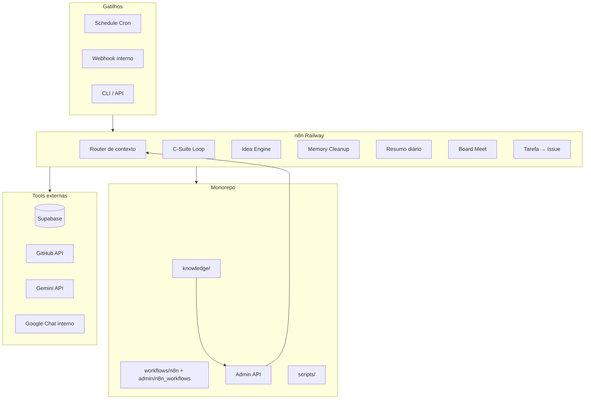

# Plano de Automações n8n com Agentes, Skills e Tools — Adventure Labs

## 1. Contexto e alinhamento ao monorepo

O monorepo já possui base sólida para expansão agentic:

- **C-Suite em n8n:** Loop autônomo **V11 em produção** (paralelização, histórico, founder reports); versões v7–v9 em `apps/core/admin/n8n_workflows/csuite/`. Memória pgvector; integração Admin (context-docs API, tarefa→issue GitHub). Ver [n8n_workflows/README.md](../apps/core/admin/n8n_workflows/README.md).
- **Knowledge:** `knowledge/` (00_GESTAO_CORPORATIVA a 99_ARQUIVO) como fonte canônica; [PLANO_MONOREPO_ADVENTURE_LABS.md](../../PLANO_MONOREPO_ADVENTURE_LABS.md) define taxonomia e princípios de segurança.
- **Skills:** 21 skills em `apps/core/admin/agents/skills/` mapeadas por C-Level ([arquitetura-agentic-csuite-skills.md](../knowledge/06_CONHECIMENTO/arquitetura-agentic-csuite-skills.md)).
- **Scripts e integrações:** `scripts/audit-secrets.sh`, `apps/core/admin/scripts/n8n/import-to-railway.sh`, `validate-json.sh`, `commit-workflow.sh`; API Admin: `GET /api/csuite/context-docs`, `GET/POST /api/cron/daily-summary` (CRON_SECRET).

**Restrições assumidas:** Sem atendimento ou interação direta com clientes humanos; apenas agentes↔agentes e equipe interna↔agentes. Foco em organização da empresa, gestão interna e ferramentas para clientes (dados/relatórios/backlog), nunca em chat ou suporte ao cliente final.

---

## 2. Arquitetura de alto nível

- **Entrada:** Cron, webhooks internos (ex.: Admin "tarefa concluída", "gerar resumo"), chamadas CLI/API (import/export workflows, disparo manual).
- **Saída:** Issues GitHub, memória pgvector, notificações Google Chat (espaço interno), atualizações em `adv_tasks` / `adv_ideias` / `adv_daily_summaries`; nenhum canal direto ao cliente final.

---

## 3. Taxonomia de fluxos (por domínio)

Fluxos organizados por domínio, com complementaridade e profundidade.

### 3.1 Governança e conselho (alto nível)

| Fluxo | Objetivo | Gatilho | Dados | Saídas | Profundidade |
|-------|----------|---------|------|--------|--------------|
| **C-Suite Autonomous Loop** | Board meeting autônomo; síntese Grove | Schedule (ex.: 12:30) + Webhook | Tasks, Ideias, Vector Memory, **Founder Reports** (últimos 7 dias), context-docs | Issue GitHub, pgvector, Google Chat | **V11 em produção** (2026-03-09). Relatórios founder integrados. Manutenção: [apps/core/admin/n8n_workflows/README.md](../apps/core/admin/n8n_workflows/README.md) — ver [CSuite_relatorios_founder](CSuite_relatorios_founder.md) |
| **Board Meet (preparação)** | Montar pauta e números para reunião humana | Schedule (ex.: sexta 17h) ou antes do Loop | knowledge/00, indicadores, SLA, one-pager | Doc/issue com pauta e métricas | Nível 2: agregar dados de múltiplas fontes |
| **Flash CEO (resumo executivo)** | Resumo semanal para founder | Após C-Suite ou Schedule separado | Decisões Grove + ideias aprovadas + lacunas | Issue ou doc em knowledge/ | Nível 2: ler resumo-executivo + questionário e sugerir atualizações |

### 3.2 Operação e tarefas (gestão interna)

| Fluxo | Objetivo | Gatilho | Dados | Saídas | Profundidade |
|-------|----------|---------|------|--------|--------------|
| **Tarefa → Issue GitHub** | Criar issue a partir de tarefa Admin (tipo TI) | Webhook Admin | Body (título, descrição, callback_url) | Issue + callback Admin | Já existe; manter e documentar |
| **Tarefa concluída → Email** | Notificar equipe quando tarefa concluída | Webhook Admin | N8N_WEBHOOK_TAREFA_CONCLUIDA | Email interno | Já referenciado; sem interação cliente |
| **SLA e prazos (checagem)** | Alertar tarefas próximas do prazo ou atrasadas | Schedule (diário) | adv_tasks (due_at, status) | Issue ou item no board / Google Chat | Nível 2: skill sla-prazos-entrega |
| **Adventrack ↔ tarefas** | Consolidar horas x tarefas (quando Adventrack estiver ativo) | Schedule | Pontos + adv_tasks | Relatório interno ou atualização em task | Nível 3: integração futura |

### 3.3 Ideação e backlog

| Fluxo | Objetivo | Gatilho | Dados | Saídas | Profundidade |
|-------|----------|---------|------|--------|--------------|
| **Idea Engine** | Gerar 3–5 ideias a partir de decisões + tarefas done | Schedule (sexta 17h) | adv_csuite_memory, tasks done | INSERT adv_ideias | Já existe |
| **Revisão de ideias (triagem)** | Priorizar/arquivar ideias antigas | Schedule (ex.: semanal) | adv_ideias (status, data) | UPDATE status, possível issue por ideia aprovada | Nível 2: agente CPO/COO |
| **Backlog ↔ roadmap** | Sincronizar ideias aprovadas com roadmap/doc | Manual ou após triagem | adv_ideias, knowledge/ backlogs | Atualizar knowledge/ ou issue "roadmap" | Nível 3 |

### 3.4 Memória e contexto

| Fluxo | Objetivo | Gatilho | Dados | Saídas | Profundidade |
|-------|----------|---------|------|--------|--------------|
| **Memory Cleanup (Poda Sináptica)** | Consolidar memórias antigas (>30 dias) em resumo e limpar | Schedule (domingo madrugada) | adv_csuite_memory | 1 resumo vetorizado, DELETE antigos | Já existe |
| **Fetch Context** | Enriquecer contexto do C-Suite com knowledge + agents | Dentro do C-Suite Loop | GET /api/csuite/context-docs | String no Build Context | Já documentado |
| **Context por domínio (roteamento)** | Enviar ao C-Level apenas o bloco relevante (Tech/Mkt/Ops) | Dentro do Build Context | context-docs + tasks/ideias | Menos tokens, menos ruído | Já em parte (V2); refinar por skill |

### 3.5 Financeiro e custo-benefício (interno)

| Fluxo | Objetivo | Gatilho | Dados | Saídas | Profundidade |
|-------|----------|---------|------|--------|--------------|
| **CFO Agent (já no Loop)** | Análise financeira; queries SQL sob demanda | Dentro do C-Suite | adv_tasks, projetos, controle interno (sem dados sensíveis no repo) | Relatório no C-Level output | Já existe (V6) |
| **One-pager financeiro (geração)** | Sugerir texto de one-pager a partir de métricas disponíveis | Schedule ou Webhook | Dados agregados (sem CPF/extratos no n8n) | Rascunho em issue ou doc | Nível 2: skill one-pager-financeiro |
| **Custo-benefício de projetos** | Comparar custo/hora x valor por cliente (interno) | Schedule (mensal) ou sob demanda | Adventrack + adv_tasks + receita por projeto (metadados) | Relatório interno / board | Nível 3: após Adventrack estável |

**Segurança:** Nenhum dado bancário ou PII no n8n; apenas métricas agregadas ou referências; credenciais em vault/env.

### 3.6 Multi-projetos e clientes (ferramentas para clientes, sem contato)

| Fluxo | Objetivo | Gatilho | Dados | Saídas | Profundidade |
|-------|----------|---------|------|--------|--------------|
| **Lara — Meta Ads Sync** | Sync diário de métricas Meta Ads (clientes + contas Adventure); separação por `owner_type`; após N dias gera relatório analítico (persona Lara + skills) via POST /api/lara/analyze e grava em adv_founder_reports | Schedule (09:00) + Webhook | GET /api/meta/accounts, /mapping, /accounts/:id/insights; POST /api/meta/daily; GET /api/meta/daily; POST /api/lara/analyze; POST /api/csuite/founder-report | adv_meta_ads_daily, adv_founder_reports | **Implementado** (2026-03). Workflow: [apps/core/admin/n8n_workflows/meta_ads_agent/](../apps/core/admin/n8n_workflows/meta_ads_agent/). Relatório C-Suite gerado por análise (LLM) via /api/lara/analyze. Memória: adv_lara_memory; APIs: /api/lara/memory, /api/meta/topics. Requer GEMINI_API_KEY no Admin. |
| **Zazu — WhatsApp Grupos resumo diário (Cagan/CPO)** | Agente Zazu: buscar e consolidar mensagens do dia nos grupos de WhatsApp de clientes (worker WhatsApp Web, sem API oficial); publicar resumo em adv_founder_reports para o Cagan e C-Suite lerem | Schedule (18:00 BRT) | Worker GET /daily-messages?date=; POST /api/csuite/founder-report; opcional: POST /api/cron/whatsapp-daily (adv_whatsapp_daily) | adv_founder_reports, (opcional) adv_whatsapp_daily | **Implementado** (2026-03). Workflow: [apps/core/admin/n8n_workflows/whatsapp_groups_agent/](../apps/core/admin/n8n_workflows/whatsapp_groups_agent/). Worker: [apps/labs/whatsapp-worker/](../apps/labs/whatsapp-worker/). |
| **Status por cliente** | Agregar status de entregas por cliente (Lidera, Rose, Young, etc.) | Schedule (ex.: semanal) | adv_tasks, adv_projects (tenant/cliente) | Doc em knowledge/04 ou issue "Status clientes" | Nível 2 |
| **Alertas de entrega (interno)** | Prazo de entrega por projeto/cliente sem notificar o cliente | Schedule | SLA + due_at + project | Google Chat ou issue interna | Nível 2 |
| **Relatório de uso (por app cliente)** | Métricas de uso de apps para a equipe | API dos apps → n8n (agregar) | Logs/analytics internos | Dashboard interno ou doc | Nível 3: quando houver API de uso |

**Regra:** Saídas são sempre para equipe (issue, Chat, knowledge); nunca email/SMS/WhatsApp para cliente final.

### 3.7 Revisões, qualidade e segurança

| Fluxo | Objetivo | Gatilho | Dados | Saídas | Profundidade |
|-------|----------|---------|------|--------|--------------|
| **Auditoria de secrets (orquestração)** | Disparar audit e registrar resultado | Schedule (ex.: semanal) | scripts/audit-secrets.sh (CLI) | Arquivo em _internal (gitignore) + resumo commitável | Nível 2 |
| **Revisão de código (sugestões)** | Listar PRs abertos e sugerir prioridade de review | Schedule (ex.: diário) | GitHub API (PRs) | Issue ou mensagem Chat "PRs para review" | Nível 2: skill code-review |
| **Checklist de deploy** | Pós-deploy: health check e checklist | Webhook (Vercel/GitHub Actions) | URL Admin, status | Notificação interna se falha | Nível 2 |
| **Validação de workflows n8n** | Validar JSON antes de import | CLI commit-workflow ou CI | workflows/n8n/*.json | Erro em CI ou no script | Já existe (validate-json.sh); integrar em CI |

---

## 4. Agentes, skills e tools (matriz)

### 4.1 Agentes n8n (já existentes + propostos)

| Agente | Onde | Tools atuais/propostas | Uso |
|--------|------|------------------------|-----|
| **Grove (CEO)** | C-Suite Loop | Nenhum (síntese) | Orquestra decisão final |
| **Buffett (CFO)** | C-Suite Loop | Postgres (Supabase), SQL | Análise financeira e métricas |
| **Torvalds (CTO)** | C-Suite Loop | GitHub API | Issues, PRs, repositórios |
| **Ohno (COO)** | C-Suite Loop | Postgres (tasks, SLA) | Operação e prazos |
| **Ogilvy (CMO)** | C-Suite Loop | (futuro: Meta/Google Ads API só métricas) | Campanhas e KPIs |
| **Cagan (CPO)** | C-Suite Loop | Postgres (projetos, ideias) | Produto e backlog |
| **Revisor (novo)** | Fluxo de triagem de ideias | Postgres (adv_ideias) | Atualizar status e prioridade |
| **Auditor (novo)** | Fluxo de segurança | CLI/API (audit-secrets) | Só orquestração; execução fora do n8n |

### 4.2 Skills (mapeamento para nós e fluxos)

As 21 skills em `apps/core/admin/agents/skills/` devem ser usadas como **prompt/contexto** nos nós de agente:

- **CTO:** code-review, api-routes, ui-components, supabase-migrations, monorepo-pnpm, rls-tenant, n8n
- **COO:** sla-prazos-entrega, fluxo-vida-projeto, kanban-board-checklist
- **CMO:** relatorio-kpis-campanhas, copy-brief-campanha, analise-performance-canal, referencias-ideias-editorial
- **CFO:** one-pager-financeiro, reconciliacao-custos, metricas-saas-agencia
- **CPO:** escopo-projeto-checklist, briefing-cliente-template, dashboard-kpis-especificacao

### 4.3 Tools (integrações)

| Tool | Uso nos fluxos | Segurança |
|------|----------------|-----------|
| **Supabase (Postgres)** | Tasks, ideias, memory, daily_summaries, projects | RLS; service role só onde necessário; sem PII em logs n8n |
| **GitHub API** | Issues, PRs, repos (admin e outros) | PAT em credencial n8n; escopo mínimo |
| **Admin API** | GET context-docs, GET/POST daily-summary | CRON_SECRET em header; não expor em front |
| **Gemini API** | C-Levels, CEO, embeddings | API key em env; limite de tokens por fluxo |
| **Google Chat** | Notificações internas | Webhook em env; apenas canais equipe |
| **CLI (audit-secrets, import-to-railway)** | Execução em servidor/CI; n8n pode chamar API que dispara script | Não passar secrets no body; usar env no runner |
| **Vercel/ GitHub Actions** | Webhook pós-deploy | Verificação de assinatura se possível |
| **WhatsApp Worker (Zazu)** | GET /daily-messages, GET /groups; usado pelo agente Zazu no fluxo "WhatsApp Grupos resumo diário" | URL em WHATSAPP_WORKER_URL (n8n e Admin). Só leitura; sessão no worker (Railway); Admin faz proxy para QR/grupos com auth |

---

## 5. Segurança de dados

- **Nunca no n8n (nem em variáveis):** Credenciais, extratos bancários, CPF, respostas sigilosas, tokens de cliente. Manter em 1Password/vault e em `.env` no Admin ou no runner de scripts.
- **No n8n:** IDs, status, títulos, métricas agregadas, textos de decisão; URLs do Admin e do próprio n8n; PAT GitHub com permissão mínima.
- **Saídas:** Issues e docs em knowledge/ sem dados sensíveis; Google Chat apenas canais internos; relatórios financeiros só com métricas já aprovadas para compartilhamento interno.
- **Auditoria:** Fluxo "Auditoria de secrets" dispara `./scripts/audit-secrets.sh --report` (ou API que o invoca); resultado em _internal (gitignore); resumo commitável para visibilidade.
- **Versionamento de workflows:** JSON em `workflows/n8n/` e `apps/core/admin/n8n_workflows/` sem URLs de webhook ou chaves; usar variáveis de ambiente no n8n (Railway).

---

## 6. Otimização de processos e CLI/API-first

- **Import/export:** Manter e usar `import-to-railway.sh` e `commit-workflow.sh` para deploy e versionamento; CI pode rodar `validate-json.sh` em todo push em `workflows/`.
- **Disparo manual:** Webhooks por fluxo com autenticação (CRON_SECRET ou token n8n); evitar depender só da UI do n8n.
- **Context-docs:** Manter limite de 42k caracteres e roteamento por domínio para reduzir tokens e custo.
- **Agenda única:** Centralizar horários de Schedule em um doc (ex.: `knowledge/00_GESTAO_CORPORATIVA/processos/n8n-schedule.md`) para evitar sobrecarga e facilitar revisão.

---

## 7. Faseamento e prioridades

| Fase | Conteúdo | Prioridade |
|------|----------|------------|
| **F0 (já feito)** | C-Suite Loop (v9), Idea Engine, Memory Cleanup, Tarefa→Issue, Resumo diário, Fetch Context, Board Meet, tarefa concluída→email | — |
| **F1** | Documentar todos os fluxos existentes em um único doc em `knowledge/` (índice de fluxos n8n); consolidar workflows em `workflows/n8n/` e `n8n_workflows/csuite/`; CI para validate-json. | Alta |
| **F2** | SLA e prazos (checagem diária); Triagem de ideias (semanal); Board Meet preparação (dados agregados); Flash CEO (resumo para founder). | Alta |
| **F3** | Status por cliente (semanal); Alertas de entrega (interno); Auditoria de secrets orquestrada (schedule); Revisão de PRs (lista + sugestão). | Média |
| **F4** | One-pager financeiro (rascunho); Checklist pós-deploy; Context por domínio refinado (roteamento por skill). | Média |
| **F5** | Adventrack ↔ tarefas; Custo-benefício projetos; Relatório de uso por app cliente. | Baixa (dependem de dados/APIs) |

---

## 8. Resumo dos fluxos complementares (níveis)

- **Nível 1 (dados → um agente):** Fetch Tasks/Ideias/Memory + Build Context → C-Suite → decisão.
- **Nível 2 (fluxo → outro fluxo):** Idea Engine alimenta adv_ideias → Triagem atualiza status → C-Suite lê ideias na próxima run; Board Meet prepara pauta → C-Suite ou humano consome; Resumo diário → exibido no Admin e opcionalmente no Flash CEO.
- **Nível 3 (múltiplas fontes e ciclos):** Memory Cleanup mantém qualidade do vector → C-Suite usa memória relevante; Status clientes + SLA + Adventrack (futuro) → relatórios consolidados para o founder e para o Board.

---

## 9. Arquivos e referências chave

- Estrutura do monorepo: `PLANO_MONOREPO_ADVENTURE_LABS.md` (raiz GitHub)
- C-Suite e skills: `knowledge/06_CONHECIMENTO/arquitetura-agentic-csuite-skills.md`
- Documentação n8n C-Suite: `apps/core/admin/docs/n8n-csuite-workflow-documentacao.md`, `csuite-n8n-setup-guide.md`
- APIs e cron: `knowledge/00_GESTAO_CORPORATIVA/processos/api-cron-daily-summary.md`, `n8n-workflow-resumo-diario-checklist.md`
- Backlog de automações: `knowledge/00_GESTAO_CORPORATIVA/backlogs_roadmap/backlog-automacoes.md`
- Segurança e vault: `PLANO_MONOREPO_ADVENTURE_LABS.md` §3, `docs/FASE_6_GIT_E_REPOSITORIO.md`
- Scripts: `scripts/audit-secrets.sh`, `apps/core/admin/scripts/n8n/import-to-railway.sh`, `validate-json.sh`, `commit-workflow.sh`

Este plano não inclui as ações de implementação passo a passo (criação de cada nó no n8n), mas define a estrutura completa dos fluxos, sua complementaridade, profundidade, segurança e ordem de implementação recomendada.
