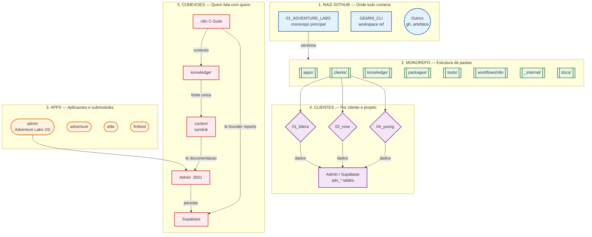

# Estrutura completa — um único diagrama (completo, cores e anotações)

Visão unificada com **regras de cor por seção**, **formas geométricas** distintas e **anotações** nas setas e nos blocos.

## Legenda de cores e formas

| Seção | Cor | Forma | Significado |
|-------|-----|--------|-------------|
| **1. Raiz /GitHub** | Azul | Retângulo / Círculo (outros) | Onde tudo começa |
| **2. Monorepo** | Verde | Hexágono | Estrutura de pastas |
| **3. Apps** | Laranja | Cilindro (stadium) | Aplicações e submodules |
| **4. Clientes** | Roxo | Losango | Por cliente e projeto |
| **5. Conexões** | Vermelho suave | Retângulo | Fluxos e integrações |

## Diagrama

Este diagrama está disponível como **um único FigJam** com o nome *"Estrutura GitHub e monorepos — Adventure Labs (completo, cores e anotações)"*. Use o link de claim na sua conta Figma para abrir e compartilhar com a equipe. Para o detalhe de cada parte, use os arquivos 01 a 05 nesta pasta.
