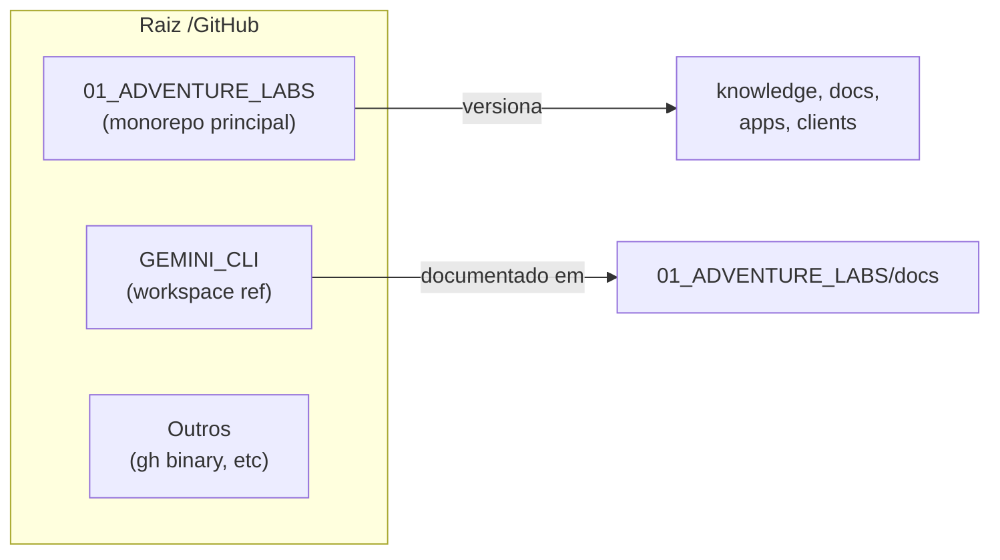

# Visão geral /GitHub

O que existe na raiz e a relação entre os itens.

## Resumo

- **01_ADVENTURE_LABS** — Monorepo principal (repo "adventure-labs"); versiona knowledge/, docs/, .cursor/, apps/, clients/, packages/, tools/, workflows/.
- **GEMINI_CLI** — Workspace consolidado; documentação em `01_ADVENTURE_LABS/docs/GEMINI_CLI_WORKSPACE.md`; raiz de trabalho recomendada é `01_ADVENTURE_LABS`.
- **Outros** — Artefatos como binário `gh`, etc.; listados no .gitignore quando aplicável.
