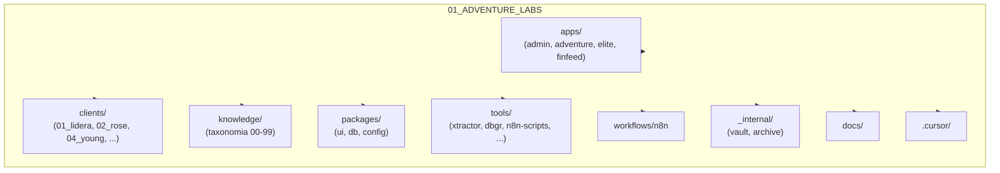

# Mapa do monorepo 01_ADVENTURE_LABS

Árvore de pastas e descrição de cada área.

## Pastas

| Pasta | Conteúdo |
|-------|----------|
| **apps/** | Aplicações principais (submodules): admin, adventure, elite, finfeed |
| **clients/** | Projetos por cliente (NN_nome/projeto); submodules por repo |
| **knowledge/** | Base de conhecimento; taxonomia 00–99 (gestão, comercial, marketing, etc.) |
| **packages/** | Pacotes compartilhados: ui, db, config |
| **tools/** | Ferramentas internas: xtractor, dbgr, gdrive-migrator, notebooklm, musicalart, n8n-scripts |
| **workflows/** | Definições n8n (workflows versionados) |
| **_internal/** | Uso interno: vault (refs a secrets), archive (código descontinuado) |
| **docs/** | Documentação (FASE_6, manuais, relatórios) |
| **.cursor/** | Regras e skills do Cursor; AGENTS.md na raiz |
