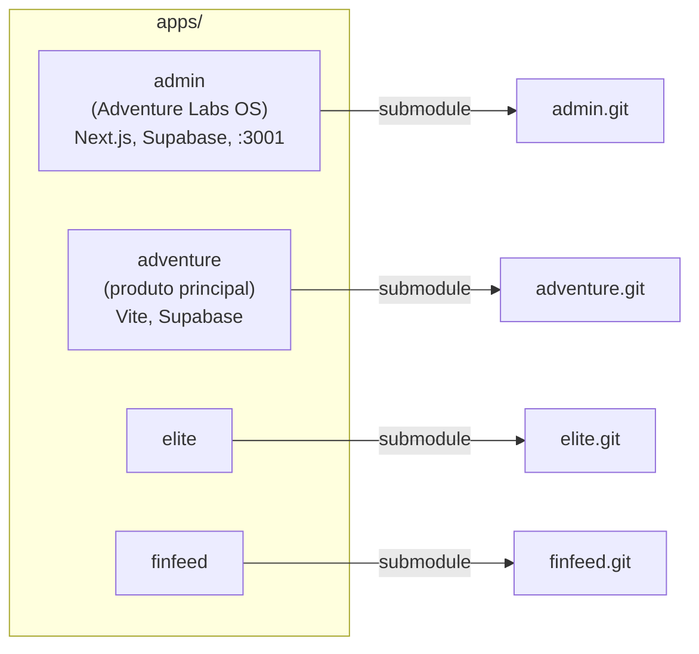

# Apps e funções

Aplicações principais do monorepo e repositórios (submodules) correspondentes.

## Apps

| App | Função | Stack | Repo (submodule) |
|-----|--------|-------|------------------|
| **admin** | Adventure Labs OS — painel interno (tarefas, projetos, clientes, relatórios C-Suite, docs) | Next.js, Supabase, porta 3001 | adventurelabsbrasil/admin |
| **adventure** | Produto principal (CRM) | Vite, React, Supabase | adventurelabsbrasil/adventure |
| **elite** | App Elite | — | adventurelabsbrasil/elite |
| **finfeed** | App Finfeed | — | adventurelabsbrasil/finfeed |

Setup após clone: `./scripts/setup.sh` (inicializa submodules e symlink `apps/core/admin/context -> ../../../knowledge`).
