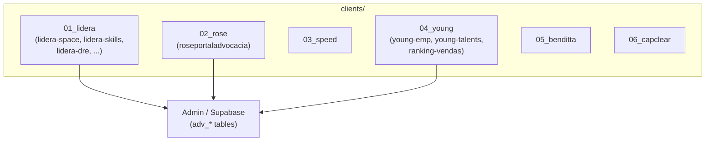

# Clientes e projetos

Estrutura `clients/NN_nome/projeto` e relação com Admin/Supabase.

## Clientes e submodules

| Cliente | Projetos (ex.) | Repos (submodules) |
|---------|----------------|--------------------|
| **01_lidera** | lidera-space, lidera-skills, lidera-dre | lidera-space.git, lidera-skills.git |
| **02_rose** | roseportaladvocacia | roseportaladvocacia.git |
| **04_young** | young-emp, young-talents, ranking-vendas | young-emp.git, young-talents.git, ranking-vendas.git |
| 03_speed, 05_benditta, 06_capclear | — | — |

Os dados de clientes e projetos são geridos no Admin (tabelas `adv_*` no Supabase); os repositórios em `clients/` são submodules com código específico por projeto.
