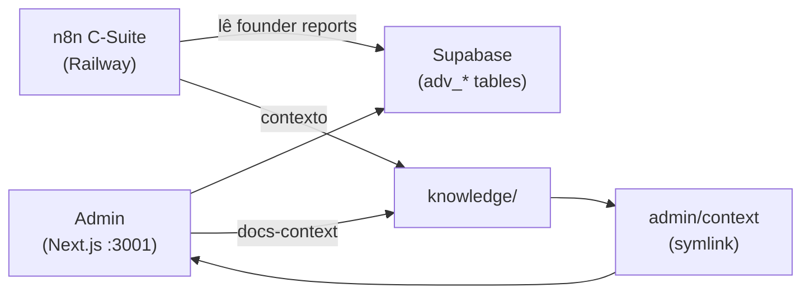

# Conexões e fluxos

Como Admin, n8n (C-Suite), knowledge e Supabase se relacionam.

## Fluxos

- **knowledge/** — Base de conhecimento (taxonomia 00–99). Fonte canônica de contexto.
- **apps/core/admin/context** — Symlink para `../../../knowledge`; evita duplicação.
- **Admin** — Lê contexto para exibir documentação (`/dashboard/docs-context` via manifest); persiste dados em Supabase (tabelas `adv_*`).
- **n8n C-Suite** — Workflow em Railway; lê `adv_founder_reports` (relatórios dos últimos 7 dias) e usa contexto da base de conhecimento para os agentes (CFO, CTO, COO, CMO, CPO) e Grove.

Documentação: `docs/CSuite_relatorios_founder.md`, `docs/FASE_6_GIT_E_REPOSITORIO.md`.
