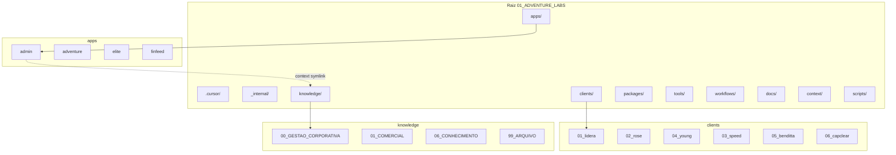

# Mapa da estrutura de pastas — 01_ADVENTURE_LABS (para IA)

**Data:** 2026-03-12  
**Objetivo:** Documento único que mapeia a estrutura real do monorepo para uso com IA ou ferramentas, na segunda etapa de análise e sugestões de melhoria.

---

## 1. Instruções para a IA (segunda etapa)

**Prompt sugerido ao colar este documento:**

> Analise o mapeamento abaixo da estrutura de pastas do monorepo 01_ADVENTURE_LABS. Com base na árvore de pastas, nas convenções atuais, nos problemas conhecidos e no diagnóstico crítico já iniciado, sugira melhorias concretas para torná-la mais sólida, funcional e escalável: nomenclatura, duplicações a remover ou consolidar, separação entre apps/clientes/knowledge/tools, preparação para ML/RAG e multi-agentes, e priorização (curto/médio/longo prazo).

**Contexto em uma linha:** Monorepo privado (pnpm workspace), submodules em `apps/` e `clients/`, base de conhecimento em `knowledge/` com taxonomia 00–99; Admin (Adventure Labs OS) consome `knowledge` via symlink `context`.

---

## 2. Árvore de pastas (mapeamento)

Pastas e níveis relevantes. Excluídos na listagem: `node_modules`, `.git`, `.next`, `dist`, `.npm-cache`, `.vercel`.

```
01_ADVENTURE_LABS/
├── .cursor/
│   ├── rules/
│   └── skills/
│       ├── clientes/
│       ├── comercial/
│       ├── desenvolvimento/
│       ├── gestao-corporativa/
│       └── marketing/
├── .github/
│   ├── ISSUE_TEMPLATE/
│   └── workflows/
├── _internal/
│   ├── archive/          # Código/projetos descontinuados ou clones temp
│   │   ├── adventure-/
│   │   ├── gemini-cli-API/
│   │   ├── gemini-cli-meus-workflows/
│   │   ├── n8n-dumps/
│   │   ├── relatorios-founder/
│   │   ├── temp_admin_report_* (várias variantes)
│   │   └── ...
│   └── vault/             # Referências a secrets (não os secrets em si)
├── apps/
│   ├── admin/            # Adventure Labs OS (canônico)
│   │   ├── context -> ../../knowledge (symlink)
│   │   ├── src/
│   │   ├── docs/
│   │   ├── scripts/
│   │   ├── supabase/
│   │   └── ...
│   ├── adventure/
│   │   ├── src/
│   │   ├── extension/
│   │   ├── functions/
│   │   ├── docs/
│   │   ├── scripts/
│   │   └── ...
│   ├── adventure 2/      # Duplicata/legado (mesmo nome com espaço)
│   ├── elite/
│   │   ├── app/
│   │   ├── components/
│   │   ├── lib/
│   │   ├── api/
│   │   └── ...
│   └── finfeed/
├── clients/
│   ├── 01_lidera/
│   │   ├── admin/
│   │   ├── lidera-dre/
│   │   ├── lidera-space/
│   │   ├── lidera-skills/
│   │   └── lideraspacev1/
│   ├── 01_lidera 2/     # Duplicata (cliente Lidera com sufixo " 2")
│   │   ├── Lidera/      # Subpastas com variantes (lideraspace, lidera-space, lidera-, etc.)
│   │   ├── lidera-space/
│   │   ├── lidera-skills/
│   │   └── ...
│   ├── 02_rose/
│   │   ├── admin/
│   │   ├── roseportaladvocacia/
│   │   └── sites/
│   ├── 03_speed/
│   ├── 04_young/
│   │   ├── admin/
│   │   ├── young-emp/
│   │   ├── young-talents/
│   │   └── ranking-vendas/
│   ├── 05_benditta/
│   └── 06_capclear/
│       └── CAPCLEAR/
├── context/             # Pasta na raiz (ex.: relatórios diários)
│   └── 00_RELATORIOS_DIARIOS/
├── docs/
│   ├── estrutura-visual/   # Este documento e diagramas (00–05, mapa-estrutura.html)
│   ├── roles/
│   ├── ADMIN_POR_CLIENTE_SUBDOMINIO.md
│   ├── ADS_META_ADMIN.md
│   ├── CREDENCIAIS_GOOGLE_E_META.md
│   ├── MANUAL_TAXONOMIA_REPOSITORIO.md
│   ├── SUPABASE_*.md (vários)
│   ├── PLANO_N8N_AUTOMACOES_AGENTES_SKILLS_TOOLS.md
│   └── ...
├── knowledge/           # Base de conhecimento (taxonomia 00–99, fonte canônica)
│   ├── 00_GESTAO_CORPORATIVA/
│   │   ├── backlogs_roadmap/
│   │   ├── checklists_config/
│   │   ├── guidelines/
│   │   ├── operacao/
│   │   ├── processos/
│   │   └── templates/
│   ├── 01_COMERCIAL/
│   ├── 02_MARKETING/
│   ├── 03_PROJETOS_INTERNOS/
│   ├── 04_PROJETOS_DE_CLIENTES/
│   ├── 05_LABORATORIO/
│   ├── 06_CONHECIMENTO/
│   ├── 99_ARQUIVO/
│   ├── knowledge/       # Subpasta aninhada com mesmo nome (possível redundância)
│   └── README.md
├── packages/
│   ├── config/
│   ├── db/
│   └── ui/
├── scripts/             # Scripts raiz (setup.sh, audit-secrets, etc.)
├── tools/
│   ├── dbgr/
│   ├── gdrive-migrator/
│   ├── imports/
│   ├── musicalart/
│   ├── n8n-scripts/
│   ├── notebooklm/
│   └── xtractor/
├── workflows/
│   └── n8n/             # Workflows n8n (JSON)
├── AGENTS.md
├── CONTRIBUTING.md
├── pnpm-workspace.yaml
├── PLANO_MONOREPO_ADVENTURE_LABS.md
└── README.md
```

---

## 3. Convenções e configuração atuais

- **Workspace pnpm:** `pnpm-workspace.yaml` declara `apps/*`, `packages/*` e `tools/*`. Os projetos em `clients/*` não são pacotes do workspace (cada um pode ter seu próprio package.json e repositório como submodule).
- **Submódulos Git:** Apps e clientes são submodules; cada app/cliente mantém seu próprio repositório. O script `scripts/setup.sh` inicializa submodules e cria o symlink `apps/core/admin/context -> ../../knowledge`.
- **Nomenclatura:**
  - Clientes: prefixo numérico `NN_nome` (ex.: `01_lidera`, `02_rose`).
  - Knowledge: prefixo numérico `NN_NOME` em maiúsculas (ex.: `00_GESTAO_CORPORATIVA`, `06_CONHECIMENTO`).
- **Arquivos âncora na raiz:** `AGENTS.md` (diretrizes multi-agentes), `CONTRIBUTING.md`, `README.md`, `PLANO_MONOREPO_ADVENTURE_LABS.md`. Scripts em `scripts/` (ex.: `setup.sh`, `audit-secrets.sh`).
- **Segurança:** Credenciais e dados sensíveis não entram no repositório; referências em `_internal/vault/README.md`.

---

## 4. Problemas e inconsistências conhecidos (para a IA usar como alvo)

- **Duplicações:** "01_lidera" e "01_lidera 2"; "adventure" e "adventure 2"; múltiplas variantes de projetos Lidera (lidera-space, lideraspace, lideraspacev1, Lidera/*, lidera-, etc.). Pastas em `_internal/archive/` espelham clones/versões antigas (temp_admin_report_*, adventure-, etc.).
- **Nomenclatura:** Knowledge usa MAIÚSCULAS (`00_GESTAO_CORPORATIVA`); clientes usam minúsculas com número. Inconsistência em nomes de projetos (hífen vs nada vs " 2").
- **Estrutura confusa:** `knowledge/knowledge/` (pasta aninhada com mesmo nome); `context/` na raiz vs `apps/core/admin/context` (symlink para knowledge); docs tanto na raiz (`docs/`) quanto dentro de apps e clientes.
- **Workspace:** `clients/*` não está no pnpm workspace (proposital para submodules independentes); `tools/*` está no workspace na configuração atual.
- **Documentação visual:** Já existem em `docs/estrutura-visual/` os arquivos 01 a 05 e `mapa-estrutura.html` com diagramas de raiz, monorepo, apps, clientes e conexões. Este documento é o **mapeamento de pastas** focado em uso com IA para segunda etapa de análise.

---

## 5. Diagnóstico crítico da estrutura com sugestões de melhoria e otimização

### 5.1 Diagnóstico crítico (eixos)

- **Duplicação e redundância:** Pastas como "01_lidera 2" e "adventure 2" geram dúvida sobre qual é a fonte de verdade. Várias variantes de nome para o mesmo cliente (lidera-space, lideraspace, lideraspacev1) aumentam custo de manutenção e risco de trabalho em código errado. O `_internal/archive/` concentra clones temporários e versões antigas; é útil para histórico, mas deve estar claramente separado e documentado para não ser confundido com estrutura ativa.
- **Nomenclatura e convenção:** Mistura de maiúsculas (knowledge) e minúsculas (clients); nomes com espaço ("adventure 2", "01_lidera 2") são problemáticos em CLI e scripts. Falta convenção única para nomes de projetos (kebab-case vs sem hífen).
- **Separação de responsabilidades:** Fronteira entre apps (produtos da casa), clients (por cliente) e knowledge (base de conhecimento) está clara na raiz, mas dentro de clients há admins e sites misturados; docs estão na raiz em `docs/` e também em cada app/cliente, sem regra clara de “fonte canônica” para cada tipo de doc.
- **Workspace e dependências:** `tools/*` no pnpm workspace permite reuso de pacotes entre apps e tools; `clients/*` fora do workspace reflete que cada cliente pode ser um deploy/repo independente. Falta documentar explicitamente quando um novo “tool” ou “app” deve entrar no workspace e como clientes consomem packages (se consumirem).
- **Preparação para IA/ML e multi-agentes:** A taxonomia em `knowledge/` (00–99) e o symlink `apps/core/admin/context -> knowledge` facilitam RAG e contexto único. `.cursor/skills/` já está organizado por domínio (gestao-corporativa, comercial, marketing, etc.). Pontos fracos: duplicação de nomes e pastas obscuras atrapalham indexação e “onde colocar” novo conhecimento; `knowledge/knowledge/` é ambíguo.
- **Escalabilidade e onboarding:** Adicionar um novo cliente implica criar `clients/NN_nome/` e possivelmente submodules; a existência de "01_lidera 2" e variantes de nome dificulta explicar “um projeto por cliente”. Onboarding de novo dev ou agente exige entender a diferença entre apps, clients, knowledge e archive.

### 5.2 Sugestões de melhoria e otimização (priorizável)

- **Curto prazo:** (1) Consolidar duplicatas: definir um único nome canônico por cliente/projeto (ex.: manter só `01_lidera` e tratar "01_lidera 2" como archive ou migrar conteúdo e remover). (2) Renomear ou remover "adventure 2" (ou mover para _internal/archive). (3) Esclarecer ou remover `knowledge/knowledge/` (renomear para algo explícito ou integrar conteúdo em `06_CONHECIMENTO`). (4) Documentar na raiz (README ou PLANO) que `_internal/archive/` é apenas histórico/clones e não estrutura ativa.
- **Médio prazo:** (5) Unificar nomenclatura: manter knowledge em NN_NOME (maiúsculas) e clientes em NN_nome (minúsculas); eliminar nomes com espaço; adotar kebab-case para subprojetos (ex.: lidera-space como padrão). (6) Definir regra para docs: documentação global em `docs/`; por app em `apps/<app>/docs`; por cliente em `clients/NN_nome/<projeto>/docs`; referência cruzada em `knowledge/README.md` já existe. (7) Ajustes no workspace: manter `clients/*` fora do workspace e documentar o motivo; manter ou não `tools/*` conforme uso real de packages compartilhados.
- **Longo prazo / decisões:** (8) Decidir estratégia de submodules: manter um repo por app e por cliente ou migrar para monorepo único com pastas (trade-off entre independência de deploy e simplicidade de estrutura). (9) Revisar conteúdo de `_internal/archive/`: mover para fora do repo (backup externo) ou manter apenas referências leves para reduzir tamanho e confusão.

Objetivo: o leitor (ou a IA na segunda etapa) tenha um ponto de partida crítico e sugestões acionáveis, além do mapeamento bruto, para evoluir para uma estrutura sólida e funcional.

---

## 6. Critérios de “estrutura sólida e funcional” (referência para sugestões)

- **Segurança:** Nenhum secret no repositório; referências em vault; .env via .env.example e variáveis de ambiente em deploy.
- **Taxonomia consistente:** Nomenclatura previsível (NN_nome para clientes, NN_NOME para knowledge); um nome canônico por projeto/cliente.
- **Preparado para IA/ML:** Pastas mapeáveis para skills e contextos; base de conhecimento única (knowledge) com frontmatter e domínios para RAG; .cursor/skills alinhado aos domínios.
- **Escalabilidade:** Adicionar novo cliente ou app sem ambiguidade (onde criar pasta, qual convenção de nome); onboarding claro (README, AGENTS.md, este mapa).
- **Menos duplicação:** Eliminar ou arquivar duplicatas (01_lidera 2, adventure 2); evitar múltiplas variantes de nome para o mesmo projeto; clarificar papel de archive.

---

## 7. Diagrama Mermaid (estrutura de pastas — visão simplificada)



---

*Fim do documento. Use este arquivo como contexto único para uma segunda etapa de análise por IA ou ferramentas.*
