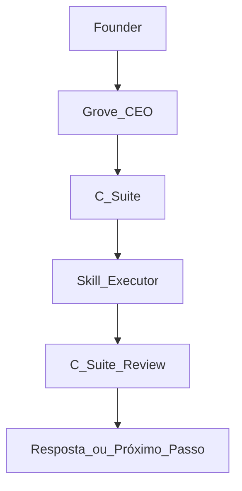
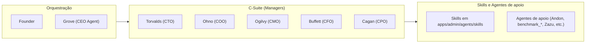

## Arquitetura agêntica — visão geral e fluxo

Esta página resume a arquitetura descrita em `knowledge/06_CONHECIMENTO/arquitetura-agentic-csuite-skills.md` em formato de Wiki.

- **C-Suite (Managers):** planejam, quebram em passos, escolhem skills, revisam output.
- **Skills (Executors):** executam tarefas específicas com contexto estreito.
- **Grove (CEO Agent):** orquestra e delega ao C-Level adequado.

### Fluxo principal

### Camadas da arquitetura

Para detalhes completos (regras, exemplos por diretor e pacote de agente), veja:

- `knowledge/06_CONHECIMENTO/arquitetura-agentic-csuite-skills.md`
- `AGENTS.md`

