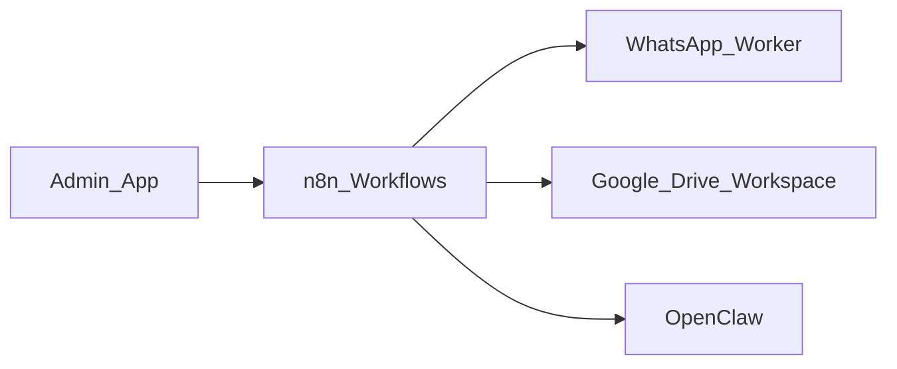

## Automações, integrações e relação com agentes/skills

Esta página mapeia, em alto nível, como automações e integrações se conectam com agentes e skills.

### Visão geral

### Exemplos de conexões

| Área | Automação / Tooling | Agente / Skill relacionada | Documentos principais |
|------|---------------------|----------------------------|-----------------------|
| Asana → knowledge | Workflow n8n **Andon** | Agente `andon_asana`, skill `asana-csuite-ingest` | `apps/core/admin/agents/andon_asana/`, `apps/core/admin/agents/skills/asana-csuite-ingest/` |
| WhatsApp → Admin / reports | whatsapp-worker + n8n | Agentes ligados a Zazu / relatórios; skills de ingest WhatsApp (quando definidas) | `tools/whatsapp-web/`, `tools/openclaw/whatsapp/`, docs em `knowledge/` |
| Google Drive / Workspace | Google APIs + skills | `google_workspace_advisor` (agente), skills `google-drive-adventure`, `google-workspace-inspector` | `apps/core/admin/agents/google_workspace_advisor/`, `apps/core/admin/agents/skills/google-drive-adventure/`, `apps/core/admin/agents/skills/google-workspace-inspector/` |
| Benchmarks martech | Web + processos internos | Agentes `benchmark_adventure`, `benchmark_clientes`, `benchmark_conteudo` e suas 9 skills | `apps/core/admin/agents/benchmark_*/`, `apps/core/admin/agents/skills/benchmark-*` |
| C-Suite memory / context-docs | n8n + `adv_csuite_memory` | Grove + C-Suite; agentes de apoio que gravam em memória diária | `knowledge/06_CONHECIMENTO/relatorio-tech-*.md`, docs de Loop C-Suite e OpenClaw |

Para detalhes técnicos de cada automação (payloads, schemas, endpoints), consulte:

- Pasta `tools/openclaw/` (OpenClaw local + Railway).
- Pasta `workflows/n8n/` (workflows versionados).
- Documentos em `knowledge/00_GESTAO_CORPORATIVA/` e `knowledge/06_CONHECIMENTO/` ligados a cada projeto.

