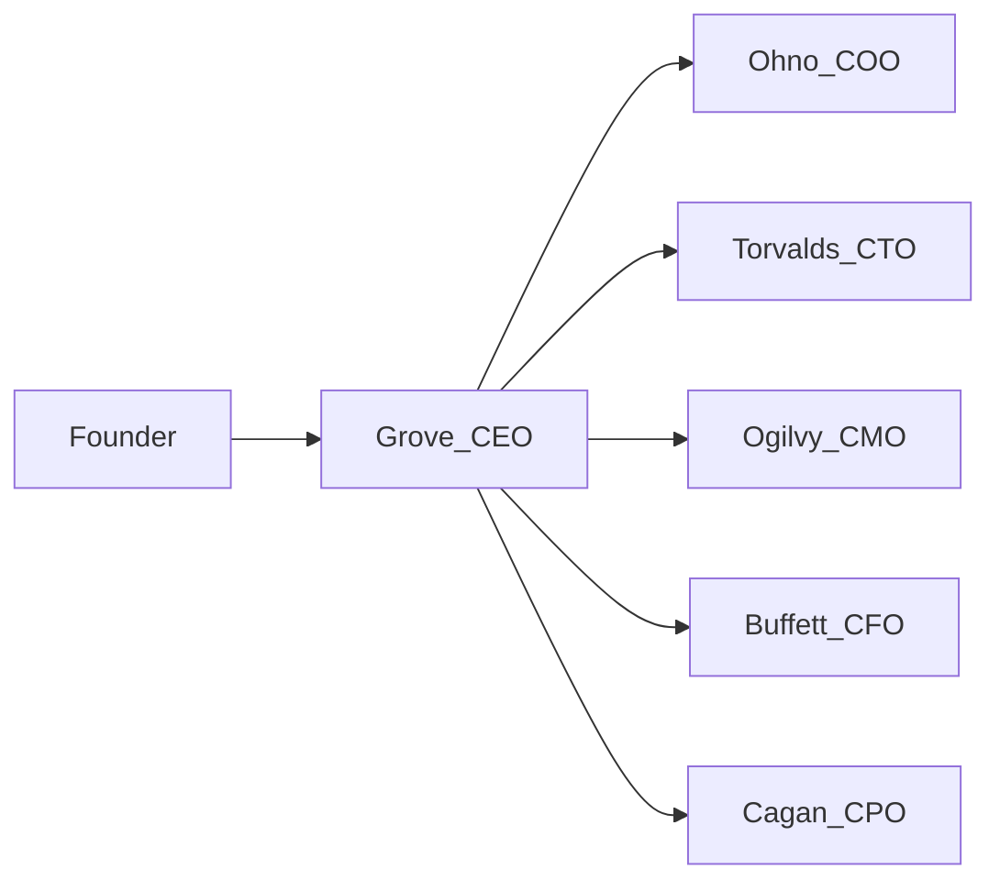

## Grove e C-Suite — papéis e delegação

Esta página resume o que cada C-Level faz, a partir de `AGENTS.md`, `apps/admin/agents/grove_ceo.md` e arquivos de persona (`ohno_coo.md`, `torvalds_cto.md`, etc.).

### Diagrama Grove → C-Suite

### Resumo por persona

| Persona | Arquivo (admin) | Domínio principal | Exemplos de decisões/delegações |
|--------|------------------|-------------------|---------------------------------|
| **Grove (CEO Agent)** | `apps/admin/agents/grove_ceo.md` | Orquestração geral, memória, triagem e delegação | Decide qual C-Level acionar, garante registro de tarefas e aplica a regra de sobrescrita. |
| **Ohno (COO)** | `apps/admin/packages/ai-core/personas/ohno_coo.md` | Operações, Kanban, SLA, Asana, Google Drive Adventure | Fluxos de vida de projeto, prazos, organização de quadros, ingest Asana (Andon), arquivos internos. |
| **Torvalds (CTO)** | `apps/admin/agents/torvalds_cto.md` | Código, arquitetura, Supabase, RLS, monorepo | Decisões técnicas, migrations, revisão de código, performance. |
| **Ogilvy (CMO)** | `apps/admin/agents/ogilvy_cmo.md` | Marketing, campanhas, criativos, KPIs, benchmark martech | Estratégia de campanhas, análise de canais, benchmark Adventure, benchmark conteúdo. |
| **Buffett (CFO)** | `apps/admin/agents/buffett_cfo.md` | Finanças, métricas SaaS, custos, caixa | One-pagers financeiros, conciliação bancária, previsão de caixa, KPIs de rentabilidade. |
| **Cagan (CPO)** | `apps/admin/agents/cagan_cpo.md` | Produto, escopo, experiência de cliente, dashboards | Escopo por cliente, experiência dos projetos, dashboards e KPIs, agentes por cliente. |

> Detalhes finos (tom de voz, redlines, permissões) estão nos arquivos de cada persona em `apps/admin/agents/`.

